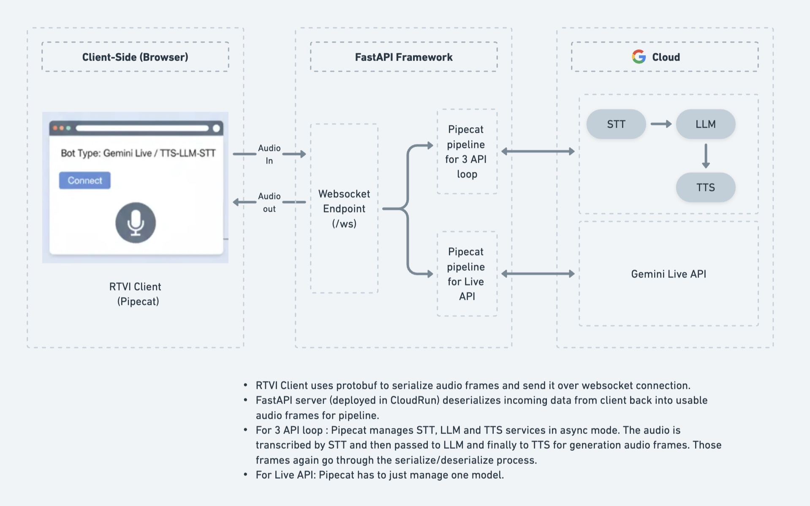
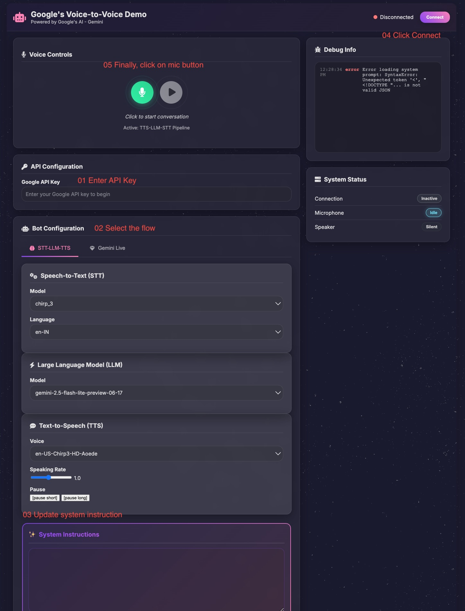

**Real-Time Voice-to-Voice bot using Google's AI & Pipecat orchestration**


This project demonstrates a real-time, voice-to-voice AI assistant using Google's AI models with Pipecat's WebSocket transport. It features a Python FastAPI backend and a TypeScript/Vite frontend.

The application captures audio from the user's microphone, streams it to the server for transcription, processes it with a LLM, generates a spoken response with text-to-speech, and streams the audio back to the client for playback—all in real time.

Two flows available:
- Live API flow (with standard voices and cloned voice via Chirp 3 HD TTS)
- STT + LLM + TTS flow (with standard voices and cloned voice via Chirp3 HD TTS)

Learn about instant custom clone voice here - https://cloud.google.com/text-to-speech/docs/chirp3-instant-custom-voice

**Architecture**

The client-side UI captures microphone audio and establishes a WebSocket connection with the Pipecat server. The server manages the real-time pipeline, integrating with third-party AI services for transcription, language modeling, and speech synthesis.



Features
- Real-Time Transcription: Captures user audio and transcribes it live.
- LLM Integration: Processes transcribed text with a configurable large language model.
- Low-Latency Text-to-Speech (TTS): Generates and streams synthesized voice back to the client with minimal delay.
- Voice Cloning: Utilizes voice IDs to generate responses in specific cloned voices.
- Scalable Backend: Built with FastAPI, suitable for production workloads.
- Modern Frontend: Clean user interface built with TypeScript and Vite.
- Cloud-Ready: Includes a complete guide for deploying to Google Cloud Run with Docker and Secret Manager.

**Prerequisites**

- Python 3.8+
- Node.js and npm (v18+)
- Google Cloud SDK (gcloud CLI)
- GCP project with Vertex AI API enabled
- Service account with Vertex AI permissions (or Application Default Credentials)


Follow these steps to set up and run the project on your local machine.

### 1. Clone the Repository

```bash
git clone https://github.com/your-username/pipecat-websocket-demo.git
cd pipecat-websocket-demo
```

### 2. Configure the Backend

The backend server handles the core AI pipeline.

1.  **Navigate to the server directory:**
    ```bash
    cd server
    ```

2.  **Create and activate a virtual environment:**
    ```bash
    python3 -m venv venv
    source venv/bin/activate
    # On Windows, use: venv\Scripts\activate
    ```

3.  **Install Python dependencies:**
    ```bash
    pip install -r requirements.txt
    ```

4.  **Set up your environment variables:**
    Copy the example file and add your secret keys.
    ```bash
    cp .env.example .env
    ```
    Now, edit the `.env` file with your credentials. This is where you'll add your Vertex AI configuration and voice cloning keys.

    **.env**
    ```env
    # Vertex AI Configuration
    GOOGLE_APPLICATION_CREDENTIALS="/path/to/your/service-account-key.json"
    GCP_PROJECT_ID="your-gcp-project-id"
    GCP_LOCATION="us-central1"
    
    # Voice Cloning Keys from TTS provider (Chirp3 HD)
    CLONE_TTS_VOICE_KEY_MALE="/path/to/your/male_voice_key.txt"
    CLONE_TTS_VOICE_KEY_FEMALE="/path/to/your/female_voice_key.txt"
    ```
    
    **Configuration Details:**
    - `GOOGLE_APPLICATION_CREDENTIALS`: Path to your GCP service account JSON key file
    - `GCP_PROJECT_ID`: Your Google Cloud Project ID (e.g., "my-project-123")
    - `GCP_LOCATION`: GCP region for Vertex AI (e.g., "us-central1", "us-east4", "europe-west1")
    - Voice cloning keys: File paths containing your Chirp3 HD voice cloning keys

    **Setup Service Account:**
    1. Create a service account in your GCP project with Vertex AI permissions
    2. Download the JSON key file
    3. Set the path in `GOOGLE_APPLICATION_CREDENTIALS`
    
    Alternatively, for local development, you can authenticate using:
    ```bash
    gcloud auth application-default login
    ```
    
### 3. Run the Application

1.  **Start the backend server:**
    Make sure you are in the `server` directory with your virtual environment active.
    ```bash
    python server.py
    ```
    The server will start on `http://localhost:7860`. (Do not OPEN THIS IN BROWSER. This is only running server)

2.  **Run the frontend client:**
    Open a **new terminal window**.
    ```bash
    cd client
    npm install
    npm run dev
    ```
    The client will be accessible at the URL provided by Vite (usually `http://localhost:5173`). Open this URL in your browser to start using the voice assistant.

## Deployment to Google Cloud Run

This project is configured for easy deployment as a single container on Google Cloud Run. The `Dockerfile` builds the frontend assets and serves them from the Python backend.

### 1. Secret Management (Optional but definitely recommended for production workloads)

Do not hardcode your credentials. Use Google Secret Manager to store them securely.
**Note:** This application now uses Vertex AI for accessing Gemini Live API, providing better integration with GCP services.

```bash
# Set your GCP Project ID
export PROJECT_ID="your-gcp-project-id"
gcloud config set project $PROJECT_ID
```

### 2. Deploy to Cloud Run

From the root directory of the project, run the following command.
This command builds the container from the Dockerfile and deploys it.
Replace <your-service-name>, <your-region>, and <your-gcp-project> with your specific values.
code

```bash
gcloud run deploy <your-service-name> \
  --source . \
  --platform managed \
  --region <your-region> \
  --allow-unauthenticated \
  --set-env-vars="GOOGLE_CLOUD_PROJECT=<your-gcp-project>"
```

How to run UI:



Steps:

(API Key is not needed)

1. Select the flow - STT-LLM-TTS or Gemini Live (its default).
2. Select the model, voice and language. defaults are
    - gemini-live-2.5-flash-native-audio
    - Aoede (Female Voice)
    - Hindi
3. Update system instruction. You can override it. The default system instruction is for a voice assistant speaking in Indian Hindi accent.
4. Click on Connect > Click on Mic button (to start conversation.)


**Contributing**

Contributions are welcome! Please feel free to submit a pull request or open an issue for bugs, feature requests, or improvements.

Fork the repository.
- Create your feature branch (git checkout -b feature/AmazingFeature).
- Commit your changes (git commit -m 'Add some AmazingFeature').
- Push to the branch (git push origin feature/AmazingFeature).
- Open a Pull Request. We will review and proceed.

**License**

This project is licensed under the MIT License. See the LICENSE file for details.
