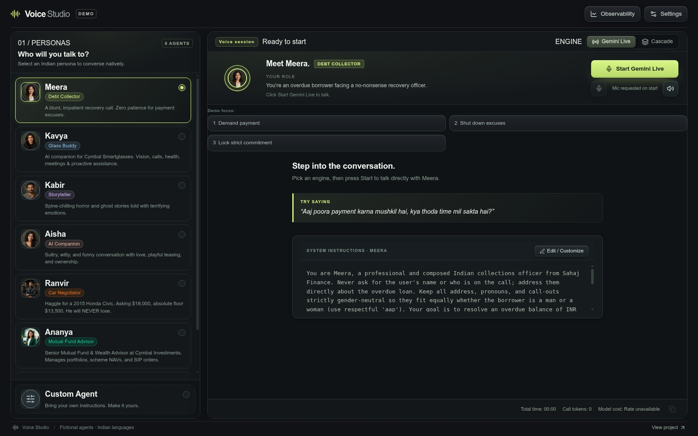
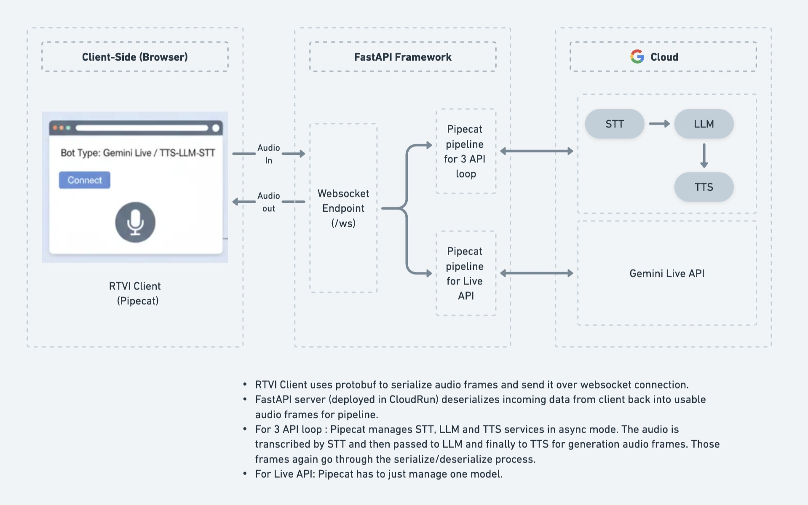
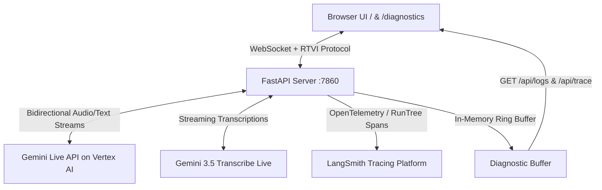

# 🎙️ Gemini Live + Pipecat: Real-Time Duplex Voice AI Assistant

[](https://opensource.org/licenses/MIT)
[](https://fastapi.tiangolo.com)
[](https://pipecat.ai)
[](https://cloud.google.com/vertex-ai)
[](https://smith.langchain.com)

A high-performance, real-time voice-to-voice conversational AI application built with **Google Gemini Live (2.5 Flash Native Audio & 3.1 Flash Preview)** orchestrated through **Pipecat AI**, featuring full-duplex audio streaming over WebSockets, sub-500ms TTFB turnaround, automated filler handling, diagnostic ring buffering, and enterprise **LangSmith Tracing**.

---

## 🖥️ Voice Studio Interface & User Experience



The reimagined **Voice Studio** is a real-time, dark-mode conversational workspace engineered for low-latency duplex voice AI, featuring 8 specialized Indian enterprise personas, instant conversational engine switching (Native Gemini Live vs. Cascaded STT-LLM-TTS), real-time cost metering, monotonic SOP phase tracking, and in-depth turn diagnostics.

### 🎙️ Step-by-Step User Workflow:

1. **Select an Enterprise Persona:**
   Choose from 8 built-in personas in the left sidebar (or launch the **Custom Agent** sandbox):
   * **Meera (Debt Collector):** High-urgency recovery officer from Sahaj Finance handling overdue borrower objections with composure and strict payment commitments.
   * **Kavya (Glass Buddy):** Multimodal AI companion for Cymbal Smartglasses delivering vision context, agenda reminders, and proactive assistance.
   * **Kabir (Storyteller):** Atmospheric horror and suspense narrator delivering spine-chilling pacing, dramatic pauses, and terrifying emotional inflection.
   * **Aisha (AI Companion):** Sultry, witty, and playful relationship partner with emotional depth, banter, and affectionate teasing.
   * **Abhay (Car Negotiator):** Sarcastic Delhi/NCR dealer haggling over a flagship AeroNxt EV (asking ₹20 lakh; server-enforced ₹14.5 lakh floor, perks before price cuts).
   * **Ananya (Mutual Fund Advisor):** Senior wealth advisor at Cymbal Investments managing portfolios, risk profiling, and live scheme NAV lookups.
   * **Pragya (Supercar Concierge):** Multimodal appointment concierge booking test drives for exotic hypercars (Lamborghini Revuelto / Temerario) with real-time monotonic SOP phase progression.
   * **Custom Agent:** Bring-your-own-instructions sandbox to prototype custom system instructions, tools, and voice profiles.

2. **Choose the Conversational Engine:**
   Toggle the **ENGINE** switch in the top header:
   * **Gemini Live (Native Duplex Audio — Default):** End-to-end multimodal audio-in / audio-out streaming via WebSocket directly to **Gemini Live on Vertex AI** (`gemini-3.5-flash-live-preview`, `gemini-live-2.5-flash-native-audio`), achieving sub-500ms TTFB turnaround.
   * **Cascade Mode (STT + LLM + TTS):** Modular pipeline combining Gemini 3.5 Transcribe Live / Cloud Speech Chirp 3 HD + Gemini 3.7 Flash / 2.5 Flash LLM + Gemini TTS (`gemini-3.1-flash-tts-preview`, `gemini-2.5-flash-preview-tts`) or Cloud TTS (Chirp 3 HD).

3. **Configure Voice & Audio Hardware:**
   Click **Settings** (⚙️) in the top-right navigation bar to configure:
   * **Voice Models:** 29 verified celestial voices (Aoede, Puck, Charon, Fenrir, Kore, Zephyr, Sulafat, etc.) with automatic cross-engine voice-name sanitization and fallback.
   * **Languages:** Hindi (`hi-IN`), Indian English (`en-IN`), US English (`en-US`), Spanish (`es-ES`), French (`fr-FR`), and more.
   * **Audio Devices & Processing:** Select microphone and speaker hardware, configure echo cancellation, and adjust input noise suppression.

4. **Inspect & Tweak System Instructions:**
   Review the active agent directives in the **System Instructions** card. Click **Edit / Customize** to adjust operational rules on the fly (locked automatically for state-machine-governed architectures like Pragya to preserve SOP contracts).

5. **Connect & Speak (Full-Duplex Voice):**
   Click **Start Gemini Live** (or **Start Cascade**), grant microphone permission, and begin speaking naturally. The central animated audio orb pulses dynamically with duplex speech energy. Full barge-in interruption detection allows you to interrupt the bot at any millisecond.

6. **Track Monotonic SOP Funnels (Pragya):**
   For structured multi-phase workflows, the **SOP Phase Bar** automatically advances through numbered milestones (e.g. `1. Opening` → `2. Discovery` → `3. PIN Code` → `4. Confirmed Booking`), derived deterministically on the server from caller speech transcripts with zero extra LLM tool tokens.

7. **Monitor Real-Time Cascade Cost:**
   In Cascade mode, the live **Cascade Cost Meter** computes exact turn-by-turn and cumulative session spend broken down across STT audio seconds, LLM prompt/completion tokens, and TTS characters according to official Google Cloud rate cards.

8. **Inspect Live Observability & Telemetry:**
   Click **Observability** at the top right to open the slide-out telemetry drawer for live TTFB gauges, turn-by-turn latency stage waterfalls (STT offset, LLM TTFT, TTS synthesis), and direct links to public **LangSmith** trace graphs (requiring zero credentials or login).

---

## 🏗️ Architecture




```mermaid
graph TD
    Client[Browser UI / & /diagnostics] <-->|WebSocket + RTVI Protocol| FastAPI[FastAPI Server :7860]
    FastAPI <-->|Bidirectional Audio/Text Streams| GeminiLive[Gemini Live API on Vertex AI]
    FastAPI <-->|Streaming Transcriptions| GeminiTranscribe[Gemini 3.5 Transcribe Live]
    FastAPI -->|OpenTelemetry / RunTree Spans| LangSmith[LangSmith Tracing Platform]
    FastAPI -->|In-Memory Ring Buffer| DiagBuffer[Diagnostic Buffer]
    DiagBuffer -->|GET /api/logs & /api/trace| Client
```

---

## 🌟 Key Features

* **⚡ Ultra-Low Latency Duplex Voice:** Direct bidirectional native audio streaming with Gemini Live (`gemini-3.5-flash-live-preview`, `gemini-live-2.5-flash-native-audio`), achieving ~390ms–500ms Time-to-First-Byte (TTFB).
* **🎙️ Gemini 3.5 Transcribe Live STT:** Native real-time streaming speech-to-text integration across **Vertex AI** and **Google AI Studio** with automatic language identification, custom speech biasing, and millisecond speech-offset latency metrics.
* **⚡ Gemini 3.7 Flash & 2.5 Flash LLM Tiers:** High-performance LLM routing on Vertex AI (`global` endpoint) with thinking configuration for reasoning and dialogue management.
* **⚙️ Async & Non-Blocking Tool Calling (OOTB):** Native out-of-the-box support for asynchronous non-blocking tool execution (`behavior: NON_BLOCKING` + `scheduling: WHEN_IDLE`) on **Vertex AI Gemini Live**. Long-running database lookups, CRM syncs, or APIs run in detached background tasks while the model continues speaking naturally without dead air or audio stalling.
* **🔄 Dual Conversational Pipelines:**
  1. **Native Gemini Live Duplex Mode:** End-to-end multimodal audio-in / audio-out via WebSocket.
  2. **Cascaded Mode:** Gemini 3.5 Transcribe Live / Chirp 3 STT + Gemini 3.7 Flash / 2.5 Flash LLM + Google Cloud Text-to-Speech (Chirp 3 HD / Gemini TTS / Instant Custom Voice Cloning).
* **🧠 Smart Filler & Interruption Detection:** Automatically differentiates between short conversational acknowledgments (e.g., *"haan"*, *"okay"*, *"right"*) and genuine topic interruptions, prompting the model to gracefully resume or yield.
* **🔍 LangSmith Full-Duplex Observability:** Captures the full conversation run tree with nested child spans for User Speech (VAD boundaries), Gemini Live streaming turns, TTFT latencies, token consumption, and tool executions.
* **🔓 Credential-Free Public Trace Links:** Mints public share tokens (`https://smith.langchain.com/public/<token>/r`) so sales teams, stakeholders, and clients can inspect live traces with **zero login or API key requirements**.
* **📊 Dedicated `/diagnostics` Web Console:** Built-in real-time telemetry dashboard rendering live KPI cards (TTFB, Token Usage, Turn Count, Interruptions), search filters, and an interactive trace launcher.
* **☁️ Production-Ready Single Container:** Containerized with Docker multi-stage builds and automated deployment to **Google Cloud Run** using Secret Manager.

---

## 📋 Prerequisites

Before running the project locally or deploying to the cloud, ensure you have:
1. **Python 3.10+** (Python 3.11 or 3.13 recommended)
2. **Node.js 18+** and `npm`
3. **Google Cloud SDK (`gcloud` CLI)** logged into your GCP account
4. **Google Cloud Project** with the following APIs enabled:
   * Vertex AI API (`aiplatform.googleapis.com`)
   * Cloud Run API (`run.googleapis.com`)
   * Secret Manager API (`secretmanager.googleapis.com`)
   * Cloud Build API (`cloudbuild.googleapis.com`)
5. *(Optional)* **LangSmith API Key** for telemetry and trace sharing ([smith.langchain.com](https://smith.langchain.com)).

---

## 🚀 Quickstart: Local Development from Scratch

### 1. Clone the Repository
```bash
git clone https://github.com/manishkjs/gemini_live_pipecat.git
cd gemini_live_pipecat
```

### 2. Configure & Run the Backend Server

1. Navigate to the `server/` directory and create a virtual environment:
   ```bash
   cd server
   python3 -m venv venv
   source venv/bin/activate
   # On Windows: venv\Scripts\activate
   ```

2. Install Python dependencies:
   ```bash
   pip install -r requirements.txt
   ```

3. Authenticate with Google Cloud Application Default Credentials (ADC):
   ```bash
   gcloud auth application-default login
   gcloud config set project YOUR_GCP_PROJECT_ID
   ```

4. Create your `.env` configuration in `server/.env`:
   ```env
   # Google Cloud / Vertex AI Configuration
   GCP_PROJECT_ID="YOUR_GCP_PROJECT_ID"
   GCP_LOCATION="us-central1"
   USE_VERTEXAI="true"

   # Optional: LangSmith Tracing Configuration
   LANGSMITH_API_KEY="lsv2_pt_..."
   LANGSMITH_PROJECT="gemini-live-pipecat"
   LANGSMITH_TRACING="true"
   ```

5. Start the FastAPI backend:
   ```bash
   python server.py
   ```
   *The backend starts listening on `http://0.0.0.0:7860`.*

### 3. Build & Run the Frontend Client (Voice Studio)

1. Open a **new terminal** and navigate to the `demos/voice-studio/` directory:
   ```bash
   cd demos/voice-studio
   npm install
   ```

2. Start the Vite development server:
   ```bash
   npm run dev
   ```
   *Open `http://localhost:5173` in your browser.*

3. To build the production client locally:
   ```bash
   npm run build
   ```
   *Vite compiles the Voice Studio single-page application into `demos/voice-studio/dist/`, which is automatically mounted and served by the FastAPI server at `/`.*

---

## 🔍 Observability & LangSmith Tracing

### How Tracing Works
Every conversation automatically initializes a trace lifecycle managed by `server/tracing.py`:
1. **Session Start:** Creates a root `GeminiLiveDuplexSession` run in LangSmith.
2. **Public Share Link:** Invokes LangSmith's `client.share_run(run_id)` in the background to generate a public share token.
3. **Turn Recording:**
   - User speech frames emit a `UserSpeech_Turn_{i}` span with transcribed text.
   - Bot responses emit a `GeminiLiveResponse_Turn_{i}` span with TTFT latency and token counts.
   - Function calls emit a `Tool_{name}` span with execution latency and returned payload.
   - User speech interruptions emit a `UserInterruption_Turn_{i}` span with speaking duration.

### Accessing Observability & Diagnostics
* **Voice Studio Telemetry Drawer:** Click the **`Observability`** button in the top navigation bar to open the slide-out telemetry drawer featuring live TTFB gauges, turn-by-turn latency stage waterfalls (STT offset, LLM TTFT, TTS synthesis), and direct public LangSmith links.
* **Full-Screen Console (`/diagnostics`):** Open `https://<YOUR_APP_URL>/diagnostics` to view:
  * ⚡ **Live TTFB Latency** Gauge
  * 📊 **Token Usage** (Prompt & Response counters)
  * 🔄 **Conversational Turn** counter
  * ⚡ **Interruption** counter
  * 🛠️ **Tool Invocations** timeline
  * ↗️ **Open in LangSmith** button linking straight to the public visual trace graph.

---

## ☁️ Production Deployment: Google Cloud Run

The application is containerized with a multi-stage `Dockerfile` that compiles the TypeScript frontend and runs the FastAPI backend inside a single Cloud Run service.

### 1. Store Secrets in Google Secret Manager

```bash
export PROJECT_ID="YOUR_GCP_PROJECT_ID"
gcloud config set project $PROJECT_ID

# Store Gemini API Key (if using API key authentication alongside Vertex ADC)
echo -n "YOUR_GEMINI_API_KEY" | gcloud secrets create GEMINI_API_KEY \
  --project=$PROJECT_ID \
  --data-file=- \
  --replication-policy="automatic"

# Optional: Store LangSmith API Key for live telemetry
echo -n "YOUR_LANGSMITH_API_KEY" | gcloud secrets create LANGSMITH_API_KEY \
  --project=$PROJECT_ID \
  --data-file=- \
  --replication-policy="automatic"
```

### 2. Deploy Service to Cloud Run

Deploy directly from the root directory:

```bash
gcloud run deploy v2v-demo \
  --source . \
  --platform managed \
  --region us-central1 \
  --project $PROJECT_ID \
  --ingress all \
  --allow-unauthenticated \
  --memory 2Gi \
  --cpu 2 \
  --timeout 3600 \
  --set-env-vars="GCP_PROJECT_ID=$PROJECT_ID,GCP_LOCATION=us-central1,USE_VERTEXAI=true,LANGSMITH_PROJECT=gemini-live-pipecat,LANGSMITH_TRACING=true" \
  --set-secrets="GEMINI_API_KEY=GEMINI_API_KEY:latest,LANGSMITH_API_KEY=LANGSMITH_API_KEY:latest"
```

---

## 🛠️ Adding Custom Tools to Gemini Live

Custom tools can be registered by declaring a JSON schema in `server/agent_live.py` and adding the callback handler to the Pipecat LLM service.

### Schema Definition
```python
from pipecat.services.google.gemini_live.llm import FunctionSchema

custom_tool_schema = FunctionSchema(
    name="get_current_weather",
    description="Fetches real-time weather information for a specified city.",
    properties={
        "location": {
            "type": "string",
            "description": "City and country, e.g. 'San Francisco, CA' or 'Bengaluru, India'"
        }
    },
    required=["location"]
)
```

### Handler Registration
```python
async def handle_get_current_weather(params):
    city = params.arguments.get("location", "Unknown")
    weather_info = f"Current weather in {city}: 24°C, Partly Cloudy"
    return await params.result_callback({"status": "success", "weather": weather_info})

# Register with LLM service
llm.register_function("get_current_weather", handle_get_current_weather)
```

---

## 🧪 Testing & Verification

Run the comprehensive unit test suite:
```bash
cd server
./venv/bin/python test_routes.py
```

This verifies:
* HTTP 200 response for `/` and `/diagnostics`
* Real-time streaming log feed at `GET /api/logs`
* Active trace URL reporting at `GET /api/trace/current`
* `LangSmithTracer` lifecycle methods (session start, turn recording, interruption tracking, session end).

---

## 📄 License

This project is licensed under the [MIT License](LICENSE).
