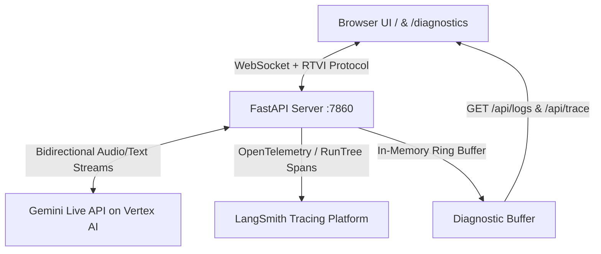

# 🎙️ Gemini Live + Pipecat: Real-Time Duplex Voice AI Assistant

[](https://opensource.org/licenses/MIT)
[](https://fastapi.tiangolo.com)
[](https://pipecat.ai)
[](https://cloud.google.com/vertex-ai)
[](https://smith.langchain.com)

A high-performance, real-time voice-to-voice conversational AI application built with **Google Gemini Live (2.5 Flash Native Audio & 3.1 Flash Preview)** orchestrated through **Pipecat AI**, featuring full-duplex audio streaming over WebSockets, sub-500ms TTFB turnaround, automated filler handling, diagnostic ring buffering, and enterprise **LangSmith Tracing**.

---

## 🌟 Key Features

* **⚡ Ultra-Low Latency Duplex Voice:** Direct bidirectional native audio streaming with Gemini Live (`gemini-live-2.5-flash-native-audio` and `gemini-3.1-flash-live-preview`), achieving ~450ms–700ms Time-to-First-Byte (TTFB).
* **🔄 Dual Conversational Pipelines:**
  1. **Native Gemini Live Duplex Mode:** End-to-end multimodal audio-in / audio-out via WebSocket.
  2. **Cascaded Mode:** Speech-to-Text + LLM + Google Cloud Text-to-Speech (Chirp 3 HD / Instant Custom Voice Cloning).
* **🧠 Smart Filler & Interruption Detection:** Automatically differentiates between short conversational acknowledgments (e.g., *"haan"*, *"okay"*, *"right"*) and genuine topic interruptions, prompting the model to gracefully resume or yield.
* **🔍 LangSmith Full-Duplex Observability:** Captures the full conversation run tree with nested child spans for User Speech (VAD boundaries), Gemini Live streaming turns, TTFT latencies, token consumption, and tool executions.
* **🔓 Credential-Free Public Trace Links:** Mints public share tokens (`https://smith.langchain.com/public/<token>/r`) so sales teams, stakeholders, and clients can inspect live traces with **zero login or API key requirements**.
* **📊 Dedicated `/diagnostics` Web Console:** Built-in real-time telemetry dashboard rendering live KPI cards (TTFB, Token Usage, Turn Count, Interruptions), search filters, and an interactive trace launcher.
* **☁️ Production-Ready Single Container:** Containerized with Docker multi-stage builds and automated deployment to **Google Cloud Run** using Secret Manager.

---

## 🏗️ Architecture


```mermaid
graph TD
    Client[Browser UI / & /diagnostics] <-->|WebSocket + RTVI Protocol| FastAPI[FastAPI Server :7860]
    FastAPI <-->|Bidirectional Audio/Text Streams| GeminiLive[Gemini Live API on Vertex AI]
    FastAPI -->|OpenTelemetry / RunTree Spans| LangSmith[LangSmith Tracing Platform]
    FastAPI -->|In-Memory Ring Buffer| DiagBuffer[Diagnostic Buffer]
    DiagBuffer -->|GET /api/logs & /api/trace| Client
```

---

## 📋 Prerequisites

Before running the project locally or deploying to the cloud, ensure you have:
1. **Python 3.10+** (Python 3.11 or 3.13 recommended)
2. **Node.js 18+** and `npm`
3. **Google Cloud SDK (`gcloud` CLI)** logged into your GCP account
4. **Google Cloud Project** with the following APIs enabled:
   * Vertex AI API (`aiplatform.googleapis.com`)
   * Cloud Run API (`run.googleapis.com`)
   * Secret Manager API (`secretmanager.googleapis.com`)
   * Cloud Build API (`cloudbuild.googleapis.com`)
5. *(Optional)* **LangSmith API Key** for telemetry and trace sharing ([smith.langchain.com](https://smith.langchain.com)).

---

## 🚀 Quickstart: Local Development from Scratch

### 1. Clone the Repository
```bash
git clone https://github.com/manishkjs/gemini_live_pipecat.git
cd gemini_live_pipecat
```

### 2. Configure & Run the Backend Server

1. Navigate to the `server/` directory and create a virtual environment:
   ```bash
   cd server
   python3 -m venv venv
   source venv/bin/activate
   # On Windows: venv\Scripts\activate
   ```

2. Install Python dependencies:
   ```bash
   pip install -r requirements.txt
   ```

3. Authenticate with Google Cloud Application Default Credentials (ADC):
   ```bash
   gcloud auth application-default login
   gcloud config set project YOUR_GCP_PROJECT_ID
   ```

4. Create your `.env` configuration in `server/.env`:
   ```env
   # Google Cloud / Vertex AI Configuration
   GCP_PROJECT_ID="YOUR_GCP_PROJECT_ID"
   GCP_LOCATION="us-central1"
   USE_VERTEXAI="true"

   # Optional: LangSmith Tracing Configuration
   LANGSMITH_API_KEY="lsv2_pt_..."
   LANGSMITH_PROJECT="gemini-live-pipecat"
   LANGSMITH_TRACING="true"
   ```

5. Start the FastAPI backend:
   ```bash
   python server.py
   ```
   *The backend starts listening on `http://0.0.0.0:7860`.*

### 3. Build & Run the Frontend Client

1. Open a **new terminal** and navigate to the `client/` directory:
   ```bash
   cd client
   npm install
   ```

2. Start the Vite development server:
   ```bash
   npm run dev
   ```
   *Open `http://localhost:5173` in your browser.*

3. *(Optional)* To test production builds locally:
   ```bash
   npm run build
   ```
   *Vite compiles both `index.html` (Main Voice Demo) and `diagnostics.html` (`/diagnostics` Telemetry Console) into `client/dist/`.*

---

## 🔍 Observability & LangSmith Tracing

### How Tracing Works
Every conversation automatically initializes a trace lifecycle managed by `server/tracing.py`:
1. **Session Start:** Creates a root `GeminiLiveDuplexSession` run in LangSmith.
2. **Public Share Link:** Invokes LangSmith's `client.share_run(run_id)` to generate a public share token.
3. **Turn Recording:**
   - User speech frames emit a `UserSpeech_Turn_{i}` span with transcribed text.
   - Bot responses emit a `GeminiLiveResponse_Turn_{i}` span with TTFT latency and token counts.
   - Function calls emit a `Tool_{name}` span with execution latency and returned payload.
   - User speech interruptions emit a `UserInterruption_Turn_{i}` span with speaking duration.

### Accessing the Diagnostics Console
* **Main Voice Demo (`/`):** Click on the floating **`⚡ DIAGNOSTIC ENGINE`** badge at the bottom-right of the screen to open the slide-out drawer or click `↗ Full Dashboard`.
* **Full-Screen Console (`/diagnostics`):** Open `https://<YOUR_APP_URL>/diagnostics` to view:
  * ⚡ **Live TTFB Latency** Gauge
  * 📊 **Token Usage** (Prompt & Response counters)
  * 🔄 **Conversational Turn** counter
  * ⚡ **Interruption** counter
  * 🛠️ **Tool Invocations** timeline
  * ↗️ **Open in LangSmith** button linking straight to the public visual trace graph.

---

## ☁️ Production Deployment: Google Cloud Run

The application is containerized with a multi-stage `Dockerfile` that compiles the TypeScript frontend and runs the FastAPI backend inside a single Cloud Run service.

### 1. Store Secrets in Google Secret Manager

```bash
export PROJECT_ID="YOUR_GCP_PROJECT_ID"
gcloud config set project $PROJECT_ID

# Store Gemini API Key (if using API key authentication alongside Vertex ADC)
echo -n "YOUR_GEMINI_API_KEY" | gcloud secrets create GEMINI_API_KEY \
  --project=$PROJECT_ID \
  --data-file=- \
  --replication-policy="automatic"

# Optional: Store LangSmith API Key for live telemetry
echo -n "YOUR_LANGSMITH_API_KEY" | gcloud secrets create LANGSMITH_API_KEY \
  --project=$PROJECT_ID \
  --data-file=- \
  --replication-policy="automatic"
```

### 2. Deploy Service to Cloud Run

Deploy directly from the root directory:

```bash
gcloud run deploy v2v-demo \
  --source . \
  --platform managed \
  --region us-central1 \
  --project $PROJECT_ID \
  --ingress all \
  --allow-unauthenticated \
  --memory 2Gi \
  --cpu 2 \
  --timeout 3600 \
  --set-env-vars="GCP_PROJECT_ID=$PROJECT_ID,GCP_LOCATION=us-central1,USE_VERTEXAI=true,LANGSMITH_PROJECT=gemini-live-pipecat,LANGSMITH_TRACING=true" \
  --set-secrets="GEMINI_API_KEY=GEMINI_API_KEY:latest,LANGSMITH_API_KEY=LANGSMITH_API_KEY:latest"
```

*When deployment completes, Cloud Run will output the live Service URL (e.g. `https://v2v-demo-853612069841.us-central1.run.app`).*

---

## 🛠️ Adding Custom Tools to Gemini Live

Custom tools can be registered by declaring a JSON schema in `server/agent_live.py` and adding the callback handler to the Pipecat LLM service.

### Schema Definition
```python
from pipecat.services.google.gemini_live.llm import FunctionSchema

custom_tool_schema = FunctionSchema(
    name="get_current_weather",
    description="Fetches real-time weather information for a specified city.",
    properties={
        "location": {
            "type": "string",
            "description": "City and country, e.g. 'San Francisco, CA' or 'Bengaluru, India'"
        }
    },
    required=["location"]
)
```

### Handler Registration
```python
async def handle_get_current_weather(params):
    city = params.arguments.get("location", "Unknown")
    # Fetch weather data...
    weather_info = f"Current weather in {city}: 24°C, Partly Cloudy"
    return await params.result_callback({"status": "success", "weather": weather_info})

# Register with LLM service
llm.register_function("get_current_weather", handle_get_current_weather)
```

---

## 🧪 Testing & Verification

Run the comprehensive unit test suite:
```bash
cd server
./venv/bin/python test_routes.py
```

This verifies:
* HTTP 200 response for `/` and `/diagnostics`
* Real-time streaming log feed at `GET /api/logs`
* Active trace URL reporting at `GET /api/trace/current`
* `LangSmithTracer` lifecycle methods (session start, turn recording, interruption tracking, session end).

---

## 📄 License

This project is licensed under the [MIT License](LICENSE).
