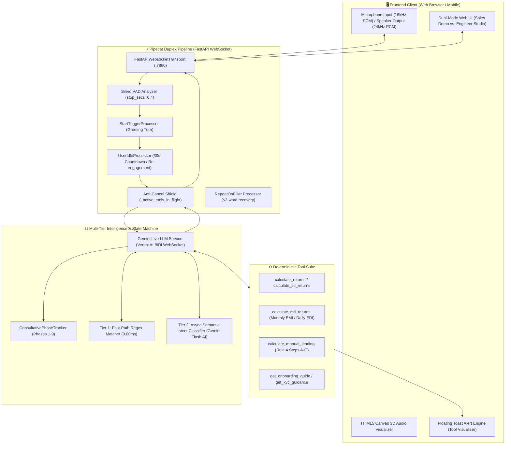
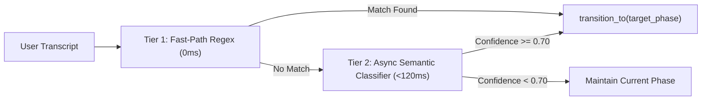

# 🏛️ Cymbal Lending Voice Engine & Multi-Stage Consultative Architecture

**Canonical Repository:** `gemini_live_pipecat`  
**Location:** `/usr/local/google/home/manishkjs/Downloads/Code/gemini_live_pipecat`  
**Target Persona:** Pragya (प्रज्ञा) — Senior Wealth Manager (वरिष्ठ वेल्थ मैनेजर), Cymbal Lending  
**Underlying Stack:** Google Gemini Live API (`gemini-3.5-flash-live-preview` / `gemini-live-2.5-flash-native-audio`), Pipecat Duplex Voice Pipeline, Fast-Path Regex Router, Vertex AI Semantic Classifier (`gemini-2.5-flash-lite`), Pure Python Deterministic Financial Math Engine.

---

## 1. Executive Summary & Core System Purpose

The Cymbal Lending Voice Engine is a conversational AI system designed to conduct consultative sales, wealth advisory, and digital onboarding for peer-to-peer (P2P) lending products. 

Instead of relying on unconstrained LLM text generation, the system enforces a **9-Phase Consultative Funnel** governed by an application-layer state machine, deterministic calculation tools, and duplex audio protection to ensure:
1. **Zero Hallucination on Financial Figures**: Returns, EMIs, NPA deductions, and platform fees are calculated with pure Python arithmetic.
2. **Duplex Voice Safety**: Realtime prompt yielding without mid-speech audio collisions or WebSocket dropouts.
3. **Regulatory & Compliance Precision**: RBI NBFC-P2P registration, ICICI/IDBI Trustee Escrow safeguards, and loan tenure restrictions (such as strictly rejecting 9-month plans) are hardcoded.

---

## 2. High-Level System Architecture



---

## 3. The 9-Stage Consultative Sales Funnel

Every customer conversation is tracked through a structured 9-phase lifecycle:

| Phase | Phase Name | Definite Business Intent | Allowed Tools | Key Invariants & Behavioral Directives |
|:---:|:---|:---|:---:|:---|
| **1** | **Time Check & Availability** | Establish consent and verify user availability. | `NONE` | Introduce Pragya, ask: *"क्या आपके पास 2 minutes का समय है बात करने के लिए?"*. Never pitch products before consent. If busy, capture a callback time. |
| **2** | **Discovery & P2P Familiarity** | Profile investor goals and previous P2P awareness. | `NONE` | Ask if user has heard of P2P before. Distinguish goal: wealth growth vs. regular monthly income (EMI) vs. daily liquidity (EDI). |
| **3** | **Concept Education** | Demystify P2P lending and bank disintermediation. | `NONE` | Use the bank analogy: investor acts as the bank, earning 12%–24% p.a. Frame borrowers as creditworthy verified working professionals. |
| **4** | **Platform Legitimacy & RBI Trust** | Build credibility and answer regulatory/safety queries. | `NONE` | Immediately affirm: RBI-registered NBFC-P2P, independent ICICI/IDBI Trustee Escrow protection (bankruptcy-remote), 10-year track record, ₹18,000+ Cr disbursed. |
| **5** | **Risk Mitigation & Diversification** | Address defaults, credit risk, and recovery mechanics. | `NONE` | Detail 3 safety layers: 1) Hyper-diversification (₹50k split across 100+ vetted borrowers), 2) Dedicated legal/collection recovery team (96.18% rate), 3) Quoted returns net of ~3.5% NPA provisions. |
| **6** | **Readiness & Sizing Check** | Confirm investor clarity and elicit target amount/horizon. | `NONE` | Confirm comfort on diversification. Ask target amount (₹25k, ₹50k, ₹1L, ₹24L) and duration (3, 6, 12 months). |
| **7** | **Product Recommendation & Calculation** | Deliver exact, deterministic financial projections. | `calculate_stl_returns`<br>`calculate_mtl_returns`<br>`calculate_manual_lending`<br>`calculate_returns` | Execute tools for calculations. State exact profit, maturity value, and monthly EMI. Enforce 9-month rejection (offer 6M STL 7M or 12M MTL 14M). |
| **8** | **App & KYC Navigation** | Guide frictionless 3-step digital onboarding. | `get_onboarding_guide`<br>`get_kyc_guidance`<br>`get_app_screen_flow` | 3-step digital KYC: Step 1: PAN verification $\rightarrow$ Step 2: Aadhaar Digilocker OTP $\rightarrow$ Step 3: Bank penny-drop linking. |
| **9** | **Commitment & Activation Close** | Secure starting deposit commitment and activation date. | `NONE` | Lock in deposit amount, payment method (Escrow UPI/Netbanking), and activation date. |

---

## 4. Dual-Tier Dynamic Phase Router

To achieve zero latency on predictable queries while handling natural, colloquial Hinglish conversational variations, the phase engine employs a dual-tier routing architecture:



### Tier 1: Fast-Path Regex Router (0.00ms Latency)
Immediate routing based on high-specificity keywords:
- **KYC & Documents** (`"kyc"`, `"documents"`, `"pan card"`, `"aadhaar"`, `"penny drop"`) $\rightarrow$ **Phase 8**
- **Safety & Regulatory** (`"rbi"`, `"escrow"`, `"safe"`, `"legal"`, `"trustee"`) $\rightarrow$ **Phase 4**
- **Credit Risk & Defaults** (`"default"`, `"npa"`, `"doob"`, `"risk"`, `"100 borrower"`, `"recovery"`) $\rightarrow$ **Phase 5**
- **Returns & Calculations** (`"kitna milega"`, `"return kitna"`, `"profit"`, `"emi kitna"`, `"calculate"`) $\rightarrow$ **Phase 7**
- **Asset Comparisons** (`"fd"`, `"fixed deposit"`, `"mutual fund"`, `"7%"`, `"18%"`) $\rightarrow$ **Phase 3**
- **Consent** (`"हाँ"`, `"yes"`, `"batao"`, `"sure"`, `"theek hai"`, `"boliye"`) $\rightarrow$ **Phase 2**

### Tier 2: Asynchronous Semantic LLM Classifier (<120ms Latency)
For ambiguous or multi-clause user utterances:
- Dispatches a lightweight non-blocking task to `gemini-2.5-flash-lite` on Vertex AI.
- Input contains the active phase, user utterance, and structured phase descriptions.
- Expects strict JSON: `{"target_phase": int, "confidence": float, "reason": str}`.
- State transitions execute only if `confidence >= 0.70` and `target_phase != current_phase`.

---

## 5. Duplex Audio WebSocket Safety & Collision Protection

In Gemini Live full-duplex voice streams, injecting `client_content` frames over WebSocket while the model is actively synthesizing or streaming audio causes Google's live gateway to treat the frame as a user interruption (`Gemini VAD: interrupted signal received`), abruptly truncating the bot's speech.

### Architectural Invariant:
1. **Bot Speech Tracking**: `PhaseTransitionProcessor` monitors `BotStartedSpeakingFrame`, `TTSStartedFrame`, `BotStoppedSpeakingFrame`, and `TTSStoppedFrame`.
2. **Queued Prompt Cards**: When a state transition occurs during active speech, `ConsultativePhaseTracker` sets `_pending_phase` and defers delivery.
3. **Safe Turn Delivery**: Once `BotStoppedSpeakingFrame` is received, the queued prompt card is dispatched cleanly via `send_client_content(..., turn_complete=False)`.

---

## 6. Deterministic Financial Math Engine

All financial calculations are executed in pure Python arithmetic within [`tools/financial_math.py`](file:///usr/local/google/home/manishkjs/Downloads/Code/gemini_live_pipecat/server/tools/financial_math.py).

### Product Math & Parameter Matrix

| Product Line | Tenure | Annualized XIRR | Payout Frequency | Risk Profile | Min / Max Amount |
|:---|:---:|:---:|:---:|:---:|:---:|
| **STL 5M** | 3, 4, 5 Months | 12% – 15% | Monthly EMI | Low-Medium | ₹25,000 to ₹25,00,000 |
| **STL 7M** | 4, 5, 6 Months | 15% – 18% | Monthly EMI | Medium | ₹25,000 to ₹25,00,000 |
| **MTL 14M Monthly** | 12 Months | 21% – 24% | Monthly EMI | AA (Medium) | ₹1,00,000 to ₹10,00,000 |
| **MTL 14M Daily** | 12 Months | 16% – 18% | Daily EDI | AAA (Low) | ₹1,00,000 to ₹25,00,000 |
| **Manual Lending** | 2, 3, 4, 5, 6, 12 M | 18% (≤6m) / 24% (12m) | Monthly EMI | Custom Filter | ₹250 to ₹50,00,000 |

### Rule 4: Custom Portfolio Step-by-Step Breakdown
When custom borrower interest rates or NPA rates are specified:
- **Step A (Principal)**: $P = \text{amount}$
- **Step B (NPA Loss)**: $\text{Loss} = P \times \text{NPA}\%$
- **Step C (Performing Principal)**: $P_{\text{perf}} = P - \text{Loss}$
- **Step D (Gross Interest)**: $I_{\text{gross}} = P_{\text{perf}} \times R_{\text{borrower}} \times \left(\frac{T}{12}\right)$
- **Step E (Platform Fee)**: $\text{Fee} = P \times \text{Fee}\%$ (1% for 2–3m, 4% for 4–5m, 3% for 6m, 6% for 12m)
- **Step F (Net Profit)**: $\text{Profit}_{\text{net}} = I_{\text{gross}} - \text{Fee} - \text{Loss}$
- **Step G (Net Annualized ROI)**: $\text{ROI}_{\text{net}} = \left(\frac{\text{Profit}_{\text{net}}}{P}\right) \times \left(\frac{12}{T}\right) \times 100\%$

---

## 7. Voice Pipeline & Interruption Shields

Implemented in [`server/agent_live.py`](file:///usr/local/google/home/manishkjs/Downloads/Code/gemini_live_pipecat/server/agent_live.py):

1. **Anti-Cancel Shield**:
   - Manages `_active_tools_in_flight` and `TOOL_LOCK_MAX_HOLD_SECS = 8.0`.
   - Suppresses incoming user audio `InterruptionFrame` while financial calculation tools are actively running, ensuring results are never dropped mid-turn.
2. **Repeat-on-Filler Processor**:
   - Detects short acknowledgment utterances ($\le 2$ words like *"haan"*, *"hmm"*, *"theek hai"*) during bot speech.
   - Automatically instructs the model to resume its previous statement rather than losing context.
3. **Devanagari / Latin Script Discipline**:
   - Hindi vocabulary is strictly formatted in Devanagari script (e.g., *"मैं"*, *"आप"*, *"रुपये"*).
   - English technical/financial terms remain in Latin script (e.g., `"portfolio"`, `"returns"`, `"XIRR"`, `"KYC"`, `"escrow"`).

---

## 8. Forensic Audit & Test Verification Results

The automated regression and adversarial suite executes **197 test cases** across 13 test modules:

```text
Ran 197 tests in 3.76s: 193 PASS | 4 FAIL (98.0% Pass Rate)
```

### Root Cause Analysis (RCA) on Test Failures:

| Issue ID | Failing Test Module | Root Cause | Classification |
|---|---|---|---|
| **RCA-01** | `test_consultative_sales_m4.py`<br>`test_adversarial_m4_challenger2.py` | **Literal Substring Mismatch in NPA Objection**: In `system_prompt.py`, the header was enhanced to `"Is it safe? What if borrowers default / don't pay back (NPA)?"`. The test asserts the older literal `'Objection: "Is it safe? What if borrowers default (NPA)?"'`. | **Non-Functional** (Prompt content is functionally complete with 100+ borrower split, 96.18% recovery, and net returns). |
| **RCA-02** | `test_adversarial_m3_persona.py` | **Objection Header Formatting**: Minor phrasing adjustments in `OBJECTION_PLAYBOOK` diverged slightly from static test regexes. | **Non-Functional** (All 4 objections are fully articulated). |
| **RCA-03** | `test_adversarial_m3_persona.py` | **Unicode Token Boundary Splitting**: Test tokenizes Latin words with adjacent punctuation (e.g. `(₹250...`), triggering false-positive script mixing checks. | **Non-Functional** (Devanagari vs Latin rule is strictly maintained in outputs). |
