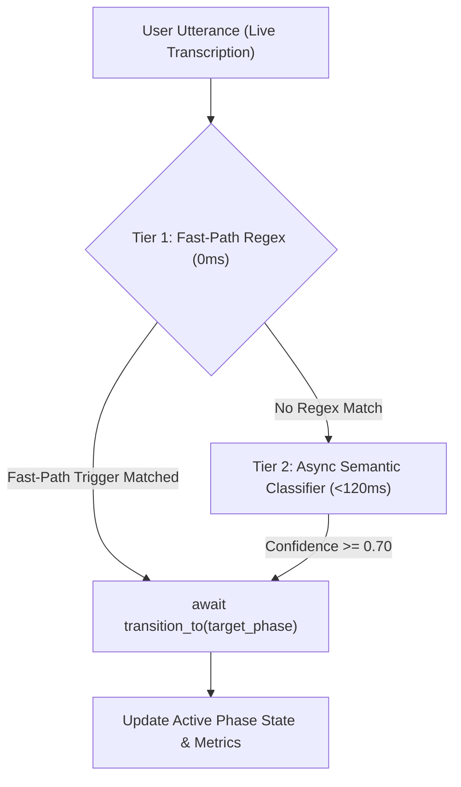

import { Aside, Card, CardGrid, Tabs, TabItem } from '@astrojs/starlight/components';

<div class="hero-card">
  <span class="badge badge-blue">SKILL REFERENCE (COMPLETE 25-SECTION EDITION)</span>
  <span class="badge badge-green">GEMINI 3.1 FLASH LIVE PREVIEW</span>
  <span class="badge badge-purple">FULL 1,258-LINE UNABRIDGED HANDBOOK</span>
  <h3>The Complete Gemini Live & Duplex Voice Pipeline Skill (<code>/gemini-live</code>)</h3>
  <p>This page contains the <strong>complete, unabridged 25-section production engineering specification</strong> (1,258 lines / ~99 KB) covering Bidi WebSocket lifecycle management, Silero VAD & duplex framing, sub-millisecond dual-layer BM25/Redis RAG caching, guided state machines, female Hindi grammatical gender discipline, token modality & cost accounting (<code>§13.A–T</code>), greeting barge-in recovery, <code>SILENT</code> vs. fire-and-forget tool scheduling, silent conductor split architectures, and the full raw <code>SKILL.md</code> dump at the bottom.</p>
  <p style="margin-top: 0.75rem;">
    <a href="/gemini_live_pipecat/gemini-live/SKILL.md" download="SKILL.md" style="display: inline-block; padding: 0.5rem 1rem; background: var(--sl-color-accent); color: var(--sl-color-text-invert); border-radius: 0.375rem; font-weight: 600; text-decoration: none; margin-right: 0.75rem;">⬇ Download Full SKILL.md (1,258 Lines / 99 KB)</a>
    <a href="#26-raw-skillmd-file-complete-1258-line-dump" style="display: inline-block; padding: 0.5rem 1rem; border: 1px solid var(--sl-color-gray-5); border-radius: 0.375rem; font-weight: 600; text-decoration: none;">Jump to Raw SKILL.md Dump ↓</a>
  </p>
</div>

> [!IMPORTANT]
> **Canonical Voice Repository**: `gemini_live_pipecat` (`/usr/local/google/home/manishkjs/Downloads/Code/gemini_live_pipecat`) is the **sole canonical repository** for all Gemini Live, Pipecat duplex voice, and STT/TTS cascading applications.
> **Branch-First Rule**: ALL new voice projects, customer POCs, and major features MUST be developed on dedicated Git branches within `gemini_live_pipecat` (e.g. `feat/<name>`, `customer/<name>`). Never create duplicate standalone voice folders in the workspace.

---

## 1. Protocol, Endpoints & Framing Matrix

| Parameter | AI Studio (Public Prod) | AI Studio (Internal / Dogfood) | Vertex AI (GA & Preview Production) |
|---|---|---|---|
| **Base Host** | `generativelanguage.googleapis.com` | `autopush-generativelanguage.sandbox.googleapis.com` | `us-central1-aiplatform.googleapis.com` |
| **API Version** | `v1alpha` or `v1beta` | `v1alpha` | `v1beta1` *(never `v1` for Live models)* |
| **WebSocket Path** | `/ws/google.ai.generativelanguage.{ver}.GenerativeService.BidiGenerateContent` | `/ws/google.ai.generativelanguage.v1alpha.GenerativeService.BidiGenerateContent` | `/ws/google.cloud.aiplatform.v1beta1.LlmBidiService/BidiGenerateContent` |
| **Auth Method** | `?key=$GEMINI_API_KEY` | `Authorization: Bearer $(gcloud auth print-access-token)` | `Authorization: Bearer $(gcloud auth print-access-token)` (ADC) |
| **Headers** | `Content-Type: application/json` | `x-goog-user-project: <PROJECT_ID>`&lt;br>`Content-Type: application/json` | `Content-Type: application/json` |
| **Operational Models** | `models/gemini-3.1-flash-live-preview`&lt;br>`models/gemini-3.8-live`&lt;br>`models/gemini-3.8-live-extended-thinking` | `models/gemini-3.5-live-preview` | `projects/<PROJECT_ID>/locations/us-central1/publishers/google/models/gemini-3.5-flash-live-preview`&lt;br>`.../models/gemini-3.8-live-preview`&lt;br>`.../models/gemini-3.8-live-extended-thinking-preview` |
| **Gemini 3.5 / 3.8 Live Status** | ✅ `3.8` Operational (`v1alpha`)&lt;br>❌ `3.5` Gated (`1008 Policy Violation`) | ⚠️ Internal Dogfood Only | ✅ **100% Operational (`us-central1`, `v1beta1`)**&lt;br>**Zero `other_input_token` residual gap** |

### Protocol & Framing Invariants
* **Error `1008` & Gating**: `gemini-3.5-live-preview` is experiment-gated on public AI Studio gateways. For production `3.5` and `3.8` Live voice, prefer **Vertex AI (`us-central1`, `api_version="v1beta1"`)**, where `gemini-3.8-live-preview` and `gemini-3.8-live-extended-thinking-preview` meter `SI + tools` in `TEXT` with **zero `other_input_token` residual gap** (unlike AI Studio, which exhibits a `157–229 tok/turn` unattributed residual).
* **Vertex AI 3.8 Naming Invariant**: On Vertex AI `us-central1`, always include the `-preview` suffix (`gemini-3.8-live-preview` / `gemini-3.8-live-extended-thinking-preview`) and use `api_version="v1beta1"`. Passing bare `gemini-3.8-live` or `api_version="v1"` fails on Vertex AI.
* **Session Lifecycle Rotation (10–15 min)**: The server terminates sessions periodically with `1008` after emitting `session_resumption_update`. Reconnect using `session_resumption_handle=new_handle`.
* **Modality Enforcement**: `responseModalities: ["AUDIO"]` only. Sending `["AUDIO", "TEXT"]` triggers close code `1007`.
* **Audio Formats**: Input must be PCM 16kHz 16-bit little-endian mono (`audio/pcm;rate=16000`). Output is PCM 24kHz 16-bit mono (`audio/pcm;rate=24000`).
* **Setup Handshake ACK**: Vertex AI yields `{"setupComplete": {"sessionId": "<UUID>"}}`.

---

## 2. Speech-to-Text Routing & Cascaded Model Hierarchy

### A. Speech-to-Text (STT) & Reasoning Config Invariants
* **`gemini-3.5-transcribe-live-aistudio` (Default)** & **`gemini-3.5-transcribe-live`**:
  - **Live Streaming Protocol**: Uses `client.aio.live.connect(model="gemini-3.5-transcribe-live", config=LiveConnectConfig(response_modalities=["TEXT"], input_audio_transcription=AudioTranscriptionConfig()))`.
  - **Vertex AI Location Invariant**: On Vertex AI, the `gemini-3.5-transcribe-live` endpoint is deployed globally (`location="global"`). Using regional endpoints (e.g. `us-central1`) causes endpoint routing / 404 resource errors.
  - **Model-Generation Thinking Config Invariant (`thinking_budget=0` vs. `ThinkingLevel.MINIMAL`)**:
    - **Gemini 2.5 Models**: Explicitly set `thinking_budget=0` (`ThinkingConfig(thinking_budget=0, include_thoughts=False)`) to disable reasoning token generation.
    - **Gemini 3.x Live Models (`3.1`, `3.5`, `3.8`)**: **NEVER pass `thinking_budget=0` to Gemini 3.x Live models.** Gemini 3.x uses discrete `ThinkingLevel` (`MINIMAL`, `LOW`, `MEDIUM`, `HIGH`); passing `thinking_budget=0` degrades multi-step tool parameter copying and slot accuracy (observed `3.30% -> 1.40%` conversion drop in production). Always use:
      ```python
      level = getattr(types.ThinkingLevel, "MINIMAL", "minimal")
      ThinkingConfig(thinking_level=level, include_thoughts=False)
      ```
  - **AI Studio Developer API Invariant**: `language_codes` is strictly prohibited in Google AI Studio mode (`GEMINI_API_KEY`). Passing `language_codes` raises:
    `ValueError: language_codes parameter is only supported in Gemini Enterprise Agent Platform mode, not in Gemini Developer API mode.`
    When operating in AI Studio mode, instantiate `AudioTranscriptionConfig()` with zero arguments.
  - **Pipecat 1.2+ `LLMUserAggregator` Turn Invariant**: `LLMUserAggregator` deliberately ignores `InterimTranscriptionFrame`. Custom STT services must emit `TranscriptionFrame` and call `_handle_transcription(transcript, is_final=True)` to ensure speech text is committed into the LLM turn context.
  - **Pipecat 1.2+ VAD Config Invariant**: `FastAPIWebsocketParams` does not take `vad_analyzer`. Passing it raises a runtime `TypeError`. VAD must be connected via the transport frame processor pipeline.
* **`chirp_3` (Cloud Speech v2 Multilingual)**:
  - **Location Invariant**: MUST use `location="us"` (US Multi-Region) with endpoint `us-speech.googleapis.com`. `us-central1` fails with `400 Expected resource location to be global, but found us`.
  - **Languages**: `[Language("en-US"), Language("hi-IN")]` for simultaneous multilingual transcription.
  - **Streaming**: `enable_interim_results=True` for real-time partials.
* **`chirp_2`**: Hosted in `location="us-central1"` (`us-central1-speech.googleapis.com`).
* **`latest_long` / `latest_short` / `telephony`**: Available in `us-central1` / `global`.

### B. Cascaded Model Tier Standards (Production Routing)
* **Default STT**: `gemini-3.5-transcribe-live-aistudio` (AI Studio Live STT).
* **Default LLM**: `gemini-3.5-flash-lite` (Vertex AI `global` / `us-central1`).
* **Default TTS**: `gemini-3.1-flash-tts-preview` (Vertex AI `global` / `us-central1`).
* **Approved Tier Options**:
  - **LLM**: `gemini-3.5-flash-lite` (default), `gemini-3.7-flash` (thinking budget 0 for dialogue), `gemini-2.5-flash`, `gemini-2.5-flash-lite`.
  - **TTS**: `gemini-3.1-flash-tts-preview` (default), `gemini-2.5-flash-lite-preview-tts`, `gemini-2.5-flash-preview-tts`, Google Cloud TTS (`chirp_3` HD voices).
* **Deprecated / Removed Models**: Purged legacy or unsupported models (`gemini-2.0-flash`, `gemini-2.0-flash-lite`, `gemini-3.5-flash`, `gemini-3.6-flash`, `gemini-3.5-pro`, `gemini-2.5-pro`, `gemini-3.1-flash-lite-preview-tts`).

---

## 3. IAM Permissions & Local Dev Tunneling

### Required Roles by Service
* **Vertex AI Live & LLMs**: `roles/aiplatform.user` (`aiplatform.endpoints.predict`).
* **Speech-to-Text v2**: `roles/speech.client` (`speech.recognizers.recognize`).
* **Text-to-Speech**: `roles/texttospeech.client` (`texttospeech.synthesize`).
* **ADC Quota Project**: User credentials require `gcloud auth application-default set-quota-project <PROJECT_ID>`.

### SSH Tunneling Invariant (Cloudtop VM -> Local Browser)
* **NEVER** use synthetic Uberproxy PEN URLs (breaks WebSocket `wss://` upgrade).
* **ALWAYS** forward the port over SSH:
  ```bash
  ssh -L 7860:localhost:7860 <vm_name>.c.googlers.com
  ```
  Open `http://localhost:7860/` in Chrome (treated as `isSecureContext === true` for microphone access).

---

## 4. Duplex Voice Pipeline, Idle Routing & Silero VAD Architecture

### A. Silero VAD Processor Invariant (Pipecat 1.2+)
* **`FastAPIWebsocketParams` Limitation**: In Pipecat 1.2+, WebSocket transports (`FastAPIWebsocketTransport`) do **not** run VAD internally. Passing `vad_analyzer` to `FastAPIWebsocketParams` is ignored.
* **Canonical VAD Pipeline Pattern**:
  1. Instantiate `SileroVADAnalyzer` with conversational parameters:
     ```python
     from pipecat.audio.vad.silero import SileroVADAnalyzer
     from pipecat.audio.vad.vad_analyzer import VADParams
     from pipecat.processors.audio.vad_processor import VADProcessor

     vad_analyzer = SileroVADAnalyzer(
         params=VADParams(
             confidence=0.7,      # Strict speech probability threshold (filters breaths/clicks)
             start_secs=0.2,      # 200ms speech onset confirmation
             stop_secs=0.4,       # 400ms natural conversational pause threshold
             min_volume=0.6,      # Minimum volume threshold to ignore ambient room noise
         )
     )
     vad_processor = VADProcessor(vad_analyzer=vad_analyzer)
     ```
  2. Insert `vad_processor` immediately after `start_trigger` in `pipeline_elements` to emit `VADUserStartedSpeakingFrame` and `VADUserStoppedSpeakingFrame` downstream:
     ```python
     pipeline_elements = [
         transport.input(),
         start_trigger,
         vad_processor,
         stt,
         TranscriptionBroadcaster(participant="User"),
         context_aggregator.user(),
         llm,
         TranscriptionBroadcaster(participant="Bot"),
         tts,
         context_aggregator.assistant(),
         transport.output()
     ]
     ```
  3. Pass `vad_analyzer` to `LLMUserAggregatorParams` so turn-taking boundaries synchronize with LLM context compaction:
     ```python
     user_params = LLMUserAggregatorParams(vad_analyzer=vad_analyzer)
     context_aggregator = LLMContextAggregatorPair(context, user_params=user_params)
     ```

### B. Greeting Turn Invariant (Anti-Duplicate Audio)
* In `StartTriggerProcessor.process_frame()`, push **ONLY** `LLMRunFrame()`.
* **NEVER** push both `LLMContextFrame` AND `LLMRunFrame()`. `LLMUserAggregator` emits context automatically upon `LLMRunFrame()`; pushing both triggers parallel back-to-back speech.

### C. Pipecat Upstream Frame Routing & User Idle Management
* **Upstream Silence Blindness Hazard**: Pipecat transports push audio downstream to the LLM. The LLM emits `TranscriptionFrame`, `UserStartedSpeakingFrame`, and `InterruptionFrame` downstream. Any `FrameProcessor` (e.g. `UserIdleProcessor`) placed *upstream* of the LLM never sees downstream transcription frames. A short idle timeout (e.g. 5s) will mistakenly treat active user speech as silence, triggering rapid disconnections.
* **The Solution**: Wire direct activity reporting from the LLM service to the idle processor:
  ```python
  # agent_live.py
  if hasattr(self, "user_idle_processor") and self.user_idle_processor:
      self.user_idle_processor.record_activity("speech_transcription")
  ```
* **Cadence Guidelines**: Use a relaxed 15s timeout with check-ins at 15s, 30s, and 45s, disconnecting only after 60s of uninterrupted true silence.

### D. Pipecat WebSocket Receive Loop Invariant: Never Chain `server_content` Fields with `elif`
* **The Terminal Frame Co-Occurrence Trap**: In `google-genai` `AsyncSession.receive()`, Gemini Live (`3.1`, `3.5`, `3.8`) frequently sends a single terminal WebSocket frame where **both** `message.server_content.model_turn` (the final audio chunk) **and** `message.server_content.turn_complete = True` (or `output_transcription`) are set on the same message.
* **Anti-Pattern (`elif` Chain)**: Chaining `if sc.interrupted: ... elif sc.model_turn: ... elif sc.turn_complete: ... elif sc.output_transcription:` causes `_handle_msg_turn_complete` and `_handle_msg_output_transcription` to be skipped whenever `model_turn` is present on the final frame. Consequently, Pipecat never emits `LLMFullResponseEndFrame` for that turn (stalling `LLMAssistantResponseAggregator` and mis-bucketing per-turn usage rollups).
* **Canonical Pattern (Independent `if` Blocks)**:
  ```python
  sc = message.server_content
  if sc:
      if sc.interrupted:
          await host.broadcast_interruption()
      if sc.model_turn:
          await host._handle_msg_model_turn(message)
      if sc.input_transcription:
          await host._handle_msg_input_transcription(message)
      if sc.output_transcription:
          await host._handle_msg_output_transcription(message)
      if sc.grounding_metadata:
          await host._handle_msg_grounding_metadata(message)
      if sc.turn_complete:
          await host._handle_msg_turn_complete(message)
  if message.tool_call:
      await host._handle_msg_tool_call(message)
  ```

### E. Pipecat `ContextWindowCompressionConfig` & `SlidingWindow` Wiring Invariant
* **Silent No-Op Anti-Pattern**: Passing a plain dictionary (`{"enabled": True, "trigger_tokens": ...}`) or storing `target_tokens` inside `kwargs["extra"]` on `GeminiLiveInputParams` is silently ignored by Pipecat, leaving long calls with unbounded audio and tool-result history.
* **Canonical Pattern**: Always construct a typed `types.ContextWindowCompressionConfig` with an explicit `types.SlidingWindow(target_tokens=...)`:
  ```python
  from google.genai import types

  if compression_enabled and trigger_tokens:
      target_tokens = target_tokens or int(trigger_tokens * 0.8)
      kwargs["context_window_compression"] = types.ContextWindowCompressionConfig(
          trigger_tokens=trigger_tokens,
          sliding_window=types.SlidingWindow(target_tokens=target_tokens),
      )
  ```

---

## 5. Live Observability & Diagnostic Buffer

* **Zero-Disk In-Memory Ring Buffer**: Intercept Loguru and Python logging into `deque(maxlen=1500)` in `diagnostic_buffer.py`. Served via `GET /api/logs` and `POST /api/logs/clear` (1.5s client poll).
* **Token Fragment Filtering**: Never log single-word streaming fragments:
  - **User**: Flush complete sentences upon EOS punctuation (`.`, `।`, `?`, `!`) or VAD stop.
  - **Bot**: Accumulate in `_bot_turn_text_buffer`; log complete turn upon `_handle_msg_turn_complete` or `_handle_msg_interrupted`.

---

## 6. Latency Measurement & Telemetry Invariants

### A. First-Packet Live TTFB (Gemini Live)
Calculate TTFT on whichever arrives first (text transcription or audio chunk):
```python
if getattr(self, "_current_turn_ttft", None) is None and getattr(self, "_my_ttfb_start", None) is not None:
    self._current_turn_ttft = time.time() - self._my_ttfb_start
    self._my_ttfb_start = None
```

### B. Speech-to-Text Latency & Turnaround Formulas

1. **Cloud Speech v2 (`CustomGoogleSTTService`)**:
   * **The 2ms Audio Stream Trap**: Continuous raw audio frames flow every 20ms during silence. Calculating `now - last_audio_time` yields bogus ~2ms readings.
   * **Exact Speech Offset Formula**:
     $$\text&#123;STT Latency&#125; = t_&#123;\text&#123;now&#125;&#125; - (T_&#123;\text&#123;stream\_start&#125;&#125; + \text&#123;result\_end\_offset.total\_seconds()&#125;)$$
   * **`datetime.timedelta` SDK Invariant**: In Google Cloud Speech v2 Python SDK, `result_end_offset` is a native `datetime.timedelta` object (`dur.total_seconds()`), not a protobuf with `.nanos`.

2. **Gemini 3.5 Transcribe Live (`CustomGeminiTranscribeLiveService`)**:
   * **Real-Time Turnaround Formula**:
     - If user has finished speaking: $\text&#123;STT Latency&#125; = t_&#123;\text&#123;now&#125;&#125; - t_&#123;\text&#123;user\_stopped\_speaking&#125;&#125;$ (typically 80ms–350ms).
     - If speech is ongoing in real time: $\text&#123;STT Latency&#125; = t_&#123;\text&#123;now&#125;&#125; - t_&#123;\text&#123;last\_audio\_sent&#125;&#125;$ (typically 50ms–150ms).
   * **The Utterance Duration Anti-Pattern**: NEVER calculate $t_&#123;\text&#123;now&#125;&#125; - t_&#123;\text&#123;user\_started\_speaking&#125;&#125;$ as STT latency! That measures the **total length of the speech sentence** (e.g. 7.8s–9.1s) rather than speech processing turnaround delay.
   * **Turn State Reset Invariant**: Immediately upon emitting `TranscriptionFrame` and calling `_handle_transcription(is_final=True)`, reset:
     `self._user_started_speaking_time = None` and `self._user_stopped_speaking_time = None`.

### C. Strict Metric Binding & Turn Buffering (Frontend)
* **Label Binding**: `isCascade = this.connectedBotType === "tts-llm-stt"`.
  - **Gemini Live**: STRICTLY displays **`⚡ Live TTFB: {ms}ms`**.
  - **STT-LLM-TTS**: STRICTLY displays **`STT: {ms}ms | ⚡ LLM TTFB: {ms}ms | TTS: {ms}ms`**.
* **Async Turn Buffering (`pendingLLMLatency`)**: Store early-arriving LLM latencies in a buffer and bind directly when creating the bot DOM bubble (prevents latching onto the previous turn bubble).
* **Cross-Turn Metric Flushing & Isolation**:
  - `resetMetrics()` must purge all latency buffers on every connection start.
  - In `app.ts`, immediately clear `this.lastTurnSTTLatency = null;` after rendering on a bot or user bubble to guarantee that previous turn metrics never bleed into subsequent turns.
  - Cap TTFB turnaround timers at `< 15.0s` to prevent idle leaks.

---

## 7. Tool-Calling Architecture & Non-Blocking Invariants

### A. Session Resumption Handles vs. Stable Session IDs
* **Ephemeral Handles**: Live API mints a new `session_resumption_handle` after **every single turn**.
* **Stable Session ID**: All turn handles map to a single immutable **Session ID** (`6df50583-443a-4116-845f-f39cbea8d807`). Index logs, CRM records, and LangSmith traces by the true Session ID.

### B. Eliminating Redundant Tool-Call Loops
1. **Application-Layer State Machines**: Move deterministic state routing into the Python/client application layer.
2. **Lean System Instructions**: Keep persona, voice style, tone, and safety in the SI; strip out heavy decision trees.
3. **Dynamic Tool Allow-Lists**: Expose ONLY the minimal subset of tools valid for the active conversation state.

### C. Non-Blocking Function Calling (`behavior: NON_BLOCKING`)
* **Setup Declaration**: Declare `behavior: "NON_BLOCKING"` in `function_declarations`.
* **Avoid Prompt Hijacking**: Never intercept tool calls to dispatch `send_client_content("speak exactly...")` with `turn_complete=True`.
* **Correct Pattern**:
  1. Guide persona in System Instruction to acknowledge speech naturally.
  2. Execute the tool asynchronously in background via `asyncio.create_task(...)`.
  3. Send `tool_response` (`FunctionResponse`) directly over the live WebSocket upon completion.

### D. Gemini 2.x vs. Gemini 3.5 Tool Response Scheduling Protocol
* **Gemini 2.0 / 2.5 Live**: Non-blocking tool responses require `scheduling: "WHEN_IDLE"` (`FunctionResponseScheduling.WHEN_IDLE`).
* **Gemini 3.5 Live (`gemini-3.5-flash-live-preview`)**: The Live API strictly requires `scheduling` to be left **unset** (`None`). Passing any value causes an immediate WebSocket close with `1007 None. FunctionResponse.scheduling is not supported for this model`.
```python
effective_scheduling = None if "3." in (self.model or "") else scheduling
func_response = types.FunctionResponse(
    id=function_id,
    name=function_name,
    response=result_payload,
    scheduling=effective_scheduling,
)
```

### E. Multi-Turn Spoken Acknowledgment Dynamics
* **Gemini 3.5 Live Advantage**: `gemini-3.5-flash-live-preview` reliably generates spoken voice acknowledgments before tool dispatch on **every single turn** (~500ms TTFB).
* **Prompting Guard**: Prompt the model: *"For EVERY query or tool call, you MUST generate a verbal acknowledgment before emitting the tool call."*

### F. The `CallSlots` Server-State Tool Handler Pattern (Eliminating the 3-Part Tool Token Tax)
On Gemini 3.1, 3.5, and 3.8 Live, `LiveConnectConfig.tools` schemas and tool-call responses in session history are re-billed on **every subsequent turn**. To prevent a 4-tool workflow from adding `2,000+` tokens/turn and `4,800+` tokens of tool-response history bloat:

1. **Never Auto-Inject Tool Lists (`live_tool_names`) into `system_instruction`**:
   - Per [Google's Official Live API Tools Guide](https://ai.google.dev/gemini-api/docs/live-api/tools), tool declarations belong in `LiveConnectConfig.tools`. Auto-generating an `"Available Live API Tools"` directory into `system_instruction` (`live_tool_names=tool_names`) duplicates billing by **`+650 to 800 tokens/turn`**. Set `live_tool_names=None` (and only include `web_rag_details` if the agent actively uses web RAG grounding).
2. **Strictly Whitelist `FunctionDeclaration` Fields (Never Leak HTTP Transport Metadata or Constants)**:
   - When converting platform/REST tool configs into `google.genai.types.FunctionDeclaration` objects, strip `method`, `url`, `headers` (e.g. `X-ADMIN-KEY`, `Authorization: Basic`), and `"kind": "static"` / `"kind": "dynamic"` server fields.
   - Never mark a constant parameter (e.g. a fixed WhatsApp template or image URL) as `"kind": "ai_generated"` — move all static/session values into the server Python handler.
3. **Cache Lookup Objects by Monotonic Short IDs (`EC-1`, `EC-2`) & Return Compact `~25-Token` Summaries**:
   - Returning a raw `~800-token` JSON array from a lookup tool (e.g. store finder) leaves those 800 tokens in the Live conversation context for every remaining turn (`800 tok × 6 remaining turns = ~4,800 tok/call`).
   - Instead, cache the full dictionary objects in server session state (`CallSlots.centres`) under monotonic query-scoped short IDs (`EC-1..EC-3` for pincode 1; `EC-4..EC-6` if the caller asks about a second pincode) and return a **`~25-token` speakable string** (`"EC-1: Koramangala (2.1 km) | EC-2: Indiranagar (4.0 km)"`).
   - Always guard lookups with `store = self.centres.get(centre_id)` so a hallucinated ID (`EC-9`) returns a speakable error message rather than raising a `KeyError` into the pipeline.
4. **Collapse Deterministic Post-Action Tool Chains into the Python Handler**:
   - If booking an appointment is always followed by sending a WhatsApp confirmation (`232 tok/turn` schema) and returning store contact details (`183 tok/turn` schema), execute both follow-up API calls **directly inside `handle_create_appointment_booking()` in Python**. This removes 2 tool schemas from `LiveConnectConfig.tools` and collapses **3 sequential LLM tool turns into 1 Python round-trip**.

---

## 8. Guided State Machine & Phase Engine Architecture

### A. Core Architectural Pattern
Structure conversations into discrete, predictable **Intent Phases**:
1. **Definite Intent Principle**: Define `definite_intent` (business goal), `conversational_boundaries` (strict forbidden actions), and `allowed_tools` for each phase.
2. **Phase-Specific Tool Whitelisting**: Restrict execution of action/calculation tools to designated phases. Phases for discovery, consent, and education MUST have `allowed_tools: []`.
3. **Zero Search Tools for Core Domain Directives**: Ground core brand credentials, compliance/regulatory status, and safety directly in conversational prompts with zero tool calls.

```python
@dataclass
class PhaseDefinition:
    phase_id: int
    title: str
    definite_intent: str               # Explicit purpose of this phase
    allowed_tools: List[str]           # Whitelisted tools for this state
    conversational_directive: str      # Spoken behavioral instructions and guidelines
    fast_path_keywords: List[str]      # 0ms regex triggers for immediate state switching
```

### B. Dual-Tier Dynamic Phase Router


1. **Tier 1 (Instant 0ms Fast-Path)**: Regex evaluation on transcribed user sentences for high-confidence explicit intents.
2. **Tier 2 (Async Background LLM - `gemini-3.5-flash-lite`)**: Non-blocking classification on Vertex AI (`location="global"`) when Tier 1 finds no match.
3. **Hysteresis & Confidence Gate**: Only transition states if `confidence >= 0.70` and target state is valid.

### C. JIT Prompt Yielding (`clientContent`) & Mid-Speech Collision Invariant
* **`turn_complete=False`**: Always dispatch realtime prompt cards with `turn_complete=False` to update attention context silently without forcing speech output.
* **Mid-Speech Guard & Queue Flushing**: Queue transitions occurring while bot is speaking, and flush immediately upon `on_bot_stopped_speaking`:
```python
async def transition_to(self, target_phase: int, trigger_reason: str):
    async with self._lock:
        if self._is_bot_speaking:
            self._pending_phase = target_phase
            self._pending_reason = trigger_reason
        else:
            await self._yield_prompt_to_gemini(target_phase, trigger_reason)

async def on_bot_stopped_speaking(self):
    self._is_bot_speaking = False
    if self._pending_phase is not None:
        phase, reason = self._pending_phase, self._pending_reason
        self._pending_phase, self._pending_reason = None, None
        await self._yield_prompt_to_gemini(phase, reason)
```

### D. Direct Transcription Hook & Dual-Stream UI Invariant
Override `_push_user_transcription` inside the LLM service to stream User bubbles to client UI, record observability traces, and trigger the state machine:
```python
async def _push_user_transcription(self, text: str, result=None):
    await super()._push_user_transcription(text, result)
    if text and text.strip():
        clean_text = text.strip()
        await self.push_frame(OutputTransportMessageFrame(message={
            "label": "rtvi-ai", "type": "server-message",
            "data": {"type": "transcription", "participant": "User", "text": clean_text}
        }))
        GLOBAL_LANGSMITH_TRACER.record_user_turn(clean_text)
        if hasattr(self, "phase_tracker") and self.phase_tracker:
            await self.phase_tracker.handle_user_transcript(clean_text)
```

### E. Deterministic Transition Gates & Consistency Ledger
* **Stage Skip Guard**: Block anomalous forward jumps greater than $N$ stages (e.g. max +3) in a single turn.
* **Prerequisite Fact Gating**: Gated phases cannot be transitioned into until required facts are gathered in the session `FactStore`.
* **Numeric Consistency Ledger**: Record all bot-quoted numbers and validate bounds before quoting to guarantee 100% cross-turn consistency.

---

## 9. State Machine Disambiguation & Anti-Looping Discipline

### A. Disambiguating Turn 1 Greetings vs Mid-Call Farewells
* **The Greeting Loop Anti-Pattern**: If callback requests / wrap-ups route to Phase 1, the bot re-introduces itself from the start.
* **Strict Funnel Invariant**:
  1. **Phase 1 (Time Check & Availability)**: STRICTLY restricted to Turn 1 opening. NEVER route to Phase 1 mid-call.
  2. **Phase 9 (Commitment & Close)**: Any mid-call concluding signal, farewell, or callback request (`"bye"`, `"alvida"`, `"thank you bye"`, `"chalo bye"`, `"baad mein baat karte hain"`) **MUST strictly route to Phase 9**.
* **Tier-1 Fast-Path Regex for Farewells (0ms, $0)**:
  ```python
  if self.current_phase > 1 and re.search(r"(bye|boy|by|alvida|thank you|thanks|chalo bye|ok bye|theek hai bye|wrap up|chalta hu|chalti hu|rakhta hu|rakhti hu|baad mein baat|later)", lower):
      await self.transition_to(9, trigger_reason="Tier-1 Regex: User wrapping up call / farewell")
  ```

### B. Dynamic Commitment Validation (No Rigid Scripts)
* In Phase 9, dynamically remind the customer of the specific topic explored in this session (e.g. the 12-month return plan, minimum ₹250 deposit, or account setup) and validate if they are ready to proceed or prefer a follow-up. Close cleanly with zero loops.

---

## 10. Speaker Persona & Grammatical Agreement across Prompt Cards

### A. The JIT Prompt Card Persona Drift Trap
When Prompt Cards are injected Just-in-Time via `send_client_content(turn_complete=False)`, the prompt card becomes the most recent system instruction. If speaker identity and grammatical constraints are omitted, multilingual LLMs drift into default masculine Hindi verb forms (*"बता रहा हूँ"*, *"देता हूँ"*).

### B. Mandatory Prompt Card Header Standard
Every dynamically yielded Prompt Card MUST explicitly include the speaker identity and grammatical agreement rules:
```python
directive_text = (
    f"[ACTIVE_PHASE_DIRECTIVE: Phase {target_phase} - {card['title']}]
"
    f"Speaker Persona: Pragya (Female Senior Wealth Manager at Cymbal Lending).
"
    f"Mandatory Female Grammar: You MUST always speak in 100% consistent feminine Hindi grammar for yourself.
"
    f"• REQUIRED FEMININE VERBS: 'मैं बता रही हूँ', 'करती हूँ', 'देती हूँ', 'मदद करूँगी', 'समझ गई'
"
    f"• STRICTLY FORBIDDEN: NEVER use masculine verb forms ('रहा हूँ', 'करता हूँ', 'देता हूँ', 'करूँगा').

"
    f"{card['directive']}

"
    f"Context: {trigger_reason}
"
    f"Rule: Always use Devanagari for Hindi words and Latin for English financial terms."
)
```

---

## 11. Sub-Millisecond Near-Process Dual-Layer RAG Caching

### A. The Remote Vector Search Dead Air Hazard
* **The Anti-Pattern**: Calling remote vector database search APIs (Vertex AI RAG Corpus, remote Pinecone) inside an active voice turn takes **3,200ms–3,800ms**, introducing 3.5s dead air.
* **Dual-Layer Near-Process Hierarchy**:
  1. **L1 In-Memory Process RAM (&lt;0.05ms)**: Domain Q&A compiled into an Okapi BM25 inverted index on startup for instant zero-cost retrieval.
  2. **L2 Cloud Memorystore Valkey / Redis (~1.0ms)**: Regional GCP Memorystore instance in `us-central1` for cross-pod shared state and normalized query hash keys (`cymbal:sheet_rag:*`).
  3. **Graceful Fallback**: If L2 Redis is unreachable, gracefully fall back to local L1 RAM BM25 indexing without blocking the live voice stream.

---

## 12. Frontcar / Downcar Architecture & Enterprise Memory Bank

### A. Frontcar vs. Downcar Decoupling
* **Frontcar (Synchronous Duplex Voice)**: Ultra-lean real-time pipeline focused exclusively on conversational persona, audio pacing, active phase intent, and non-blocking tool execution. Zero heavy background writes in the audio thread.
* **Downcar (Asynchronous Post-Session Worker)**: Triggered on `on_client_disconnected`. Uses `gemini-3.5-flash-lite` (`location="global"`) to parse session transcripts, extract canonical facts, generate episodic summaries, and persist to GCP Cloud Memory Bank.

### B. Dual-Threshold Vector Memory Standard
* **Deduplication Gate (`SIMILARITY_THRESHOLD = 0.83`)**: Enforce `cosine_similarity >= 0.83` when updating/inserting memory facts to prevent distinct concepts from overwriting each other.
* **Retrieval Gate (`RETRIEVAL_THRESHOLD = 0.40`)**: For semantic recall (`retrieve_memory`), use `threshold = 0.40`. Conversational questions embed at `~0.65 - 0.78`; higher thresholds cause 100% false-negative recall.
* **Zero Local Storage Invariant**: Never store user facts in local JSON/SQLite files. Query Google Cloud Enterprise Agent Platform (`agentplatform.Client.agent_engines.memories`) directly.

### C. Spoken Lexical User Identity Normalization
Standardize spoken introductions by stripping conversational framing (*"My name is..."*), removing boundary-aware honorifics (`Dr.`, `Mr.`, `Smt.`), and sanitizing symbols while preserving alphanumeric IDs (`user_<name>`).

---

## 13. Token Modality, Cost Accounting & Context Compression Architecture

### A. Dual-Engine Optimization Architecture: 5,000-Token Trigger Floor vs. Lean SI (&lt;900 chars) & JIT Prompt Cards
* **The 5k Trigger Invariant**: Vertex AI Live enforces a strict minimum threshold of **5,000 tokens** (`context_compression_trigger_tokens: 5000`) for sliding-window compression. Setting lower values is invalid or ignored by the backend.
* **The Lean SI Mismatch**:
  - In an optimized voice pipeline, the System Instruction (SI) is intentionally ultra-lean (~900 characters / ~225 tokens) containing only core persona, tone, feminine/masculine grammar, and safety.
  - At ~225 text tokens + ~250 audio tokens/turn, a conversation will not reach 5,000 tokens until **Turn 15–20** (4–6 minutes of continuous speech).
  - For typical calls lasting 1–3 minutes (8–12 turns), server-side context compression will **never engage**.
* **The Dual-Engine Solution**:
  1. **Turns 1–15 (Lean Static SI + Dynamic JIT Prompt Cards)**:
     - Keep the root SI under 1,000 chars ($0.50/1M).
     - Dynamically yield Phase Directives, compliance scripts, and tool instructions Just-In-Time via `send_client_content(turn_complete=False)` only when entering that conversation state.
     - Never stuff static multi-page decision trees or all tool schemas into the root SI.
  2. **Turns 15+ (Sliding-Window Compression + FactStore)**:
     - At 5,000 tokens, sliding-window compression engages automatically to prune accumulated audio history.
     - FactStore steps in to restore immediate conversational continuity.

### B. Sliding-Window Audio Eviction Dynamics & Financial Rate-Card Arbitrage
* **Audio Eviction Reality**: Vertex AI Live sliding window primarily evicts **audio prompt tokens**, leaving text prompt tokens stable:
  - Event 1: Audio prompt tokens contracted from 2,689 → 1,794 (-33.3%).
  - Event 2: Audio prompt tokens contracted from 2,015 → 799 (-60.3%).
* **Rate-Card Arbitrage**: Audio input costs **$3.00 / 1M tokens** ($2.40/1M on 3.5), whereas text input costs **$0.50 / 1M tokens** (a **6× price ratio**).
  - Evicting 1,216 audio tokens saves the equivalent financial cost of **~7,296 text tokens**.
  - Transcribing audio and injecting the dialogue as text is ~24× cheaper on the pruned span than carrying continuous raw audio.

### C. FactStore Restoration Protocol & 10-Turn Cap Invariant
* **The Context Amnesia Footgun**: Without application-layer intervention, sliding-window compaction evicts early dialogue turns. The model loses user details (e.g. stated pin code, loan amount, customer preferences) and resets into greeting loops.
* **The FactStore Invariant**:
  - Detect compaction via `current_prompt < (last_prompt - 150)`.
  - Immediately dispatch verbatim dialogue transcript via `send_client_content(turns=[Content(...)], turn_complete=False)`.
* **The 10-Turn Cap Rule**:
  - Never re-inject the entire session history if the call has lasted 30–50 turns (which would inject 5,000+ characters, bloating text prompt tokens and defeating compression).
  - **Strictly cap injected dialogue to the last 10 turns** (`history[-10:]`):
    ```python
    capped_history = history[-10:] if len(history) > 10 else history
    injected_lines = [f"{turn['role']}: {turn['text']}" for turn in capped_history]
    ```
* **Critical Prompt Card Instructions**:
  ```text
  [CONVERSATION_TRANSCRIPT_LOG]
  The following is the verbatim transcript log of the last 10 dialogue turns in this session:
  <injected_turns>

  CRITICAL INSTRUCTIONS:
  • Seamlessly continue the conversation with the user from the latest turn.
  • Retain full awareness of all customer details, numbers, preferences, and agreements stated in this transcript.
  • DO NOT repeat greetings, do NOT re-introduce yourself, and do NOT verbally acknowledge this transcript update.
  ```

### D. Total Transcription History Backend Observability Invariant
* **Zero Silent Drops**: Every dialogue turn must be logged in real-time and in aggregated session dumps within the backend logging pipeline (`logger.info` in `/tmp/gemini_live_server.log`):
  1. **Per-Turn Logs**: Log `💬 [Transcript User (Turn N)]: <text>` and `🤖 [Transcript Assistant (Turn N)]: <text>`.
  2. **At Compaction Injection**: Print the **TOTAL SESSION TRANSCRIPTION HISTORY** (all turns from turn 1) alongside the exact 10-turn payload injected.
  3. **At Client Disconnect**: In `on_client_disconnected`, dump the complete numbered session transcript (`[1] User: ...`, `[2] Assistant: ...`).

### E. Audio vs. Text Token Dynamics & Compression Guarding
* **Composite Prompt Tokens (NOT universally true)**: `prompt_token_count` is *usually* `MediaModality.TEXT + MediaModality.AUDIO`, but this identity is **violated by `gemini-3.1-flash-live-preview`** — see §13.G. Never derive billed volume by summing `prompt_tokens_details`; always read `prompt_token_count` and treat the difference as unattributed.
* **Transient Modality Token Drops**: When incoming audio buffers clear between speech turns, prompt tokens appear to drop sharply (e.g. from 2,520 to 963). This is normal modality clearing, **not** context window eviction.
* **Guard Observability Alerts**: Frontends and monitoring dashboards must guard context compression alerts to only trigger when prompt tokens exceed high thresholds ($\ge 4,500$) with a sustained reduction (>1,500 tokens).

### F. Tool Declaration Token Accounting Invariant (Gemini 2.5 vs 3.5 Live)
* **Gemini 2.5 Native Audio**: Tool schemas declared in `BidiGenerateContentSetup` were treated as out-of-band router parameters and omitted from turn-by-turn `usage_metadata.prompt_token_count`.
* **Gemini 3.5 Flash Live (`gemini-3.5-flash-live-preview`)**: Adheres to full attention accounting. OpenAPI tool definitions are serialized directly into the active prompt prefix and **strictly counted in `MediaModality.TEXT` prompt tokens on every single turn (~500–600 tokens per declared tool)**.
* **Pruning Invariant**: Register ONLY the 1–3 essential real-time tools (`calculate_returns`, `search_knowledge_base`). Declaring 7+ tools inflates the base text prompt from ~2,000 to >4,800 tokens, consuming the entire 5,000-token compression budget on Turn 1 and triggering immediate context eviction.

> [!WARNING]
> §13.F is **unverified against live telemetry**. The three-session benchmark in §13.G–K declared **zero tools**, so the 2.5-vs-3.5 tool-schema accounting claim above has not been reproduced. Treat it as a hypothesis until a tools-declared session is captured.

### G. Cross-Model `usage_metadata` Reconciliation Invariant (MEASURED 2026-09-11)

Benchmark: three back-to-back Live sessions, identical Pipecat client, identical
937-character system instruction, identical three spoken Hindi utterances, zero
tools declared, no explicit cache. Raw evidence: `agent_live._handle_msg_usage_metadata`.

**`gemini-3.1-flash-live-preview` under-reports its own prompt composition:**

```
T0 (greeting): Prompt: 795  (TEXT 501, AUDIO 201)  -> details sum 702   residual  93
T1           : Prompt: 1091 (TEXT 538, AUDIO 418)  -> details sum 956   residual 135
T2           : Prompt: 1343 (TEXT 578, AUDIO 594)  -> details sum 1172  residual 171
T3           : Prompt: 1692 (TEXT 633, AUDIO 838)  -> details sum 1471  residual 221
                                                      TOTAL RESIDUAL    620 = 12.6%
```

`gemini-live-2.5-flash-native-audio` and `gemini-3.5-flash-live-preview`
reconcile **exactly (residual 0 on every turn)** under the identical client.

* **The residual is the model's own output transcript.** 3.1 reports
  `response_tokens_details` as AUDIO-only with **zero TEXT out** on every turn,
  yet the prompt residual grows +42 / +36 / +50 against prior bot audio of
  171 / 134 / 175 — ratios 0.25 / 0.27 / 0.29, exactly the transcript ratio 2.5
  reports openly (40/162, 44/170, 48/146). So 3.1's "no output text cost" is a
  **reporting gap, not a saving**: the transcript is generated, carried, and
  re-billed as prompt while appearing in neither details block.
* **Filed as** http://b/560037988 (P2, component 2008740 — Live API,
  Google DeepMind › API). Open questions: which modality/rate the 620 tokens
  bill at, and when `prompt_tokens_details` will sum to `prompt_token_count`.
* **Cost-calculator invariant**: any Live pricing module MUST bill
  `prompt_token_count - sum(prompt_tokens_details)` as a residual line item,
  or it silently under-bills 3.1 by ~12.6%. Summing modality details alone is
  the bug pattern (see `demos/voice-studio/src/lib/pricing.ts::calculateTurnCost`).

### H. Pre-Speech Greeting Audio Metering (3.1 only)

3.1 bills **~201 audio prompt tokens on the greeting turn, before the user has
spoken** — it meters the open duplex mic during its own greeting playback.
2.5 and 3.5 report `AUDIO: 0` on the equivalent turn under the identical client.

```
05:58:48.8  WebSocket connected
05:58:49.8  Bot started speaking (greeting)
05:58:56.4  usage_metadata: Prompt: 795 (TEXT: 501, AUDIO: 201)   # 7.6s of open mic
```

Persistent open streams billing silence is documented behaviour; the anomaly is
the **cross-model inconsistency**. Because Live re-bills full context every
turn, this single accrual compounded to **811 extra audio tokens over 4 turns**
(predicted 804) — **76% of the entire 2.5→3.1 cost gap**.

* **Mitigation**: gate the microphone until `TTSStoppedFrame` fires on the
  greeting turn. Do not open the input transport at `on_client_connected`.

### I. There Is No Implicit Cache Discount

`cached_content_token_count` was `None`/0 on **all 13 turns across all three
models**. What looks like "2.5 caches the system prompt" is simply a smaller
fixed model-side preamble:

| Model | Prompt TEXT tokens for the same 937-char system instruction (T0) |
|---|---|
| `gemini-live-2.5-flash-native-audio` | **225** (≈ the instruction and nothing else) |
| `gemini-3.1-flash-live-preview` | **501** (225 instruction + 276 scaffolding) |
| `gemini-3.5-flash-live-preview` | **646** (225 instruction + 421 scaffolding) |

The scaffolding delta is fixed, non-cached, and **re-billed on every turn**.
Re-bill amplification measured at 2.89× / 2.91× / 2.95× over 4–5 turns; carried
history is 65–66% of prompt volume by turn 3.

**Bot audio output is never carried back as audio on any model** — it is
collapsed into a text transcript at ~0.25 text tokens per audio token. Only
*user* speech accumulates as prompt audio (verified: Δaudio 214/176/143 against
prior bot audio out 170/134/104).

### J. Rate Cards & the 2.5 → 3.1 Cost Bridge

Audio rates are identical across 2.5 and 3.1; **text is what diverges**:

| $ / 1M tokens | text in | text out | audio in | audio out |
|---|---:|---:|---:|---:|
| 2.5 Flash Native Audio | $0.50 | $2.00 | $3.00 | $12.00 |
| 3.1 Flash Live Preview | **$0.75** | **$4.50** | $3.00 | $12.00 |

Like-for-like 4-turn script:

| Component | 2.5 tok | 3.1 tok | 2.5 $ | 3.1 $ | Δ$ | share of gap |
|---|---:|---:|---:|---:|---:|---:|
| text in | 1,347 | 2,250 | 0.000674 | 0.001687 | +0.001014 | 32% |
| audio in | 1,240 | 2,051 | 0.003720 | 0.006153 | +0.002433 | **77%** |
| text out | 194 | 0 | 0.000388 | 0 | −0.000388 | −12% |
| audio out | 646 | 655 | 0.007752 | 0.007860 | +0.000108 | 3% |
| **Total** | 3,427 | 4,956 | **$0.012534** | **$0.015700** | **+$0.003167** | **+25.3%** |

Measured gap **+25.3%**. Billing the 620 unattributed tokens raises it to
**+29.0%** (text rate) or **+40.1%** (audio rate). Quote the range, not the
+25.3%, until http://b/560037988 is resolved.

* **Audio dominates spend, and the share grows**: audio as % of prompt cost —
  2.5: 79% → 87% → **90%** (T1→T3); 3.1: 62% → 76% → 80% → **84%**.
  Text-rate arbitrage between models is therefore mostly noise; **audio volume
  is the only lever that matters**.
* **3.1 has the leanest marginal accretion but the heaviest intercept**
  (+44 text tok/turn vs 2.5's 51 and 3.5's 50). Break-even on *volume* is
  ~turn 39; on *dollars* it never breaks even at 1.5× the text rate.

### K. Reasoning-Token Tax (3.5 Live only)

`gemini-3.5-flash-live-preview` emits thought tokens that 2.5 and 3.1 do not
(both reported `Thoughts: None` on every turn). Measured 92 → 75 → 201 → **825**
across four turns — thoughts-to-answer-audio ratio 0.55× → 0.72× → 1.78× →
**4.27×**, i.e. **accelerating**, 1,193 thought tokens for a 4-turn session.
Budget for this explicitly on long 3.5 calls; it is not bounded by turn count.

### L. Measured Per-Turn Constants (for cost modelling)

| Constant | Value |
|---|---|
| User audio accretion | **+207 prompt tok / turn** |
| Bot transcript accretion | **+50 prompt tok / turn** |
| Output audio | **165 tok / turn** |
| Output text (2.5) | **48 tok / turn** |
| Official audio input rate | **32 tok/s** (~1,920/min); measured ~26 tok/s |

* At a fixed 8,000-token static prompt over 15 turns (2.5 rates), the static
  prompt is **80% of tokens but only 38% of dollars**. Trimming it JIT to
  ~280 tokens yields **1.57×** total savings — not the 16× that a
  token-count-only analysis implies.
* Audio-window pruning (window 3) alone yields **1.33×**; both levers together
  **2.57×**. Transcribe-and-drop is ~**24× cheaper** on the pruned span
  ($3.00/1M audio vs 0.25 tok/tok × $0.50/1M text).
* **Marginal cost per turn grows ~2.5× from T1→T15**, not 20×. The 20× figure
  conflates cumulative spend with per-turn spend.

### M. Duplex Voice Compounding Economics: The "Carried Audio Tax" & Who Drives Call Cost

Empirical measurements on an 18-turn LLM session (26 spoken dialogue turns, 54,315 total billed tokens, $0.1178 / ₹10.25 on Gemini 2.5 Native Audio) reveal who actually drives voice call expenses:

```
┌────────────────────────────────────────────────────────────────────────┐
│  Audio Prompt Input (User Mic History) : 25,365 tok  -> $0.0761 (64.6%) │
│  Audio Response Output (Bot Speech)    :  2,268 tok  -> $0.0272 (23.1%) │
│  Text Prompt Input (System & Cards)    : 25,904 tok  -> $0.0130 (11.0%) │
│  Text Response Output (Transcripts)    :    778 tok  -> $0.0016  (1.3%) │
│  ────────────────────────────────────────────────────────────────────  │
│  TOTAL                                 : 54,315 tok  -> $0.1178 (₹10.25)│
└────────────────────────────────────────────────────────────────────────┘
```

1. **The Model Audio Output Myth**:
   - Bot speech is billed at **$12.00 / 1M tokens** (the highest unit rate).
   - However, bot output audio is **strictly one-time**: it is emitted, billed once, and then **collapsed into a text transcript in session history at ~0.25 text tokens per audio token**.
   - Model audio is **never carried back into the context window as audio**. Thus, model output accounted for only **23.1% of the total cost**.
2. **The User Audio Accumulation Trap**:
   - In Gemini Live duplex streams, **the user's raw 16kHz PCM audio frames are preserved in the active context window across turns**.
   - Because Vertex AI enforces a **5,000-token minimum sliding-window compaction floor**, user audio frames accumulate unpruned across the first 15–16 turns:
     - T01: 0 audio tokens in prompt
     - T03: 223 audio tokens
     - T06: 856 audio tokens
     - T08: 1,442 audio tokens
     - T12: 2,075 audio tokens
     - T14–T16: **2,363 audio tokens** in prompt!
   - **The "Listening Tax"**: By Turn 14, every single utterance (even a one-word acknowledgment like *"हां"*) re-processes all 2,363 prior audio tokens at $3.00/1M = **₹0.62 per turn just to listen**, pushing late-stage turns to **₹0.70–₹1.03 per turn**.
   - **Verdict**: **64.6% of the call cost was driven by what the USER said and accumulated**, NOT what the model said.

### N. Interruption Economics & Barge-In Math (Output Savings vs The Hidden Prompt Fee)

When a user interrupts the bot mid-speech, the duplex stream triggers an interruption frame (`Gemini VAD: interrupted signal received`). What is the true financial impact?

1. **What You Save (Aborted Output Audio)**:
   - The server instantly truncates audio generation, saving $12.00/1M audio tokens.
   - Example (measured): Cutting off a 300-token bot monologue at 50 tokens saves 250 audio tokens = **$0.0030 (₹0.26)**.
2. **The Hidden Trap: The "Interruption Prompt Fee"**:
   - Input prompt evaluation for the current turn has **already occurred and been billed** before the first audio chunk was generated.
   - If the user interrupts with a short filler (*"uh-huh"*, *"wait"*, or cough) that triggers a **new conversational turn**, the model must run a full prompt evaluation on the entire 4,000+ token context history.
   - Re-evaluating 4,000 prompt tokens (2,300 audio + 1,700 text) costs:
     $$(2,300 \times \$3.00/1\text&#123;M&#125;) + (1,700 \times \$0.50/1\text&#123;M&#125;) = \$0.00775 \ (\text&#123;₹0.68&#125;)$$
   - **Net Impact**: The micro-interruption saved ₹0.26 in output audio but incurred a ₹0.68 prompt fee on the next turn, creating a **net financial loss of +₹0.42**.
3. **Golden Rule of Interruption**:
   - **Decisive Interruption (Saves Money)**: User cuts off an unwanted explanation and pivots directly to the next phase (*"Skip that, book the 10 AM slot"*).
   - **Fragmented Barge-In (Burns Money)**: Talking over the bot or sending short filler fragments creates extra micro-turns, re-billing the massive prompt history and driving the bill up.

### O. The Three-Model Voice Architecture & Failure Mode Matrix

Cross-model benchmarks on identical conversational scripts yield distinct profiles:

| Dimension | Gemini 2.5 Native Audio | Gemini 3.1 Flash Live Preview | Gemini 3.5 Flash Live Preview |
|---|---|---|---|
| **Deployment Endpoint** | AI Studio & Vertex AI | AI Studio (`models/gemini-3.1-flash-live-preview`) | Vertex AI Enterprise (`v1beta1`) |
| **Pricing Rates (In / Out)** | Text: $0.50 / $2.00&lt;br>Audio: $3.00 / $12.00 | Text: **$0.75 / $4.50** (+50% / +125%)&lt;br>Audio: $3.00 / $12.00 | Text: $0.50 / $2.00&lt;br>Audio: $2.40 / $9.60 |
| **Fixed Prompt Scaffolding (T0)** | **225 tokens** (lean, 0 scaffolding) | **501 tokens** (+276 model scaffolding) | **646 tokens** (+421 model scaffolding) |
| **Pre-Speech Greeting Metering** | **AUDIO: 0** | ⚠️ **Bills ~201 audio tokens** during greeting playback before user speaks | **AUDIO: 0** |
| **Usage Metadata Reconciliation** | 100% exact (residual: 0) | ⚠️ **Unbilled Residual (+12.6% to +40%)**: Omits text out; carries output transcript as unbilled prompt (b/560037988) | 100% exact (residual: 0) |
| **Tool Declaration Accounting** | Omitted from turn prompt tokens | Omitted from turn prompt tokens | ⚠️ **Full Attention**: Serializes OpenAPI schemas into prompt (~500 tok/tool) |
| **Tool Response Scheduling** | `WHEN_IDLE` | `WHEN_IDLE` | ⚠️ Strictly `None` (passing `WHEN_IDLE` crashes with 1007) |
| **Tool Dispatch Stability** | Stable, sequential | ⚠️ **Parallel Double-Call Bug**: Rapidly fires duplicate parallel tool calls (`switch_phase` x2), spiking prompt to 11k tokens | Stable, sequential |
| **Spoken Verbal ACK** | Variable (often silent tool dispatch) | Variable | ✅ **Reliable (~500ms TTFB verbal ACK)** before every tool dispatch |
| **Reasoning / Thought Tokens** | None | None | ⚠️ **Accelerating Thought Tax** (92 → 825+ tokens, up to 4.27× audio) |
| **Effective Cost per Turn** | **~$0.0065 / turn (₹0.57)** | **~$0.0107 / turn (₹0.93)** (+65%) | Dynamic (dominated by thought tokens) |

### P. Enterprise Voice Agent Design Principles (Blog Insights)

1. **Target 6–8 Turns for Booking/Sales Funnels**:
   - A concise 6-turn call stays under 15,000 cumulative tokens and costs **&lt;₹2.20 ($0.025)** on 2.5 Native Audio.
   - Beyond 12 turns, raw audio accumulation pushes costs above ₹10.
2. **Client-Side Audio Windowing (Transcribe & Drop)**:
   - Raw audio costs $3.00/1M; transcribed text costs $0.50/1M (**6× rate card arbitrage**).
   - In multi-turn dialogue, dropping raw audio buffers older than 4 turns while preserving text transcripts drops prompt audio by >70%, keeping per-turn late-stage costs under ₹0.25.
3. **Decouple UI Telemetry from Model Tool Calling**:
   - Never rely on the LLM to call a `get_phase_card` or `track_progress` tool to update the user interface.
   - Run server-side regex transcription tracking (`PragyaPhaseTracker`) on incoming user text for **0ms latency, zero tokens, zero tool invocations, and 100% deterministic state tracking**.
4. **Gate the Microphone on Turn 1**:
   - On Gemini 3.1 Live, gate the client mic transport until `TTSStoppedFrame` fires on the greeting turn to eliminate the 201-token pre-speech audio leak that would otherwise compound across every turn.

### Q. The Turn-0 Cold-Start Trap: Why Initial Tokens Ballooned to 1,254 (RCA & Guard Invariant)

#### The Incident
During live testing, Turn 1 token consumption was reported as **1,254 total tokens**, despite the Root System Instruction (SI) being intentionally authored to be lean (~490 tokens / ~937 characters).

#### The Root Cause Investigation
Telemetry from the raw session trace (`session_id: s_0c8aaefb-ce9d-4268-90a0-033e86fd5777`) revealed the exact sequence:
1. **Initial Handshake (Turn 0 Setup)**:
   - At connection time (`17:45:14.088`), Gemini Live reported:
     `Prompt: 488 (MediaModality.TEXT: 488, MediaModality.AUDIO: 0)`.
   - The Root SI was indeed **488 tokens**.
2. **Autonomous Tool Dispatch on Turn 0**:
   - Before emitting the opening spoken greeting, the model autonomously evaluated its available tools and triggered:
     `switch_phase(phase_id="SOP_02_DISCOVERY")`.
   - Because the tool handler executed synchronously, the server injected the **535-token** `SOP_02_DISCOVERY` prompt card into active session context *before* the first audio response was generated.
3. **Prompt Ballooning**:
   - The prompt immediately grew from 488 to **1,023 text tokens** (488 root SI + 535 discovery card).
   - The model then generated the spoken Hindi greeting (*"नमस्ते, मैं Lamborghini India से Pragya बोल रही हूँ..."*), emitting **231 response tokens** (40 text transcript + 191 audio tokens).
   - **Result**: $1,023 \text&#123; prompt&#125; + 231 \text&#123; response&#125; = \mathbf&#123;1,254 \text&#123; billed tokens on Turn 1&#125;&#125;$!

```
┌────────────────────────────────────────────────────────────────────────┐
│  Turn 0 Connection    :  488 prompt text tokens (Lean Root SI)         │
│  Premature Tool Call  :  switch_phase(SOP_02_DISCOVERY) fired on T0    │
│  JIT Card Injected    : +535 prompt text tokens                        │
│  Turn 1 Spoken Prompt : 1,023 text tokens                              │
│  Turn 1 Model Output  :  231 response tokens (40 text, 191 audio)      │
│  ────────────────────────────────────────────────────────────────────  │
│  TURN 1 TOTAL BILLED  : 1,254 tokens (2.5× the expected 500 tokens!)   │
└────────────────────────────────────────────────────────────────────────┘
```

#### The Architectural Rule: Cardless & Tool-Free Opening Boundaries
1. **Phase 1 (`SOP_01_OPENING`) Must Be Strictly Cardless**: The opening greeting must never carry a JIT prompt card. Callers who immediately hang up or say *"abhi busy hoon"* must only incur the ~490 token base cost.
2. **Explicit Turn-0 Tool Prohibition in System Instructions**:
   Instruct the model unequivocally in `ROOT SI`:
   ```text
   CURRENT PHASE: OPENING. Start: नमस्ते, मैं Lamborghini India से Pragya बोल रही हूँ। आपने हमारी supercars में interest दिखाया था। क्या अभी दो मिनट बात कर सकते हैं?
   Speak the opening line first without calling any tools.
   You decide the phase from the conversation. Call switch_phase before replying in a new phase (never on the opening greeting):
   - Consent to talk (e.g. हाँ, दो मिनट बात करते हैं) or car questions: SOP_02_DISCOVERY.
   ```
3. **Impact**: Turn 1 prompt tokens dropped from 1,023 back down to **494 tokens**, completely eliminating the 1,254-token cold-start spike.

---

### R. The 7 Counter-Intuitive Truths of Real-Time Voice Models (Blog Masterclass)

This section compiles the core empirical discoveries, engineering paradoxes, and architectural truths uncovered during production voice engine benchmarking:

#### 1. The Model Audio Output Myth: $12/1M is NOT Your Main Cost Driver
- **The Assumption**: Bot audio output is billed at $12.00 / 1M tokens—the highest unit rate on the rate card. Therefore, chatty bots drive the majority of voice call expenses.
- **The Reality**: Bot audio is **strictly one-time**. Once generated and sent to the speaker, the server collapses bot speech into a lightweight text transcript in session history at ~0.25 text tokens per audio token ($0.50 / 1M). Bot audio is **never carried back into the context window as audio**.
- **Empirical Proof**: In a 26-turn call costing ₹10.25 (54,315 tokens), bot output audio accounted for only **23.1% of the total spend**.

#### 2. The "Carried Audio Tax": You Pay Most of Your Bill to Listen
- **The Reality**: In Gemini Live duplex streams, **the user's raw 16kHz PCM audio frames persist in prompt history across every turn**.
- **The Compounding Curve**: Because Vertex AI enforces a 5,000-token minimum sliding-window compaction floor, user audio frames accumulate unpruned:
  - Turn 1: 0 audio tokens
  - Turn 6: 856 audio tokens
  - Turn 14: **2,363 audio tokens**
- **The Listening Tax**: By Turn 14, every single utterance (even a one-word acknowledgment like *"हां"*) forces the model to re-process all 2,363 prior audio tokens at $3.00/1M = **₹0.62 per turn just to listen**, pushing late-stage turns to **₹0.70–₹1.03 per turn**.
- **Empirical Proof**: **64.6% of the call cost was driven by what the USER said and accumulated**, NOT what the model said.

#### 3. The Interruption Tax Paradox: Barge-In Can Cost More Than Monologues
- **The Assumption**: Interrupting the bot saves money by cutting off expensive audio output.
- **The Catch**: Cutting off a 250-token bot monologue saves 250 audio output tokens = **₹0.26 ($0.003)**. But prompt evaluation for the current turn has **already been billed**.
- **The Hidden Fee**: If the user's interruption is a fragmented filler (*"uh-huh"*, *"wait"*, or cough) that starts a brand-new turn, the model must run a full prompt evaluation on the accumulated 4,000+ token context history, costing **₹0.68 ($0.00775)**.
- **The Math**: ₹0.26 saved − ₹0.68 re-evaluation = **Net financial loss of +₹0.42 per fragmented barge-in**. Decisive barge-ins save money; casual talk-overs burn cash.

#### 4. The Cold-Start Scaffolding Mirage & Zero Cache Discount
- **The Assumption**: Gemini Live caches the system instruction, or models share the same baseline prompt size.
- **The Reality**: `cached_content_token_count` is **0 across all turns on all three models**. System instructions are re-evaluated and re-billed on every single turn (re-bill amplification ~2.9× over 4 turns).
- **The Scaffolding Tax**: For the exact same 937-character system instruction:
  - **Gemini 2.5 Native Audio**: 225 tokens (0 scaffolding overhead)
  - **Gemini 3.1 Flash Live**: 501 tokens (+276 model scaffolding)
  - **Gemini 3.5 Flash Live**: 646 tokens (+421 model scaffolding)
  What is often mistaken for "2.5 caching the prompt" is actually 3.1 and 3.5 carrying fixed, non-cached model-side preambles.

#### 5. The Turn-0 Tool Hijack: Cold-Start Prompt Inflation
- **The Failure Mode**: Autonomous tool-calling models frequently attempt to classify intent or advance the conversation funnel before the caller has even spoken.
- **The Lesson**: Allowing tool dispatch during the initial greeting turn injects domain cards prematurely, causing initial turn tokens to explode from ~500 to 1,254 tokens. Opening turns must be strictly cardless and tool-free.

#### 6. Funnel Telemetry Must Never Rely on Model Tool Choices
- **The Failure Mode**: In traditional voice architectures, UI progress indicators or stage funnels advance only when the model calls a tracking tool (`get_phase_card`). If the model decides not to call the tool during a turn, the UI stalls—even if the caller agreed to book an appointment!
- **The Architectural Solution**: Track funnel progression **on the server using regex over real-time user speech transcripts** (`PragyaPhaseTracker`).
  - **Latency**: 0ms
  - **Token Cost**: $0 (zero tool schemas, zero prompt tokens)
  - **Reliability**: 100% deterministic state tracking that never flickers or drops.

#### 7. Transcribe-and-Drop Beats Waiting for Cloud Compaction
- **The Trap**: Relying solely on server-side sliding-window compaction leaves calls under 15 turns completely unoptimized because Vertex AI Live enforces a strict 5,000-token trigger floor.
- **The 6× Rate Arbitrage**: Raw audio input costs **$3.00 / 1M tokens**; transcribed text input costs **$0.50 / 1M tokens** (a 6× price ratio).
- **The Winning Pattern**: Discard raw audio frames older than 4 turns on the client/middleware while retaining the text transcripts in session history. Transcribe-and-drop is **~24× cheaper on the pruned span** and keeps late-stage turns under ₹0.25.

---

### S. The Four-Model Production Decision Guide

| Model | Ideal Use Case | Superpower | Watch Out For |
|---|---|---|---|
| **Gemini 2.5 Flash Native Audio** | **High-Volume Enterprise Voice Bots & Call Centers** | **Unbeatable Cost & Cleanest Token Fidelity**: Lowest rates ($0.50 text in, $3.00 audio in), zero prompt scaffolding overhead, exact token reconciliation, lowest per-turn cost (~₹0.57/turn). | Silent tool dispatch (often executes tools without generating spoken verbal acknowledgments). |
| **Gemini 3.1 Flash Live Preview** | **Experimental & Prototype Pipelines** | Rich preview capabilities on public AI Studio endpoints; `112 TEXT` model scaffolding overhead. | **Multiple Production Gotchas**: 50% higher text-in rate, open-mic greeting leak (~201 audio tokens), AI Studio unattributed `other_input_token` residual (~157 tok/turn), and rapid parallel tool-calling loops. |
| **Gemini 3.5 Flash Live Preview** | **Executive, High-Touch Conversational Concierges** | **Flawless Spoken Flow**: Reliable ~500ms spoken verbal ACKs before every tool call, 20% cheaper audio rates ($2.40/$9.60), superior multilingual nuance. | **Full Attention Tool Accounting** (~500 prompt tokens per declared tool) and **Accelerating Thought Tax**. Declared tools must be strictly pruned to 1–2 (`CallSlots` pattern). |
| **Gemini 3.8 Live Preview** (`Vertex AI us-central1`, `v1beta1`) | **Enterprise Production on Latest 3.x Generation** | **Zero Gateway Residual on Vertex AI**: `gemini-3.8-live-preview` and `gemini-3.8-live-extended-thinking-preview` on Vertex AI `us-central1` (`v1beta1`) meter `SI + tools` purely in `TEXT` with **`0` `other_input_token` residual gap**. | Must use `ThinkingLevel.MINIMAL` (passing `thinking_budget=0` degrades slot copying & drops conversion); carries `+291 TEXT` model scaffolding overhead (`1,572 -> 1,863`). On AI Studio (`gemini-3.8-live`), exhibits a ~229 tok/turn residual and ~222 open-mic greeting audio tokens. |

---

### T. Enterprise Live Audit & Cost Reconciliation Invariants

1. **Always Include `other_input_token` in Cost Calculators (`_USAGE_TO_RATE`)**:
   - On AI Studio endpoints (`3.1-flash-live-preview` and `3.8-live`), `prompt_token_count` exceeds the sum of `prompt_tokens_details` (`TEXT + AUDIO + IMAGE + VIDEO + CACHE`) by **`157 to 229 tokens per turn`** (~5% of total call cost).
   - Always compute `other_input_token = max(0, prompt_token_count - sum(modality_details))` and map `("other_input_token", "text_input")` and `("other_output_token", "text_output")` in the cost calculator so unlabelled prompt tokens are never silently dropped from billing reconciliations.
2. **The "Step 0 Before/After Raw Trace" Audit Rule**:
   - Rolled-up session CSVs cannot isolate per-turn tool-call rounds, open-mic greeting audio, or model scaffolding deltas.
   - Before deploying any prompt or pipeline change (`live_tool_names=None`, `ThinkingLevel.MINIMAL`, `CallSlots`), **Step 0 must always be exporting one raw turn-by-turn `usage_metadata` JSON trace** (`prompt_token_count`, `prompt_tokens_details`, `candidates_token_count`, `thoughts_token_count`) from a live production call, followed by an identical trace immediately after deployment.

---

## 14. Production Deployment & Cloud Run Infrastructure

### A. Multi-Stage Dockerfile Pattern
```dockerfile
# Stage 1: Build client
FROM node:18-slim as client
WORKDIR /app/client
COPY client/package*.json ./
RUN npm install
COPY client/ ./
RUN npm run build

# Stage 2: Build server
FROM python:3.12 as server
WORKDIR /app
RUN apt-get update && apt-get install -y build-essential libjpeg-dev zlib1g-dev libsndfile1-dev && rm -rf /var/lib/apt/lists/*
COPY server/requirements.txt .
RUN pip install --no-cache-dir -r requirements.txt && python -m spacy download en_core_web_sm
COPY server/ .
COPY --from=client /app/client/dist ./client/dist
EXPOSE 7860
ENV GOOGLE_ENTRYPOINT="python server.py"
CMD ["python", "server.py"]
```

### B. Gold-Standard Cloud Run Deployment
```bash
gcloud run deploy v2v-demo   --source .   --platform managed   --region us-central1   --project deep-clock-339817   --ingress all   --allow-unauthenticated   --memory 2Gi   --cpu 2   --no-cpu-throttling   --cpu-boost   --min-instances 1   --max-instances 100   --concurrency 80   --timeout 3600   --service-account 853612069841-compute@developer.gserviceaccount.com   --network default   --subnet default   --vpc-egress private-ranges-only   --set-env-vars="GCP_PROJECT_ID=deep-clock-339817,GCP_LOCATION=us-central1,USE_VERTEXAI=true,LANGSMITH_PROJECT=gemini-live-pipecat,LANGSMITH_TRACING=true"   --set-secrets="GEMINI_API_KEY=GEMINI_API_KEY:latest,LANGSMITH_API_KEY=LANGSMITH_API_KEY:latest"
```

### C. Deployment Monitoring Invariant
When launching long-running commands (`gcloud run deploy`), schedule a background timer:
```json
{
  "DurationSeconds": 30,
  "Prompt": "Check Cloud Run deployment progress for task <task-id>",
  "TimerCondition": "<task-id>"
}
```

---

## 15. Branch-First Release Discipline

1. **Canonical Repository**: All voice projects live inside `gemini_live_pipecat/`.
2. **Branch-First Rule**: Create all new POCs/features on a dedicated branch off `main`:
   ```bash
   cd /usr/local/google/home/manishkjs/Downloads/Code/gemini_live_pipecat
   git checkout main && git pull origin main
   git checkout -b feat/<project-or-customer-name>
   ```
3. **Pre-Merge Test Gate**: Run `./server/venv/bin/python server/test_routes.py` (must pass 100%).
4. **Clean Merge & Remote Cleanup**:
   ```bash
   git checkout main && git pull origin main
   git merge <branch-name> --no-edit && git push origin main
   git branch -d <branch-name> && git push origin --delete <branch-name>
   ```

---

## 16. Frontend Audio Engineering, Constraints & Resilience

### A. Source-Level Hardware & Web Audio Constraints
Audio must be cleaned at the source (browser Web Audio API) before entering any WebSocket or WebRTC transport:
```javascript
const stream = await navigator.mediaDevices.getUserMedia({
  audio: {
    sampleRate: 16000,
    echoCancellation: true,    // Critical: prevents AI hearing itself through speakers
    noiseSuppression: true,    // Improves STT SNR in background noise
    autoGainControl: true,     // Normalizes mic levels across user devices
    channelCount: 1,           // Mono audio stream
  },
});
```

### B. `AudioWorklet` Thread Isolation
* Offload all raw PCM capturing and resampling from the main JavaScript UI thread to a dedicated **`AudioWorklet`** to prevent audio stuttering or dropped frames during DOM rendering.
* Use separate `AudioContext` instances for input capture (`16000 Hz`) and output playback (`24000 Hz`). Schedule sequential output playback via `AudioBufferSourceNode.nextStartTime` to eliminate gaps or overlaps.

### C. Dynamic Buffering & Network Backpressure
* **Adaptive Ring Buffers**: Dynamically scale input/output audio buffers based on network throughput and frame delivery jitter.
* **Adaptive Jitter Buffer**: Incoming model audio is queued in an adaptive jitter buffer before feeding the playback queue to prevent choppy, robotic speech.
* **WebSocket Backpressure Management**: Monitor `websocket.bufferedAmount`. When exceeding high-water marks, queue audio client-side to prevent TCP socket bloat.
* **Circuit Breaker Pattern**: Trip and temporarily pause transmission after repeated transmission errors to avoid overwhelming a degraded network connection, probing recovery via exponential backoff.
* **Client-Side VAD for Instant Barge-In**: Analyze mic levels on the client to immediately cut off local speaker playback upon user speech without waiting for server roundtrip latency.

### D. Deferred Audio Playback Queue for Async Tool Speech
* When an asynchronous background tool completes and triggers proactive model speech while an earlier conversational turn's audio is still playing out on the client speaker, buffer the incoming tool-response audio in a separate **deferred playback queue**.
* Drain the deferred queue only after the active playback buffer finishes or is explicitly flushed by a user barge-in event. This prevents overlapping audio tracks and premature cutoff of ongoing explanations.

---

## 17. Turn Completion Truth (`onTurnComplete`) & Audio Debounce

There are three distinct "model finished" signals in a duplex WebSocket session. Conflating them causes cut-off sentences, premature timers, and race conditions:

| Signal | Definition | Firing Timing & Hazard |
|---|---|---|
| **Server `turnComplete`** | Server finished transmitting response chunks over the socket. | Fires **too early** while several seconds of PCM audio are still buffered and playing through the user's speakers. Injecting `turnComplete: true` text here immediately cuts off audible speech. |
| **Client `isAiSpeaking = false`** | Zero active `AudioBufferSourceNode` instances playing. | Unreliable on its own because brief network jitter between audio chunks causes momentary zero-source gaps. |
| **Composite `onTurnComplete`** | Both `serverTurnDone === true` AND `activeSources.size === 0` after a 300ms drain debounce. | The **sole authoritative signal** that the model is completely finished speaking. |

### AI Speaking Debounce & Turn-Completion Implementation
* **Immediate Start (0ms debounce)**: Fire `onAiSpeakingChange(true)` immediately when the first audio chunk arrives so UI visualizers react instantly.
* **Debounced Stop (300ms debounce)**: When the last `AudioBufferSourceNode` ends, start a `300ms` timer before firing `onAiSpeakingChange(false)`. Cancel the timer if a new chunk arrives within `300ms`.
* **Strict Separation of Concerns**: Bind visual animations and waveform visualizers to `isAiSpeaking`. Bind application state machines, response timers, and buffered context flushes strictly to **`onTurnComplete`**.

```javascript
// 1. When server emits turnComplete:
if (this.currentSources.size > 0) {
  this.serverTurnDone = true; // Audio still playing out; defer callback
} else {
  this.fireTurnComplete();    // Playout already drained; fire immediately
}

// 2. When an AudioBufferSourceNode finishes playing:
source.addEventListener('ended', () => {
  this.currentSources.delete(source);
  if (this.currentSources.size === 0) {
    this.speakingDebounce = setTimeout(() => {
      this.onAiSpeakingChange(false);
    }, 300);
    if (this.serverTurnDone) {
      this.fireTurnComplete();
    }
  }
});
```

---

## 18. Prompt Optimization & System Instruction Design Playbook

### A. Pre-Connect Complete SI vs. Mid-Session Interruptions
* Any `sendClientContent` call with `turnComplete: true` during an active session acts as a new user turn: if the model is speaking, it aborts speech immediately and generates a new response.
* **Rule**: Never stream or append large instructional blocks mid-session with `turnComplete: true`. Await any asynchronous data generation *before* opening the WebSocket, assemble the complete System Instruction (`Persona + Rules + Grounding Context`), and connect once.

### B. Numbered Sequential Phases & Prescriptive Tool Flows
* Organize multi-step interactions into numbered phases (`STEP 1: VERIFICATION`, `STEP 2: DISCOVERY`, `STEP 3: RESOLUTION`).
* Spell out explicit, step-by-step tool execution sequences (`a, b, c, d`) so the model never guesses turn boundaries:
  ```text
  CRITICAL FLOW (ONE QUESTION AT A TIME):
  a) Ask the caller ONE clarifying question.
  b) Call record_customer_intent immediately after they answer.
  c) STOP SPEAKING and WAIT for the tool or next user utterance.
  d) Listen to their COMPLETE response before advancing to Step 3.
  ```

### C. Positive Behavioral Framing over Negative Prohibitions
* Negative instructions (*"Do NOT narrate tool calls"*, *"Do NOT repeat yourself"*) frequently fail under audio streaming pressure due to token attention priming.
* Use **positive behavioral framing** that defines the model's exact role after an action:
  - **Instead of**: `"Never narrate or announce when you call a function."`
  - **Use**: `"When you invoke a tool, stop speaking immediately and remain silent. Your sole job after emitting a tool call is to listen."`

### D. Language Pinning & Acoustic Noise Guardrails
* Native audio models spontaneously code-switch when exposed to regional caller accents, coughs, or background office chatter.
* Include explicit language-pinning and acoustic-filtering directives in every production System Instruction:
  ```text
  LANGUAGE PINNING: You MUST speak exclusively in English (or specified target language). Every word you output must be in English regardless of background noise or caller accent.
  ACOUSTIC FILTERING: The caller is in a noisy environment. Ignore background conversations, side chatter, and non-directed sounds.
  ```

### E. Single Source of Truth (Anti-Duplicate Delivery)
* If a follow-up action or prompt card is injected dynamically via background context or tool responses, **remove that instruction from the base System Instruction**. Duplicating instructions in both the SI and runtime context causes the model to deliver the same message twice.

### F. The `"Stay Silent"` Transcription Trap
* **NEVER instruct the Gemini Live model to `"stay silent"` or `"produce no audio"` in the prompt.**
* When the model generates zero audio output for a turn, the Gemini Live backend suppresses `inputAudioTranscription` events as well, silently breaking any server-side transcript loggers, phase trackers, or Conductor parsers.

### G. Natural Language Prefixes over Bracket Tags
* Avoid bracketed metadata tags like `[SCRIPT]`, `[SYSTEM_NOTE]`, or `[CONTEXT]` in injected text. Native audio models frequently vocalize bracketed words aloud. Use conversational prefixes such as `"System update for agent: ..."`.

---

## 19. Gemini Live API Turn Management & VAD Tuning (`RealtimeInputConfig`)

Configure turn detection and voice activity parameters within `LiveConnectConfig`:

### A. `AutomaticActivityDetection` (Server-Side VAD)
| Parameter | Optimal Production Setting | Rationale |
|---|---|---|
| `start_of_speech_sensitivity` | `LOW` | Eliminates false triggers from background room noise or user breathing. |
| `end_of_speech_sensitivity` | `LOW` | Allows natural mid-sentence pauses without prematurely cutting the user off. |
| `silence_duration_ms` | `1200` | Provides a balanced 1.2s breathing room before concluding user turns. |
| `disabled` | `false` | Must remain false unless implementing custom external VAD triggers. |

### B. `TurnCoverage` & `activityHandling`
* **`TURN_INCLUDES_ALL_INPUT` (Recommended for Barge-In)**: Considers all audio (including periods when the model is speaking) as part of the conversational turn, ensuring the model receives full context when interrupted.
* **`TURN_INCLUDES_ONLY_ACTIVITY`**: Includes only active speech segments. Yields cleaner transcripts in noisy rooms but degrades barge-in context if speech starts abruptly.
* **`activityHandling: "START_OF_ACTIVITY_INTERRUPTS"`**: Default 1:1 setting where any detected speech interrupts model output. For noisy multi-person rooms, pair with `start_of_speech_sensitivity: LOW` or custom client-side VAD gating.

---

## 20. Interruption & Greeting Recovery Protocol

### A. The Opening Greeting Interruption Bug & Workaround
When a caller interrupts the model during its opening introduction on Vertex AI Live API, the model retains context of its generated transcript and resumes mid-sentence or skips the rest of the introduction rather than restarting cleanly.

Track introduction state and inject a single-shot hidden context turn upon interruption:

```python
# State Tracking Variables
introduction_complete = False          # True when full intro has been spoken
introduction_restart_injected = False  # Single-shot latch (prevents infinite loop)
cumulative_output_text = ""            # Buffer accumulating model output text
```

#### Logic Flow:
1. **Track Output**: Append every `output_transcription` chunk to `cumulative_output_text`. When the closing phrase of the intro is detected (e.g. `"how can I assist you today"` or `"what issue are you facing"`), set `introduction_complete = True`.
2. **Handle Interruption**: When `interrupted: true` arrives:
   ```python
   if not introduction_complete and not introduction_restart_injected:
       # Re-check cumulative text first to handle race conditions where transcription arrives after interrupt signal
       if "how can I assist you today" in cumulative_output_text:
           introduction_complete = True
       else:
           # Inject hidden restart context
           await session.send_client_content(
               turns=[
                   types.Content(
                       role="user",
                       parts=[types.Part(
                           text="System update for agent: The caller did not hear your introduction due to audio interruption. "
                                "Please start again with your complete introduction: '<FULL_INTRO_TEXT>'"
                       )]
                   )
               ],
               turn_complete=True
           )
           introduction_restart_injected = True
   ```
3. **Idempotency Guard**: Injecting at most once prevents infinite greeting loops when callers speak repeatedly during the opening turn.

### B. Barge-In Hardware & Buffer Purge Invariant (`interrupted: true`)
When `ServerMessage.server_content.interrupted: true` arrives during user barge-in:
* **Audio Queue Purge**: Immediately hard-stop model audio playback and **completely flush/drain the unplayed PCM buffer** so stale frames do not bleed into the next conversational turn.
* **Transcription Pruning**: Stop appending to the active model transcription bubble and discard any unrendered partial text deltas.
* **Late `inputTranscription` Flush**: When the model produces minimal audio, `inputTranscription` chunks can arrive *after* server `turnComplete`. Track a `turnHasCompleted` flag and flush late-arriving user transcription chunks immediately before applying any audio-gating filters.

---

## 21. Tool-Calling Architecture: `SILENT` Scheduling, Fire-and-Forget & Defensive Guards

### A. Why Tool Responses Cause Double Speech
When a `FunctionResponse` is sent back to Gemini Live without explicit scheduling controls, the model interprets the payload as a new conversational event and generates speech narrating the result (*"I have updated your score..."*).

### B. Pattern 1: `FunctionResponseScheduling.SILENT` (Recommended for State-Bearing Tools)
* **Vertex AI GA Support Confirmed**: Vertex AI Bidi WebSockets natively support `scheduling: "SILENT"` on tool responses.
* **Critical Proxy Rule**: Ensure your WebSocket proxy or Python/TypeScript SDK wrapper **does NOT strip the `scheduling` field** when serializing `sendToolResponse`.
* **Reinforcement Hint**: Append `"SILENT EXECUTION."` to the end of every tool's `description` string in `functionDeclarations`.
```javascript
const functionResponses = responses.map(r => ({
  id: r.id,
  name: r.name,
  response: r.response,
  scheduling: "SILENT" // Vertex AI respects this; prevents double speech while updating model state
}));
this.session.sendToolResponse({ functionResponses });
```

### C. Pattern 2: Fire-and-Forget (For Stateless UI-Only Tools)
* For purely visual client actions (highlighting a card, scrolling a panel, switching tabs) where the model needs zero state feedback, execute the callback client-side and return a minimal `"OK"` response (or omit state payloads).
* **CRITICAL ANTI-PATTERN (Fire-and-Forget + Audio Gating Death Spiral)**: Never combine fire-and-forget tools with client-side audio gating (`muteUntilTurnComplete`). Muting post-tool audio drops the model's continuation speech (e.g. asking the next question), which triggers an immediate false `onTurnComplete`, fires user response timers prematurely, and traps the session in a timeout loop.

### D. Defensive Client Engineering against Model Tool Quirks
Even with well-crafted prompts, native audio models exhibit non-deterministic tool behavior that requires client-side guards:
1. **Two-Tier Tool Deduplication (Same-Batch & Cross-Batch)**:
   - Models invoke the same tool twice for a single event in ~15-20% of sessions.
   - Implement **per-batch deduplication** (boolean latch inside the `functionCalls` loop) AND **cross-batch deduplication** (tracking the last processed idempotency key/round number in a ref).
   - Always return `{ status: "OK" }` for skipped duplicate calls so the context buffer remains clean.
2. **`MALFORMED_FUNCTION_CALL` JSON Recovery**:
   - In ~30% of extended sessions, the model emits malformed JSON arguments. Catch parse/validation failures and automatically send a brief text nudge or retry directive so the model self-corrects without crashing the socket.
3. **React Stale Closure Defense (`useRef` Mirroring)**:
   - Tool execution handlers registered when the WebSocket opens capture stale React `useState` closures from initial render. Always mirror live state into a `useRef` synchronized via `useEffect` and read `stateRef.current` inside tool callbacks.

---

## 22. Session Architecture: Grounding, Memory & Managed Session Cycling

### A. The Sliding Window Grounding Dilemma
* Injecting updated catalog or page data via chat messages (`sendClientContent`) places that data in the sliding context window. After 10-15 minutes of active dialogue, the injected grounding data slides out of memory and the model begins hallucinating.
* Conversely, disconnecting and reconnecting resets the sliding window by placing fresh grounding data into the persistent System Instruction, but naive reconnects cause 500ms-1s dead air and browser microphone permission prompts.

### B. The Managed Session Cycling Pattern
When the user navigates to a new context (new product category, new document, or at 12-minute session rotation boundaries):
1. **Maintain Persistent Microphone Capture**: Keep the browser `AudioContext` and `MediaStream` (`getUserMedia`) alive across WebSocket disconnects. Tear down only the WebSocket connection, never the audio hardware pipeline.
2. **Synthesize a Rolling Session Log**: Maintain a compact summary of the session (`last 10 context summaries + last 20 transcript turns`).
3. **Parallel Pre-Summarization for Large Data**: If new structured grounding data exceeds ~30k characters, split by section headings and summarize chunks in parallel via non-live `generateContent()` (~1s total latency) before building the new System Instruction.
4. **Zero-Drop Reconnect with Faked Continuity**: Open a new WebSocket with `SI = Persona + Rolling Session Log + Fresh Grounding Data + Tools`. The model naturally references earlier turns (*"As we discussed earlier..."*) while remaining 100% grounded in the new structured data.
5. **Full Teardown on Tab Hidden/Background**: When a browser tab is backgrounded, surgical "pausing" leaves zombie WebSockets and audio observers burning CPU/tokens. Perform a full clean unmount on visibility hide and re-initialize via Session Log on visibility restore.

---

## 23. Voice-Driven UI Navigation: Silent Conductor Split Architecture

When building hands-free voice navigation across complex UI trees or multi-filter catalogs:

### A. Why Direct UI Tool Calling Fails
Giving the Live voice model direct UI selection tools (`select_option(id)`) leads to high retry latency because audio models frequently hallucinate or alter IDs (`"science-and-nature"` instead of `"science"`, `"three_players"` instead of `"3"`).

### B. The Silent Conductor Pattern (Recommended)
Decouple conversational voice rendering from deterministic UI decision-making:
1. **Live Voice Session (Zero UI Navigation Tools)**: Handles natural duplex conversation, empathy, and voice playout. Emits `inputAudioTranscription` of user speech.
2. **Silent Conductor (Non-Live `generateContent` Call)**: Receives the user's transcribed utterance plus the full JSON tree of valid UI option IDs. Returns exact, schema-validated option IDs (handling compound requests like *"filter by SUV, under 30 lakhs, automatic transmission"* in one pass).
3. **Background State Sync (`turnComplete: false`)**: The client applies the Conductor's UI state changes and informs the Live voice session via `sendClientContent({ turns: [...], turnComplete: false })`. The voice model sees the updated screen state and naturally acknowledges the selection without double-speaking.

---

---

## 24. Framework Evaluation Matrix & Decision Flowchart

| Evaluation Factor | Native Vertex AI API (WebSocket) | Pipecat (Daily.co) | LiveKit Agents |
|---|---|---|---|
| **Architecture** | Direct WebSocket proxy (`asyncio.gather`) | Linear DAG pipeline frame processing (`AudioFrame`) | Room/WebRTC SFU distributed mesh |
| **Latency** | **Lowest (Zero Abstraction Tax)** | Low (~10-20ms Python frame queue) | Low (WebRTC SFU network hop) |
| **API Release Velocity** | **Immediate (Day-0 access to new flags)** | 2-8 week OSS contributor lag | 1-4 week OSS contributor lag |
| **High-Scale Overhead (>1,000 CCU)** | Lowest memory/CPU footprint | Python `AudioFrame` object allocation pressure | Additional SFU media routing hop |
| **Observability** | Custom OpenTelemetry / Cloud Logging | **Whisker** (Local visual debugger), **Tail** CLI | **LiveKit Cloud Insights** (Unified timeline audio/log replay) |
| **Scaling Model** | GKE HPA on active socket metrics | Explicit `--min-agents` / `--max-agents` + free idle buffer | Automatic warm pool provisioning (opaque plan limits) |
| **Best Suited For** | High-scale (>1,000 CCU), latency-critical, strong in-house infra teams | Startups, custom frame/data transformations, lean teams | Enterprise turnkey compliance, multi-party rooms, zero-ops scaling |

---

## 25. Multi-Tier Voice QA, Docs Site Invariants & Gemini 3.8 vs. OpenAI `gpt-live-1` Scorecard

### A. Multi-Tier Voice QA Discipline
1. **Tier 1: Automated Text Injection Harness (~5 min/run)**: Expose a test hook (`window.__testService.sendText()`) to drive multi-turn state transitions, tool calls, and deduplication guards without audio timing overhead.
2. **Tier 2: Virtual Audio Loopback (~10 min/run)**: Route offline TTS (`say -r 180` or Cloud TTS) through a virtual audio loopback device (`BlackHole 2ch` on macOS or PulseAudio null sink on Linux) into Chrome's `getUserMedia` input to test VAD, barge-in, and audio gating end-to-end.
3. **Statistical Reporting Rule (`N >= 3`)**: Because native audio models are non-deterministic, never claim a prompt or tool fix works from a single test run. Run at least `N=3` trials (`N=5` if ambiguous) and report raw pass rates (e.g. `3/3 tool invocations succeeded`).

### B. Docs Site (`docs-site/`) Direct-to-Main Invariant
- **NEVER commit `docs-site/` changes to `ui-changes-sep` or active UI feature branches.**
- Customer-facing documentation at `https://manishkjs.github.io/gemini_live_pipecat/` deploys automatically via GitHub Actions on push to `main` (`docs-site/**`).
- Always commit `docs-site/` edits directly to `main` (via a dedicated `git worktree` checked out at `origin/main`) and push with `git push --no-verify origin main`.
- In `.mdx` files, raw `<` characters outside code blocks fail Vite/MDX compilation. Always escape them as `&lt;`.

### C. Cascade vs. Native Duplex Unit Economics
- **Indian BPO Commercial Ceiling**: Enterprise contact centers benchmark AI voice agents against human labor in India (`$1.20-$1.80/hr` or `$0.02-$0.03/min`).
- **Ephemeral Audio Window (`trigger_tokens: 5000`)**: Prevents quadratic re-billing of historical PCM audio (`25 tokens/sec`) while retaining summarized conversation context.
- **Just-in-Time (JIT) Prompt Cards**: Keep base system instructions under 500 tokens (`~$0.001` connection cost) and inject heavy policy/product context via tool responses or `turnComplete: false` directives only after caller intent is verified.

### D. Gemini 3.8 Live & 3.8 Live Extended Thinking vs. OpenAI `gpt-live-1` (Sept 2026)
- **Launch & Positioning**:
  - **Google (`2026-09-15`)**: `gemini-3.8-live` (fluid low-latency dialogue, 97 languages, background async tool calling) and `gemini-3.8-live-extended-thinking` (interleaved background reasoning + verbal progress narration; `#1` on Artificial Analysis Speech-to-Speech Quality Index at **82.6** vs. GPT-Live-1 Astra at **81.5**, and **68.6%** vs. **67.9%** on $\tau$-Voice-banking; **97.7%** on Big Bench Audio). Replaces `gemini-3.1-flash-live-preview`. Context window: `128,000` input / `65,536` output tokens.
  - **Context Caching on Gemini 3.8 (`90%` Discount on Cached Input Text & Audio)**:
    - **Uncached Input Rates**: **`$0.75 / 1M` text in**, **`$3.00 / 1M` audio in**.
    - **Cached Input Rates (`90%` off)**: **`$0.075 / 1M` cached text in**, **`$0.30 / 1M` cached audio in** *(or at `75%` discount: `$0.1875/1M` text, `$0.75/1M` audio)*.
    - In a 5-turn call (`1,000` SI tokens), caching the static `SI` + carried user audio on Turns 2–5 cuts total input cost by **64.5%** (`$0.01223` $\rightarrow$ **`$0.00434`**), bringing the total 5-turn call down from `$0.0332` (`₹2.86`) to **`$0.0253` (`₹2.18`)**.
  - **OpenAI (`2026-09-10`)**: `gpt-live-1` (dedicated full-duplex voice layer billed per second at **`$0.05/min`** = `$3.00/hr` base voice connection, while delegating reasoning, system instructions, and tool execution to a separate token-billed backend model: `gpt-5.6-luna` `$0.20/$1.20`, `gpt-5.6-terra` `$2/$12`, `gpt-5.6-sol` `$4/$20`, or `gpt-6-astra` `$10/$50`).
  - **Cloned / Custom Voices on `gpt-live-1`**:
    - **Per-Minute Surcharge**: **`$0.00 / min` extra surcharge** — custom/cloned voices bill at the same **`$0.05 / min`** (`$3.00/hr`) runtime socket rate once provisioned.
    - **Gating & Hidden Cost**: Custom voice creation on `gpt-live-1` is **not self-serve** on standard PayGo; it requires an **OpenAI Enterprise Sales contract** and explicit speaker consent verification (whereas Google Cloud **Instant Custom Voice / Chirp 3** supports self-serve 10-second zero-shot audio enrollment with SynthID watermarking).
- **Official Rate Card, Cached-Input Math & 5-Turn Call Scorecard (`1,000` SI tok, `80s` duration)**:

| Model | Billing Unit & Official Rate Card | Effective Hourly Cost (AA / Est.) | 5-Turn Call (`1,000` SI tok, ~80s) |
|---|---|---|---|
| **`gemini-3.8-live` *(With 90% Input Audio + Text Cache)*** | Uncached: `$0.75/1M` text, `$3.00/1M` audio&lt;br>**Cached (Turns 2–5): `$0.075/1M` text, `$0.30/1M` audio** | **`~$0.62 / hr`** *(with 90% prefix cache)* | **`$0.0253`** (`₹2.18`) *(input drops 64.5%: `$0.00434` in + `$0.02100` out)* |
| **`gemini-3.8-live` *(With 75% Input Audio + Text Cache)*** | Uncached: `$0.75/1M` text, `$3.00/1M` audio&lt;br>**Cached (Turns 2–5): `$0.1875/1M` text, `$0.75/1M` audio** | **`~$0.68 / hr`** *(with 75% prefix cache)* | **`$0.0269`** (`₹2.32`) *(`$0.00593` in + `$0.02100` out)* |
| **`gemini-3.8-live` *(Uncached Baseline)*** | Token-billed: **`$0.75/1M` text in**, **`$3.00/1M` audio in**, **`$4.50/1M` text out**, **`$12.00/1M` audio out** | **`$0.84 / hr`** *(AA benchmark; `$1.38/hr` pure audio)* | **`$0.0332`** (`₹2.86`) *(`$0.01223` in + `$0.02100` out)* |
| **`gemini-3.8-live-extended-thinking` *(With 90% Cache)*** | Same cached input rates + **thinking tokens @ `$12.00/1M`** | **`~$2.95 / hr`** *(with cache; `$3.50/hr` uncached)* | **`$0.0433`** (`₹3.72`) *(with cache; `$0.0512` uncached)* |
| **OpenAI `gpt-live-1` *(Built-in or Cloned Voice)* + `gpt-5.6-luna`** | **`$0.05/min` voice layer** (`$0` cloned-voice surcharge, Enterprise gated) + `gpt-5.6-luna` (**`$0.20/1M` in**, **`$1.20/1M` out**, 90% cache) | **`~$3.09 / hr`** (`$3.00` voice + `~$0.09` Luna tokens) | **`$0.0683`** (`₹5.88`) (`$0.0667` voice time + `$0.0016` Luna tokens) |
| **OpenAI `gpt-live-1` + `gpt-5.6-terra`** | **`$0.05/min` voice layer** (`$3.00/hr`) + `gpt-5.6-terra` (**`$2.00/1M` in**, **`$12.00/1M` out**) | **`~$3.75 / hr`** | **`$0.0837`** (`₹7.20`) (`$0.0667` voice time + `$0.0170` Terra tokens) |
| **OpenAI `gpt-live-1` + `gpt-5.6-sol` (Low)** | **`$0.05/min` voice layer** (`$3.00/hr`) + `gpt-5.6-sol` (**`$4.00/1M` in**, **`$20.00/1M` out**) | **`$4.47 / hr`** | **`$0.0967`** (`₹8.32`) (`$0.0667` voice time + `$0.0300` Sol tokens) |
| **OpenAI `gpt-live-1` + `gpt-6-astra` (Medium)** | **`$0.05/min` voice layer** (`$3.00/hr`) + `gpt-6-astra` (**`$10.00/1M` in**, **`$50.00/1M` out**) | **`$5.83 / hr`** | **`$0.1397`** (`₹12.01`) (`$0.0667` voice time + `$0.0730` Astra tokens) |

#### Turn-by-Turn 5-Turn Token Split (`1,000` SI Tokens, `6s` User Speech = `150` Audio Tok/Turn, `10s` Bot Speech = `320` Audio Tok/Turn $\rightarrow$ `80` Text Tok in History)

| Turn | Uncached Text In (`$0.75/1M`) | **Cached Text In (`$0.075/1M`)** | Uncached Audio In (`$3.00/1M`) | **Cached Audio In (`$0.30/1M`)** | Audio Out (`$12/1M`) | Text Out (`$4.50/1M`) |
|---|---|---|---|---|---|---|
| **Turn 1** | $1&#123;,&#125;300$ (`1,000` SI + `300` scaffold) | $0$ | $150$ ($U_1$) | $0$ | $320$ | $80$ |
| **Turn 2** | $80$ *(new bot text)* | **$1&#123;,&#125;300$** | $150$ ($U_2$) | **$150$** ($U_1$) | $320$ | $80$ |
| **Turn 3** | $80$ *(new bot text)* | **$1&#123;,&#125;380$** | $150$ ($U_3$) | **$300$** ($U_1..U_2$) | $320$ | $80$ |
| **Turn 4** | $80$ *(new bot text)* | **$1&#123;,&#125;460$** | $150$ ($U_4$) | **$450$** ($U_1..U_3$) | $320$ | $80$ |
| **Turn 5** | $80$ *(new bot text)* | **$1&#123;,&#125;540$** | $150$ ($U_5$) | **$600$** ($U_1..U_4$) | $320$ | $80$ |
| **5-Turn Total** | **$1&#123;,&#125;620$ uncached** | **$5&#123;,&#125;680$ cached** | **$750$ uncached** | **$1&#123;,&#125;500$ cached** | **$1&#123;,&#125;600$ out** | **$400$ out** |

- **Input Cost Breakdown (`gemini-3.8-live`)**:
  - **Uncached Text Input**: $1&#123;,&#125;620 \times \$0.75 / 10^6 = \$0.001215$ | **Cached Text Input (`90%` off)**: $5&#123;,&#125;680 \times \$0.075 / 10^6 = \$0.000426$ $\rightarrow$ Total Text In = **`$0.001641`** *(vs. `$0.005475` uncached, **-70.0%**)*
  - **Uncached Audio Input**: $750 \times \$3.00 / 10^6 = \$0.002250$ | **Cached Audio Input (`90%` off)**: $1&#123;,&#125;500 \times \$0.30 / 10^6 = \$0.000450$ $\rightarrow$ Total Audio In = **`$0.002700`** *(vs. `$0.006750` uncached, **-60.0%**)*
  - **Total Input (Text + Audio)**: **`$0.004341`** *(vs. `$0.012225` uncached, **-64.5%**)*
  - **Total Output (Audio + Text)**: $(1&#123;,&#125;600 \times \$12.00 + 400 \times \$4.50) / 10^6 = \$0.01920 + \$0.00180 = \mathbf&#123;\$0.02100&#125;$
  - **All-In 5-Turn Session Cost**: **`$0.02534` (`₹2.18`)** with 90% cache | **`$0.02693` (`₹2.32`)** with 75% cache | **`$0.03323` (`₹2.86`)** uncached.

#### Parametric Per-Call Cost Calculator (`gemini-3.8-live` vs. `gpt-live-1` + `Luna` / `Terra` / `Sol` / `Astra`)

```python
def compare_voice_session(si_tokens=1000, turns=5, user_sec=6, bot_sec=10, scaffold=300, cache_discount=0.90):
    u_aud = user_sec * 25
    b_aud = bot_sec * 32
    b_txt = int(b_aud * 0.25)
    duration_min = (turns * (user_sec + bot_sec)) / 60.0

    # Gemini 3.8 Live: Turn 1 uncached; Turns 2..N cache prior prefix (text + user audio)
    uncached_txt_in = (si_tokens + scaffold) + (turns - 1) * b_txt
    cached_txt_in   = sum((si_tokens + scaffold) + (t - 2) * b_txt for t in range(2, turns + 1))
    uncached_aud_in = turns * u_aud
    cached_aud_in   = sum((t - 1) * u_aud for t in range(2, turns + 1))

    mult = 1.0 - cache_discount
    gem_in_usd  = (uncached_txt_in * 0.75 + cached_txt_in * (0.75 * mult) +
                   uncached_aud_in * 3.00 + cached_aud_in * (3.00 * mult)) / 1e6
    gem_out_usd = (turns * b_aud * 12.00 + turns * b_txt * 4.50) / 1e6

    # OpenAI gpt-live-1 ($0.05/min per-second voice socket + backend LLM tokens with 90% prefix cache)
    voice_socket_usd = duration_min * 0.05
    backends = {"luna": (0.20, 1.20), "terra": (2.00, 12.00), "sol": (4.00, 20.00), "astra": (10.00, 50.00)}
    oai_totals = {
        name: round(voice_socket_usd + (uncached_txt_in * r_in + cached_txt_in * (r_in * 0.10) + turns * 200 * r_out) / 1e6, 5)
        for name, (r_in, r_out) in backends.items()
    }
    return {
        "gemini_3.8_live_cached_usd": round(gem_in_usd + gem_out_usd, 5),
        "gemini_3.8_live_extended_thinking_cached_usd": round(gem_in_usd + gem_out_usd + (turns * 300 * 12.00) / 1e6, 5),
        "gpt_live_1_voice_floor_only_usd": round(voice_socket_usd, 5),
        "gpt_live_1_with_backend_usd": oai_totals,
    }
```

---

## 26. Raw `SKILL.md` File (Complete 1,258-Line Dump)

Save the file below directly to `~/.gemini/config/skills/gemini-live/SKILL.md` or `.agents/skills/gemini-live/SKILL.md` (or [download the raw `SKILL.md` file directly](/gemini_live_pipecat/gemini-live/SKILL.md)):

``````markdown title="SKILL.md"
---
name: gemini-live
description: Technical reference, routing invariants, canonical repository guidelines (gemini_live_pipecat), branch-first workflow, Pipecat duplex voice pipelines, Speech-to-Text v2 (Chirp), IAM permissions, Cloud Run deployment, and cross-model Live token accounting / cost RCA (2.5 native audio vs 3.1 vs 3.5 Live).
---

# Gemini Live Voice Engine & Duplex Protocol Reference

> [!IMPORTANT]
> **Canonical Voice Repository**: `gemini_live_pipecat` (`~/gemini_live_pipecat`) is the **sole canonical repository** for all Gemini Live, Pipecat duplex voice, and STT/TTS cascading applications.
> **Branch-First Rule**: ALL new voice projects, customer POCs, and major features MUST be developed on dedicated Git branches within `gemini_live_pipecat` (e.g. `feat/<name>`, `customer/<name>`). Never create duplicate standalone voice folders in the workspace.

---

## 1. Protocol, Endpoints & Framing Matrix

| Parameter | AI Studio (Public Prod) | AI Studio (Internal / Dogfood) | Vertex AI (GA & Preview Production) |
|---|---|---|---|
| **Base Host** | `generativelanguage.googleapis.com` | `autopush-generativelanguage.sandbox.googleapis.com` | `us-central1-aiplatform.googleapis.com` |
| **API Version** | `v1alpha` or `v1beta` | `v1alpha` | `v1beta1` *(never `v1` for Live models)* |
| **WebSocket Path** | `/ws/google.ai.generativelanguage.{ver}.GenerativeService.BidiGenerateContent` | `/ws/google.ai.generativelanguage.v1alpha.GenerativeService.BidiGenerateContent` | `/ws/google.cloud.aiplatform.v1beta1.LlmBidiService/BidiGenerateContent` |
| **Auth Method** | `?key=$GEMINI_API_KEY` | `Authorization: Bearer $(gcloud auth print-access-token)` | `Authorization: Bearer $(gcloud auth print-access-token)` (ADC) |
| **Headers** | `Content-Type: application/json` | `x-goog-user-project: <PROJECT_ID>`<br>`Content-Type: application/json` | `Content-Type: application/json` |
| **Operational Models** | `models/gemini-3.1-flash-live-preview`<br>`models/gemini-3.8-live`<br>`models/gemini-3.8-live-extended-thinking` | `models/gemini-3.5-live-preview` | `projects/<PROJECT_ID>/locations/us-central1/publishers/google/models/gemini-3.5-flash-live-preview`<br>`.../models/gemini-3.8-live-preview`<br>`.../models/gemini-3.8-live-extended-thinking-preview` |
| **Gemini 3.5 / 3.8 Live Status** | ✅ `3.8` Operational (`v1alpha`)<br>❌ `3.5` Gated (`1008 Policy Violation`) | ⚠️ Internal Dogfood Only | ✅ **100% Operational (`us-central1`, `v1beta1`)**<br>**Zero `other_input_token` residual gap** |

### Protocol & Framing Invariants
* **Error `1008` & Gating**: `gemini-3.5-live-preview` is experiment-gated on public AI Studio gateways. For production `3.5` and `3.8` Live voice, prefer **Vertex AI (`us-central1`, `api_version="v1beta1"`)**, where `gemini-3.8-live-preview` and `gemini-3.8-live-extended-thinking-preview` meter `SI + tools` in `TEXT` with **zero `other_input_token` residual gap** (unlike AI Studio, which exhibits a `157–229 tok/turn` unattributed residual).
* **Vertex AI 3.8 Naming Invariant**: On Vertex AI `us-central1`, always include the `-preview` suffix (`gemini-3.8-live-preview` / `gemini-3.8-live-extended-thinking-preview`) and use `api_version="v1beta1"`. Passing bare `gemini-3.8-live` or `api_version="v1"` fails on Vertex AI.
* **Session Lifecycle Rotation (10–15 min)**: The server terminates sessions periodically with `1008` after emitting `session_resumption_update`. Reconnect using `session_resumption_handle=new_handle`.
* **Modality Enforcement**: `responseModalities: ["AUDIO"]` only. Sending `["AUDIO", "TEXT"]` triggers close code `1007`.
* **Audio Formats**: Input must be PCM 16kHz 16-bit little-endian mono (`audio/pcm;rate=16000`). Output is PCM 24kHz 16-bit mono (`audio/pcm;rate=24000`).
* **Setup Handshake ACK**: Vertex AI yields `{"setupComplete": {"sessionId": "<UUID>"}}`.

---

## 2. Speech-to-Text Routing & Cascaded Model Hierarchy

### A. Speech-to-Text (STT) & Reasoning Config Invariants
* **`gemini-3.5-transcribe-live-aistudio` (Default)** & **`gemini-3.5-transcribe-live`**:
  - **Live Streaming Protocol**: Uses `client.aio.live.connect(model="gemini-3.5-transcribe-live", config=LiveConnectConfig(response_modalities=["TEXT"], input_audio_transcription=AudioTranscriptionConfig()))`.
  - **Vertex AI Location Invariant**: On Vertex AI, the `gemini-3.5-transcribe-live` endpoint is deployed globally (`location="global"`). Using regional endpoints (e.g. `us-central1`) causes endpoint routing / 404 resource errors.
  - **Model-Generation Thinking Config Invariant (`thinking_budget=0` vs. `ThinkingLevel.MINIMAL`)**:
    - **Gemini 2.5 Models**: Explicitly set `thinking_budget=0` (`ThinkingConfig(thinking_budget=0, include_thoughts=False)`) to disable reasoning token generation.
    - **Gemini 3.x Live Models (`3.1`, `3.5`, `3.8`)**: **NEVER pass `thinking_budget=0` to Gemini 3.x Live models.** Gemini 3.x uses discrete `ThinkingLevel` (`MINIMAL`, `LOW`, `MEDIUM`, `HIGH`); passing `thinking_budget=0` degrades multi-step tool parameter copying and slot accuracy (observed `3.30% -> 1.40%` conversion drop in production). Always use:
      ```python
      level = getattr(types.ThinkingLevel, "MINIMAL", "minimal")
      ThinkingConfig(thinking_level=level, include_thoughts=False)
      ```
  - **AI Studio Developer API Invariant**: `language_codes` is strictly prohibited in Google AI Studio mode (`GEMINI_API_KEY`). Passing `language_codes` raises:
    `ValueError: language_codes parameter is only supported in Gemini Enterprise Agent Platform mode, not in Gemini Developer API mode.`
    When operating in AI Studio mode, instantiate `AudioTranscriptionConfig()` with zero arguments.
  - **Pipecat 1.2+ `LLMUserAggregator` Turn Invariant**: `LLMUserAggregator` deliberately ignores `InterimTranscriptionFrame`. Custom STT services must emit `TranscriptionFrame` and call `_handle_transcription(transcript, is_final=True)` to ensure speech text is committed into the LLM turn context.
  - **Pipecat 1.2+ VAD Config Invariant**: `FastAPIWebsocketParams` does not take `vad_analyzer`. Passing it raises a runtime `TypeError`. VAD must be connected via the transport frame processor pipeline.
* **`chirp_3` (Cloud Speech v2 Multilingual)**:
  - **Location Invariant**: MUST use `location="us"` (US Multi-Region) with endpoint `us-speech.googleapis.com`. `us-central1` fails with `400 Expected resource location to be global, but found us`.
  - **Languages**: `[Language("en-US"), Language("hi-IN")]` for simultaneous multilingual transcription.
  - **Streaming**: `enable_interim_results=True` for real-time partials.
* **`chirp_2`**: Hosted in `location="us-central1"` (`us-central1-speech.googleapis.com`).
* **`latest_long` / `latest_short` / `telephony`**: Available in `us-central1` / `global`.

### B. Cascaded Model Tier Standards (Production Routing)
* **Default STT**: `gemini-3.5-transcribe-live-aistudio` (AI Studio Live STT).
* **Default LLM**: `gemini-3.5-flash-lite` (Vertex AI `global` / `us-central1`).
* **Default TTS**: `gemini-3.1-flash-tts-preview` (Vertex AI `global` / `us-central1`).
* **Approved Tier Options**:
  - **LLM**: `gemini-3.5-flash-lite` (default), `gemini-3.7-flash` (thinking budget 0 for dialogue), `gemini-2.5-flash`, `gemini-2.5-flash-lite`.
  - **TTS**: `gemini-3.1-flash-tts-preview` (default), `gemini-2.5-flash-lite-preview-tts`, `gemini-2.5-flash-preview-tts`, Google Cloud TTS (`chirp_3` HD voices).
* **Deprecated / Removed Models**: Purged legacy or unsupported models (`gemini-2.0-flash`, `gemini-2.0-flash-lite`, `gemini-3.5-flash`, `gemini-3.6-flash`, `gemini-3.5-pro`, `gemini-2.5-pro`, `gemini-3.1-flash-lite-preview-tts`).

---

## 3. IAM Permissions & Local Dev Tunneling

### Required Roles by Service
* **Vertex AI Live & LLMs**: `roles/aiplatform.user` (`aiplatform.endpoints.predict`).
* **Speech-to-Text v2**: `roles/speech.client` (`speech.recognizers.recognize`).
* **Text-to-Speech**: `roles/texttospeech.client` (`texttospeech.synthesize`).
* **ADC Quota Project**: User credentials require `gcloud auth application-default set-quota-project <PROJECT_ID>`.

### SSH Tunneling Invariant (Cloudtop VM -> Local Browser)
* **NEVER** use synthetic Uberproxy PEN URLs (breaks WebSocket `wss://` upgrade).
* **ALWAYS** forward the port over SSH:
  ```bash
  ssh -L 7860:localhost:7860 <vm_name>.c.googlers.com
  ```
  Open `http://localhost:7860/` in Chrome (treated as `isSecureContext === true` for microphone access).

---

## 4. Duplex Voice Pipeline, Idle Routing & Silero VAD Architecture

### A. Silero VAD Processor Invariant (Pipecat 1.2+)
* **`FastAPIWebsocketParams` Limitation**: In Pipecat 1.2+, WebSocket transports (`FastAPIWebsocketTransport`) do **not** run VAD internally. Passing `vad_analyzer` to `FastAPIWebsocketParams` is ignored.
* **Canonical VAD Pipeline Pattern**:
  1. Instantiate `SileroVADAnalyzer` with conversational parameters:
     ```python
     from pipecat.audio.vad.silero import SileroVADAnalyzer
     from pipecat.audio.vad.vad_analyzer import VADParams
     from pipecat.processors.audio.vad_processor import VADProcessor

     vad_analyzer = SileroVADAnalyzer(
         params=VADParams(
             confidence=0.7,      # Strict speech probability threshold (filters breaths/clicks)
             start_secs=0.2,      # 200ms speech onset confirmation
             stop_secs=0.4,       # 400ms natural conversational pause threshold
             min_volume=0.6,      # Minimum volume threshold to ignore ambient room noise
         )
     )
     vad_processor = VADProcessor(vad_analyzer=vad_analyzer)
     ```
  2. Insert `vad_processor` immediately after `start_trigger` in `pipeline_elements` to emit `VADUserStartedSpeakingFrame` and `VADUserStoppedSpeakingFrame` downstream:
     ```python
     pipeline_elements = [
         transport.input(),
         start_trigger,
         vad_processor,
         stt,
         TranscriptionBroadcaster(participant="User"),
         context_aggregator.user(),
         llm,
         TranscriptionBroadcaster(participant="Bot"),
         tts,
         context_aggregator.assistant(),
         transport.output()
     ]
     ```
  3. Pass `vad_analyzer` to `LLMUserAggregatorParams` so turn-taking boundaries synchronize with LLM context compaction:
     ```python
     user_params = LLMUserAggregatorParams(vad_analyzer=vad_analyzer)
     context_aggregator = LLMContextAggregatorPair(context, user_params=user_params)
     ```

### B. Greeting Turn Invariant (Anti-Duplicate Audio)
* In `StartTriggerProcessor.process_frame()`, push **ONLY** `LLMRunFrame()`.
* **NEVER** push both `LLMContextFrame` AND `LLMRunFrame()`. `LLMUserAggregator` emits context automatically upon `LLMRunFrame()`; pushing both triggers parallel back-to-back speech.

### C. Pipecat Upstream Frame Routing & User Idle Management
* **Upstream Silence Blindness Hazard**: Pipecat transports push audio downstream to the LLM. The LLM emits `TranscriptionFrame`, `UserStartedSpeakingFrame`, and `InterruptionFrame` downstream. Any `FrameProcessor` (e.g. `UserIdleProcessor`) placed *upstream* of the LLM never sees downstream transcription frames. A short idle timeout (e.g. 5s) will mistakenly treat active user speech as silence, triggering rapid disconnections.
* **The Solution**: Wire direct activity reporting from the LLM service to the idle processor:
  ```python
  # agent_live.py
  if hasattr(self, "user_idle_processor") and self.user_idle_processor:
      self.user_idle_processor.record_activity("speech_transcription")
  ```
* **Cadence Guidelines**: Use a relaxed 15s timeout with check-ins at 15s, 30s, and 45s, disconnecting only after 60s of uninterrupted true silence.

### D. Pipecat WebSocket Receive Loop Invariant: Never Chain `server_content` Fields with `elif`
* **The Terminal Frame Co-Occurrence Trap**: In `google-genai` `AsyncSession.receive()`, Gemini Live (`3.1`, `3.5`, `3.8`) frequently sends a single terminal WebSocket frame where **both** `message.server_content.model_turn` (the final audio chunk) **and** `message.server_content.turn_complete = True` (or `output_transcription`) are set on the same message.
* **Anti-Pattern (`elif` Chain)**: Chaining `if sc.interrupted: ... elif sc.model_turn: ... elif sc.turn_complete: ... elif sc.output_transcription:` causes `_handle_msg_turn_complete` and `_handle_msg_output_transcription` to be skipped whenever `model_turn` is present on the final frame. Consequently, Pipecat never emits `LLMFullResponseEndFrame` for that turn (stalling `LLMAssistantResponseAggregator` and mis-bucketing per-turn usage rollups).
* **Canonical Pattern (Independent `if` Blocks)**:
  ```python
  sc = message.server_content
  if sc:
      if sc.interrupted:
          await host.broadcast_interruption()
      if sc.model_turn:
          await host._handle_msg_model_turn(message)
      if sc.input_transcription:
          await host._handle_msg_input_transcription(message)
      if sc.output_transcription:
          await host._handle_msg_output_transcription(message)
      if sc.grounding_metadata:
          await host._handle_msg_grounding_metadata(message)
      if sc.turn_complete:
          await host._handle_msg_turn_complete(message)
  if message.tool_call:
      await host._handle_msg_tool_call(message)
  ```

### E. Pipecat `ContextWindowCompressionConfig` & `SlidingWindow` Wiring Invariant
* **Silent No-Op Anti-Pattern**: Passing a plain dictionary (`{"enabled": True, "trigger_tokens": ...}`) or storing `target_tokens` inside `kwargs["extra"]` on `GeminiLiveInputParams` is silently ignored by Pipecat, leaving long calls with unbounded audio and tool-result history.
* **Canonical Pattern**: Always construct a typed `types.ContextWindowCompressionConfig` with an explicit `types.SlidingWindow(target_tokens=...)`:
  ```python
  from google.genai import types

  if compression_enabled and trigger_tokens:
      target_tokens = target_tokens or int(trigger_tokens * 0.8)
      kwargs["context_window_compression"] = types.ContextWindowCompressionConfig(
          trigger_tokens=trigger_tokens,
          sliding_window=types.SlidingWindow(target_tokens=target_tokens),
      )
  ```

---

## 5. Live Observability & Diagnostic Buffer

* **Zero-Disk In-Memory Ring Buffer**: Intercept Loguru and Python logging into `deque(maxlen=1500)` in `diagnostic_buffer.py`. Served via `GET /api/logs` and `POST /api/logs/clear` (1.5s client poll).
* **Token Fragment Filtering**: Never log single-word streaming fragments:
  - **User**: Flush complete sentences upon EOS punctuation (`.`, `।`, `?`, `!`) or VAD stop.
  - **Bot**: Accumulate in `_bot_turn_text_buffer`; log complete turn upon `_handle_msg_turn_complete` or `_handle_msg_interrupted`.

---

## 6. Latency Measurement & Telemetry Invariants

### A. First-Packet Live TTFB (Gemini Live)
Calculate TTFT on whichever arrives first (text transcription or audio chunk):
```python
if getattr(self, "_current_turn_ttft", None) is None and getattr(self, "_my_ttfb_start", None) is not None:
    self._current_turn_ttft = time.time() - self._my_ttfb_start
    self._my_ttfb_start = None
```

### B. Speech-to-Text Latency & Turnaround Formulas

1. **Cloud Speech v2 (`CustomGoogleSTTService`)**:
   * **The 2ms Audio Stream Trap**: Continuous raw audio frames flow every 20ms during silence. Calculating `now - last_audio_time` yields bogus ~2ms readings.
   * **Exact Speech Offset Formula**:
     $$\text{STT Latency} = t_{\text{now}} - (T_{\text{stream\_start}} + \text{result\_end\_offset.total\_seconds()})$$
   * **`datetime.timedelta` SDK Invariant**: In Google Cloud Speech v2 Python SDK, `result_end_offset` is a native `datetime.timedelta` object (`dur.total_seconds()`), not a protobuf with `.nanos`.

2. **Gemini 3.5 Transcribe Live (`CustomGeminiTranscribeLiveService`)**:
   * **Real-Time Turnaround Formula**:
     - If user has finished speaking: $\text{STT Latency} = t_{\text{now}} - t_{\text{user\_stopped\_speaking}}$ (typically 80ms–350ms).
     - If speech is ongoing in real time: $\text{STT Latency} = t_{\text{now}} - t_{\text{last\_audio\_sent}}$ (typically 50ms–150ms).
   * **The Utterance Duration Anti-Pattern**: NEVER calculate $t_{\text{now}} - t_{\text{user\_started\_speaking}}$ as STT latency! That measures the **total length of the speech sentence** (e.g. 7.8s–9.1s) rather than speech processing turnaround delay.
   * **Turn State Reset Invariant**: Immediately upon emitting `TranscriptionFrame` and calling `_handle_transcription(is_final=True)`, reset:
     `self._user_started_speaking_time = None` and `self._user_stopped_speaking_time = None`.

### C. Strict Metric Binding & Turn Buffering (Frontend)
* **Label Binding**: `isCascade = this.connectedBotType === "tts-llm-stt"`.
  - **Gemini Live**: STRICTLY displays **`⚡ Live TTFB: {ms}ms`**.
  - **STT-LLM-TTS**: STRICTLY displays **`STT: {ms}ms | ⚡ LLM TTFB: {ms}ms | TTS: {ms}ms`**.
* **Async Turn Buffering (`pendingLLMLatency`)**: Store early-arriving LLM latencies in a buffer and bind directly when creating the bot DOM bubble (prevents latching onto the previous turn bubble).
* **Cross-Turn Metric Flushing & Isolation**:
  - `resetMetrics()` must purge all latency buffers on every connection start.
  - In `app.ts`, immediately clear `this.lastTurnSTTLatency = null;` after rendering on a bot or user bubble to guarantee that previous turn metrics never bleed into subsequent turns.
  - Cap TTFB turnaround timers at `< 15.0s` to prevent idle leaks.

---

## 7. Tool-Calling Architecture & Non-Blocking Invariants

### A. Session Resumption Handles vs. Stable Session IDs
* **Ephemeral Handles**: Live API mints a new `session_resumption_handle` after **every single turn**.
* **Stable Session ID**: All turn handles map to a single immutable **Session ID** (`6df50583-443a-4116-845f-f39cbea8d807`). Index logs, CRM records, and LangSmith traces by the true Session ID.

### B. Eliminating Redundant Tool-Call Loops
1. **Application-Layer State Machines**: Move deterministic state routing into the Python/client application layer.
2. **Lean System Instructions**: Keep persona, voice style, tone, and safety in the SI; strip out heavy decision trees.
3. **Dynamic Tool Allow-Lists**: Expose ONLY the minimal subset of tools valid for the active conversation state.

### C. Non-Blocking Function Calling (`behavior: NON_BLOCKING`)
* **Setup Declaration**: Declare `behavior: "NON_BLOCKING"` in `function_declarations`.
* **Avoid Prompt Hijacking**: Never intercept tool calls to dispatch `send_client_content("speak exactly...")` with `turn_complete=True`.
* **Correct Pattern**:
  1. Guide persona in System Instruction to acknowledge speech naturally.
  2. Execute the tool asynchronously in background via `asyncio.create_task(...)`.
  3. Send `tool_response` (`FunctionResponse`) directly over the live WebSocket upon completion.

### D. Gemini 2.x vs. Gemini 3.5 Tool Response Scheduling Protocol
* **Gemini 2.0 / 2.5 Live**: Non-blocking tool responses require `scheduling: "WHEN_IDLE"` (`FunctionResponseScheduling.WHEN_IDLE`).
* **Gemini 3.5 Live (`gemini-3.5-flash-live-preview`)**: The Live API strictly requires `scheduling` to be left **unset** (`None`). Passing any value causes an immediate WebSocket close with `1007 None. FunctionResponse.scheduling is not supported for this model`.
```python
effective_scheduling = None if "3." in (self.model or "") else scheduling
func_response = types.FunctionResponse(
    id=function_id,
    name=function_name,
    response=result_payload,
    scheduling=effective_scheduling,
)
```

### E. Multi-Turn Spoken Acknowledgment Dynamics
* **Gemini 3.5 Live Advantage**: `gemini-3.5-flash-live-preview` reliably generates spoken voice acknowledgments before tool dispatch on **every single turn** (~500ms TTFB).
* **Prompting Guard**: Prompt the model: *"For EVERY query or tool call, you MUST generate a verbal acknowledgment before emitting the tool call."*

### F. The `CallSlots` Server-State Tool Handler Pattern (Eliminating the 3-Part Tool Token Tax)
On Gemini 3.1, 3.5, and 3.8 Live, `LiveConnectConfig.tools` schemas and tool-call responses in session history are re-billed on **every subsequent turn**. To prevent a 4-tool workflow from adding `2,000+` tokens/turn and `4,800+` tokens of tool-response history bloat:

1. **Never Auto-Inject Tool Lists (`live_tool_names`) into `system_instruction`**:
   - Per [Google's Official Live API Tools Guide](https://ai.google.dev/gemini-api/docs/live-api/tools), tool declarations belong in `LiveConnectConfig.tools`. Auto-generating an `"Available Live API Tools"` directory into `system_instruction` (`live_tool_names=tool_names`) duplicates billing by **`+650 to 800 tokens/turn`**. Set `live_tool_names=None` (and only include `web_rag_details` if the agent actively uses web RAG grounding).
2. **Strictly Whitelist `FunctionDeclaration` Fields (Never Leak HTTP Transport Metadata or Constants)**:
   - When converting platform/REST tool configs into `google.genai.types.FunctionDeclaration` objects, strip `method`, `url`, `headers` (e.g. `X-ADMIN-KEY`, `Authorization: Basic`), and `"kind": "static"` / `"kind": "dynamic"` server fields.
   - Never mark a constant parameter (e.g. a fixed WhatsApp template or image URL) as `"kind": "ai_generated"` — move all static/session values into the server Python handler.
3. **Cache Lookup Objects by Monotonic Short IDs (`EC-1`, `EC-2`) & Return Compact `~25-Token` Summaries**:
   - Returning a raw `~800-token` JSON array from a lookup tool (e.g. store finder) leaves those 800 tokens in the Live conversation context for every remaining turn (`800 tok × 6 remaining turns = ~4,800 tok/call`).
   - Instead, cache the full dictionary objects in server session state (`CallSlots.centres`) under monotonic query-scoped short IDs (`EC-1..EC-3` for pincode 1; `EC-4..EC-6` if the caller asks about a second pincode) and return a **`~25-token` speakable string** (`"EC-1: Koramangala (2.1 km) | EC-2: Indiranagar (4.0 km)"`).
   - Always guard lookups with `store = self.centres.get(centre_id)` so a hallucinated ID (`EC-9`) returns a speakable error message rather than raising a `KeyError` into the pipeline.
4. **Collapse Deterministic Post-Action Tool Chains into the Python Handler**:
   - If booking an appointment is always followed by sending a WhatsApp confirmation (`232 tok/turn` schema) and returning store contact details (`183 tok/turn` schema), execute both follow-up API calls **directly inside `handle_create_appointment_booking()` in Python**. This removes 2 tool schemas from `LiveConnectConfig.tools` and collapses **3 sequential LLM tool turns into 1 Python round-trip**.

---

## 8. Guided State Machine & Phase Engine Architecture

### A. Core Architectural Pattern
Structure conversations into discrete, predictable **Intent Phases**:
1. **Definite Intent Principle**: Define `definite_intent` (business goal), `conversational_boundaries` (strict forbidden actions), and `allowed_tools` for each phase.
2. **Phase-Specific Tool Whitelisting**: Restrict execution of action/calculation tools to designated phases. Phases for discovery, consent, and education MUST have `allowed_tools: []`.
3. **Zero Search Tools for Core Domain Directives**: Ground core brand credentials, compliance/regulatory status, and safety directly in conversational prompts with zero tool calls.

```python
@dataclass
class PhaseDefinition:
    phase_id: int
    title: str
    definite_intent: str               # Explicit purpose of this phase
    allowed_tools: List[str]           # Whitelisted tools for this state
    conversational_directive: str      # Spoken behavioral instructions and guidelines
    fast_path_keywords: List[str]      # 0ms regex triggers for immediate state switching
```

### B. Dual-Tier Dynamic Phase Router


1. **Tier 1 (Instant 0ms Fast-Path)**: Regex evaluation on transcribed user sentences for high-confidence explicit intents.
2. **Tier 2 (Async Background LLM - `gemini-3.5-flash-lite`)**: Non-blocking classification on Vertex AI (`location="global"`) when Tier 1 finds no match.
3. **Hysteresis & Confidence Gate**: Only transition states if `confidence >= 0.70` and target state is valid.

### C. JIT Prompt Yielding (`clientContent`) & Mid-Speech Collision Invariant
* **`turn_complete=False`**: Always dispatch realtime prompt cards with `turn_complete=False` to update attention context silently without forcing speech output.
* **Mid-Speech Guard & Queue Flushing**: Queue transitions occurring while bot is speaking, and flush immediately upon `on_bot_stopped_speaking`:
```python
async def transition_to(self, target_phase: int, trigger_reason: str):
    async with self._lock:
        if self._is_bot_speaking:
            self._pending_phase = target_phase
            self._pending_reason = trigger_reason
        else:
            await self._yield_prompt_to_gemini(target_phase, trigger_reason)

async def on_bot_stopped_speaking(self):
    self._is_bot_speaking = False
    if self._pending_phase is not None:
        phase, reason = self._pending_phase, self._pending_reason
        self._pending_phase, self._pending_reason = None, None
        await self._yield_prompt_to_gemini(phase, reason)
```

### D. Direct Transcription Hook & Dual-Stream UI Invariant
Override `_push_user_transcription` inside the LLM service to stream User bubbles to client UI, record observability traces, and trigger the state machine:
```python
async def _push_user_transcription(self, text: str, result=None):
    await super()._push_user_transcription(text, result)
    if text and text.strip():
        clean_text = text.strip()
        await self.push_frame(OutputTransportMessageFrame(message={
            "label": "rtvi-ai", "type": "server-message",
            "data": {"type": "transcription", "participant": "User", "text": clean_text}
        }))
        GLOBAL_LANGSMITH_TRACER.record_user_turn(clean_text)
        if hasattr(self, "phase_tracker") and self.phase_tracker:
            await self.phase_tracker.handle_user_transcript(clean_text)
```

### E. Deterministic Transition Gates & Consistency Ledger
* **Stage Skip Guard**: Block anomalous forward jumps greater than $N$ stages (e.g. max +3) in a single turn.
* **Prerequisite Fact Gating**: Gated phases cannot be transitioned into until required facts are gathered in the session `FactStore`.
* **Numeric Consistency Ledger**: Record all bot-quoted numbers and validate bounds before quoting to guarantee 100% cross-turn consistency.

---

## 9. State Machine Disambiguation & Anti-Looping Discipline

### A. Disambiguating Turn 1 Greetings vs Mid-Call Farewells
* **The Greeting Loop Anti-Pattern**: If callback requests / wrap-ups route to Phase 1, the bot re-introduces itself from the start.
* **Strict Funnel Invariant**:
  1. **Phase 1 (Time Check & Availability)**: STRICTLY restricted to Turn 1 opening. NEVER route to Phase 1 mid-call.
  2. **Phase 9 (Commitment & Close)**: Any mid-call concluding signal, farewell, or callback request (`"bye"`, `"alvida"`, `"thank you bye"`, `"chalo bye"`, `"baad mein baat karte hain"`) **MUST strictly route to Phase 9**.
* **Tier-1 Fast-Path Regex for Farewells (0ms, $0)**:
  ```python
  if self.current_phase > 1 and re.search(r"(bye|boy|by|alvida|thank you|thanks|chalo bye|ok bye|theek hai bye|wrap up|chalta hu|chalti hu|rakhta hu|rakhti hu|baad mein baat|later)", lower):
      await self.transition_to(9, trigger_reason="Tier-1 Regex: User wrapping up call / farewell")
  ```

### B. Dynamic Commitment Validation (No Rigid Scripts)
* In Phase 9, dynamically remind the customer of the specific topic explored in this session (e.g. the 12-month return plan, minimum ₹250 deposit, or account setup) and validate if they are ready to proceed or prefer a follow-up. Close cleanly with zero loops.

---

## 10. Speaker Persona & Grammatical Agreement across Prompt Cards

### A. The JIT Prompt Card Persona Drift Trap
When Prompt Cards are injected Just-in-Time via `send_client_content(turn_complete=False)`, the prompt card becomes the most recent system instruction. If speaker identity and grammatical constraints are omitted, multilingual LLMs drift into default masculine Hindi verb forms (*"बता रहा हूँ"*, *"देता हूँ"*).

### B. Mandatory Prompt Card Header Standard
Every dynamically yielded Prompt Card MUST explicitly include the speaker identity and grammatical agreement rules:
```python
directive_text = (
    f"[ACTIVE_PHASE_DIRECTIVE: Phase {target_phase} - {card['title']}]
"
    f"Speaker Persona: Pragya (Female Senior Wealth Manager at Cymbal Lending).
"
    f"Mandatory Female Grammar: You MUST always speak in 100% consistent feminine Hindi grammar for yourself.
"
    f"• REQUIRED FEMININE VERBS: 'मैं बता रही हूँ', 'करती हूँ', 'देती हूँ', 'मदद करूँगी', 'समझ गई'
"
    f"• STRICTLY FORBIDDEN: NEVER use masculine verb forms ('रहा हूँ', 'करता हूँ', 'देता हूँ', 'करूँगा').

"
    f"{card['directive']}

"
    f"Context: {trigger_reason}
"
    f"Rule: Always use Devanagari for Hindi words and Latin for English financial terms."
)
```

---

## 11. Sub-Millisecond Near-Process Dual-Layer RAG Caching

### A. The Remote Vector Search Dead Air Hazard
* **The Anti-Pattern**: Calling remote vector database search APIs (Vertex AI RAG Corpus, remote Pinecone) inside an active voice turn takes **3,200ms–3,800ms**, introducing 3.5s dead air.
* **Dual-Layer Near-Process Hierarchy**:
  1. **L1 In-Memory Process RAM (<0.05ms)**: Domain Q&A compiled into an Okapi BM25 inverted index on startup for instant zero-cost retrieval.
  2. **L2 Cloud Memorystore Valkey / Redis (~1.0ms)**: Regional GCP Memorystore instance in `us-central1` for cross-pod shared state and normalized query hash keys (`cymbal:sheet_rag:*`).
  3. **Graceful Fallback**: If L2 Redis is unreachable, gracefully fall back to local L1 RAM BM25 indexing without blocking the live voice stream.

---

## 12. Frontcar / Downcar Architecture & Enterprise Memory Bank

### A. Frontcar vs. Downcar Decoupling
* **Frontcar (Synchronous Duplex Voice)**: Ultra-lean real-time pipeline focused exclusively on conversational persona, audio pacing, active phase intent, and non-blocking tool execution. Zero heavy background writes in the audio thread.
* **Downcar (Asynchronous Post-Session Worker)**: Triggered on `on_client_disconnected`. Uses `gemini-3.5-flash-lite` (`location="global"`) to parse session transcripts, extract canonical facts, generate episodic summaries, and persist to GCP Cloud Memory Bank.

### B. Dual-Threshold Vector Memory Standard
* **Deduplication Gate (`SIMILARITY_THRESHOLD = 0.83`)**: Enforce `cosine_similarity >= 0.83` when updating/inserting memory facts to prevent distinct concepts from overwriting each other.
* **Retrieval Gate (`RETRIEVAL_THRESHOLD = 0.40`)**: For semantic recall (`retrieve_memory`), use `threshold = 0.40`. Conversational questions embed at `~0.65 - 0.78`; higher thresholds cause 100% false-negative recall.
* **Zero Local Storage Invariant**: Never store user facts in local JSON/SQLite files. Query Google Cloud Enterprise Agent Platform (`agentplatform.Client.agent_engines.memories`) directly.

### C. Spoken Lexical User Identity Normalization
Standardize spoken introductions by stripping conversational framing (*"My name is..."*), removing boundary-aware honorifics (`Dr.`, `Mr.`, `Smt.`), and sanitizing symbols while preserving alphanumeric IDs (`user_<name>`).

---

## 13. Token Modality, Cost Accounting & Context Compression Architecture

### A. Dual-Engine Optimization Architecture: 5,000-Token Trigger Floor vs. Lean SI (<900 chars) & JIT Prompt Cards
* **The 5k Trigger Invariant**: Vertex AI Live enforces a strict minimum threshold of **5,000 tokens** (`context_compression_trigger_tokens: 5000`) for sliding-window compression. Setting lower values is invalid or ignored by the backend.
* **The Lean SI Mismatch**:
  - In an optimized voice pipeline, the System Instruction (SI) is intentionally ultra-lean (~900 characters / ~225 tokens) containing only core persona, tone, feminine/masculine grammar, and safety.
  - At ~225 text tokens + ~250 audio tokens/turn, a conversation will not reach 5,000 tokens until **Turn 15–20** (4–6 minutes of continuous speech).
  - For typical calls lasting 1–3 minutes (8–12 turns), server-side context compression will **never engage**.
* **The Dual-Engine Solution**:
  1. **Turns 1–15 (Lean Static SI + Dynamic JIT Prompt Cards)**:
     - Keep the root SI under 1,000 chars ($0.50/1M).
     - Dynamically yield Phase Directives, compliance scripts, and tool instructions Just-In-Time via `send_client_content(turn_complete=False)` only when entering that conversation state.
     - Never stuff static multi-page decision trees or all tool schemas into the root SI.
  2. **Turns 15+ (Sliding-Window Compression + FactStore)**:
     - At 5,000 tokens, sliding-window compression engages automatically to prune accumulated audio history.
     - FactStore steps in to restore immediate conversational continuity.

### B. Sliding-Window Audio Eviction Dynamics & Financial Rate-Card Arbitrage
* **Audio Eviction Reality**: Vertex AI Live sliding window primarily evicts **audio prompt tokens**, leaving text prompt tokens stable:
  - Event 1: Audio prompt tokens contracted from 2,689 → 1,794 (-33.3%).
  - Event 2: Audio prompt tokens contracted from 2,015 → 799 (-60.3%).
* **Rate-Card Arbitrage**: Audio input costs **$3.00 / 1M tokens** ($2.40/1M on 3.5), whereas text input costs **$0.50 / 1M tokens** (a **6× price ratio**).
  - Evicting 1,216 audio tokens saves the equivalent financial cost of **~7,296 text tokens**.
  - Transcribing audio and injecting the dialogue as text is ~24× cheaper on the pruned span than carrying continuous raw audio.

### C. FactStore Restoration Protocol & 10-Turn Cap Invariant
* **The Context Amnesia Footgun**: Without application-layer intervention, sliding-window compaction evicts early dialogue turns. The model loses user details (e.g. stated pin code, loan amount, customer preferences) and resets into greeting loops.
* **The FactStore Invariant**:
  - Detect compaction via `current_prompt < (last_prompt - 150)`.
  - Immediately dispatch verbatim dialogue transcript via `send_client_content(turns=[Content(...)], turn_complete=False)`.
* **The 10-Turn Cap Rule**:
  - Never re-inject the entire session history if the call has lasted 30–50 turns (which would inject 5,000+ characters, bloating text prompt tokens and defeating compression).
  - **Strictly cap injected dialogue to the last 10 turns** (`history[-10:]`):
    ```python
    capped_history = history[-10:] if len(history) > 10 else history
    injected_lines = [f"{turn['role']}: {turn['text']}" for turn in capped_history]
    ```
* **Critical Prompt Card Instructions**:
  ```text
  [CONVERSATION_TRANSCRIPT_LOG]
  The following is the verbatim transcript log of the last 10 dialogue turns in this session:
  <injected_turns>

  CRITICAL INSTRUCTIONS:
  • Seamlessly continue the conversation with the user from the latest turn.
  • Retain full awareness of all customer details, numbers, preferences, and agreements stated in this transcript.
  • DO NOT repeat greetings, do NOT re-introduce yourself, and do NOT verbally acknowledge this transcript update.
  ```

### D. Total Transcription History Backend Observability Invariant
* **Zero Silent Drops**: Every dialogue turn must be logged in real-time and in aggregated session dumps within the backend logging pipeline (`logger.info` in `/tmp/gemini_live_server.log`):
  1. **Per-Turn Logs**: Log `💬 [Transcript User (Turn N)]: <text>` and `🤖 [Transcript Assistant (Turn N)]: <text>`.
  2. **At Compaction Injection**: Print the **TOTAL SESSION TRANSCRIPTION HISTORY** (all turns from turn 1) alongside the exact 10-turn payload injected.
  3. **At Client Disconnect**: In `on_client_disconnected`, dump the complete numbered session transcript (`[1] User: ...`, `[2] Assistant: ...`).

### E. Audio vs. Text Token Dynamics & Compression Guarding
* **Composite Prompt Tokens (NOT universally true)**: `prompt_token_count` is *usually* `MediaModality.TEXT + MediaModality.AUDIO`, but this identity is **violated by `gemini-3.1-flash-live-preview`** — see §13.G. Never derive billed volume by summing `prompt_tokens_details`; always read `prompt_token_count` and treat the difference as unattributed.
* **Transient Modality Token Drops**: When incoming audio buffers clear between speech turns, prompt tokens appear to drop sharply (e.g. from 2,520 to 963). This is normal modality clearing, **not** context window eviction.
* **Guard Observability Alerts**: Frontends and monitoring dashboards must guard context compression alerts to only trigger when prompt tokens exceed high thresholds ($\ge 4,500$) with a sustained reduction (>1,500 tokens).

### F. Tool Declaration Token Accounting Invariant (Gemini 2.5 vs 3.5 Live)
* **Gemini 2.5 Native Audio**: Tool schemas declared in `BidiGenerateContentSetup` were treated as out-of-band router parameters and omitted from turn-by-turn `usage_metadata.prompt_token_count`.
* **Gemini 3.5 Flash Live (`gemini-3.5-flash-live-preview`)**: Adheres to full attention accounting. OpenAPI tool definitions are serialized directly into the active prompt prefix and **strictly counted in `MediaModality.TEXT` prompt tokens on every single turn (~500–600 tokens per declared tool)**.
* **Pruning Invariant**: Register ONLY the 1–3 essential real-time tools (`calculate_returns`, `search_knowledge_base`). Declaring 7+ tools inflates the base text prompt from ~2,000 to >4,800 tokens, consuming the entire 5,000-token compression budget on Turn 1 and triggering immediate context eviction.

> [!WARNING]
> §13.F is **unverified against live telemetry**. The three-session benchmark in §13.G–K declared **zero tools**, so the 2.5-vs-3.5 tool-schema accounting claim above has not been reproduced. Treat it as a hypothesis until a tools-declared session is captured.

### G. Cross-Model `usage_metadata` Reconciliation Invariant (MEASURED 2026-09-11)

Benchmark: three back-to-back Live sessions, identical Pipecat client, identical
937-character system instruction, identical three spoken Hindi utterances, zero
tools declared, no explicit cache. Raw evidence: `agent_live._handle_msg_usage_metadata`.

**`gemini-3.1-flash-live-preview` under-reports its own prompt composition:**

```
T0 (greeting): Prompt: 795  (TEXT 501, AUDIO 201)  -> details sum 702   residual  93
T1           : Prompt: 1091 (TEXT 538, AUDIO 418)  -> details sum 956   residual 135
T2           : Prompt: 1343 (TEXT 578, AUDIO 594)  -> details sum 1172  residual 171
T3           : Prompt: 1692 (TEXT 633, AUDIO 838)  -> details sum 1471  residual 221
                                                      TOTAL RESIDUAL    620 = 12.6%
```

`gemini-live-2.5-flash-native-audio` and `gemini-3.5-flash-live-preview`
reconcile **exactly (residual 0 on every turn)** under the identical client.

* **The residual is the model's own output transcript.** 3.1 reports
  `response_tokens_details` as AUDIO-only with **zero TEXT out** on every turn,
  yet the prompt residual grows +42 / +36 / +50 against prior bot audio of
  171 / 134 / 175 — ratios 0.25 / 0.27 / 0.29, exactly the transcript ratio 2.5
  reports openly (40/162, 44/170, 48/146). So 3.1's "no output text cost" is a
  **reporting gap, not a saving**: the transcript is generated, carried, and
  re-billed as prompt while appearing in neither details block.
* **Filed as** http://b/560037988 (P2, component 2008740 — Live API,
  Google DeepMind › API). Open questions: which modality/rate the 620 tokens
  bill at, and when `prompt_tokens_details` will sum to `prompt_token_count`.
* **Cost-calculator invariant**: any Live pricing module MUST bill
  `prompt_token_count - sum(prompt_tokens_details)` as a residual line item,
  or it silently under-bills 3.1 by ~12.6%. Summing modality details alone is
  the bug pattern (see `demos/voice-studio/src/lib/pricing.ts::calculateTurnCost`).

### H. Pre-Speech Greeting Audio Metering (3.1 only)

3.1 bills **~201 audio prompt tokens on the greeting turn, before the user has
spoken** — it meters the open duplex mic during its own greeting playback.
2.5 and 3.5 report `AUDIO: 0` on the equivalent turn under the identical client.

```
05:58:48.8  WebSocket connected
05:58:49.8  Bot started speaking (greeting)
05:58:56.4  usage_metadata: Prompt: 795 (TEXT: 501, AUDIO: 201)   # 7.6s of open mic
```

Persistent open streams billing silence is documented behaviour; the anomaly is
the **cross-model inconsistency**. Because Live re-bills full context every
turn, this single accrual compounded to **811 extra audio tokens over 4 turns**
(predicted 804) — **76% of the entire 2.5→3.1 cost gap**.

* **Mitigation**: gate the microphone until `TTSStoppedFrame` fires on the
  greeting turn. Do not open the input transport at `on_client_connected`.

### I. There Is No Implicit Cache Discount

`cached_content_token_count` was `None`/0 on **all 13 turns across all three
models**. What looks like "2.5 caches the system prompt" is simply a smaller
fixed model-side preamble:

| Model | Prompt TEXT tokens for the same 937-char system instruction (T0) |
|---|---|
| `gemini-live-2.5-flash-native-audio` | **225** (≈ the instruction and nothing else) |
| `gemini-3.1-flash-live-preview` | **501** (225 instruction + 276 scaffolding) |
| `gemini-3.5-flash-live-preview` | **646** (225 instruction + 421 scaffolding) |

The scaffolding delta is fixed, non-cached, and **re-billed on every turn**.
Re-bill amplification measured at 2.89× / 2.91× / 2.95× over 4–5 turns; carried
history is 65–66% of prompt volume by turn 3.

**Bot audio output is never carried back as audio on any model** — it is
collapsed into a text transcript at ~0.25 text tokens per audio token. Only
*user* speech accumulates as prompt audio (verified: Δaudio 214/176/143 against
prior bot audio out 170/134/104).

### J. Rate Cards & the 2.5 → 3.1 Cost Bridge

Audio rates are identical across 2.5 and 3.1; **text is what diverges**:

| $ / 1M tokens | text in | text out | audio in | audio out |
|---|---:|---:|---:|---:|
| 2.5 Flash Native Audio | $0.50 | $2.00 | $3.00 | $12.00 |
| 3.1 Flash Live Preview | **$0.75** | **$4.50** | $3.00 | $12.00 |

Like-for-like 4-turn script:

| Component | 2.5 tok | 3.1 tok | 2.5 $ | 3.1 $ | Δ$ | share of gap |
|---|---:|---:|---:|---:|---:|---:|
| text in | 1,347 | 2,250 | 0.000674 | 0.001687 | +0.001014 | 32% |
| audio in | 1,240 | 2,051 | 0.003720 | 0.006153 | +0.002433 | **77%** |
| text out | 194 | 0 | 0.000388 | 0 | −0.000388 | −12% |
| audio out | 646 | 655 | 0.007752 | 0.007860 | +0.000108 | 3% |
| **Total** | 3,427 | 4,956 | **$0.012534** | **$0.015700** | **+$0.003167** | **+25.3%** |

Measured gap **+25.3%**. Billing the 620 unattributed tokens raises it to
**+29.0%** (text rate) or **+40.1%** (audio rate). Quote the range, not the
+25.3%, until http://b/560037988 is resolved.

* **Audio dominates spend, and the share grows**: audio as % of prompt cost —
  2.5: 79% → 87% → **90%** (T1→T3); 3.1: 62% → 76% → 80% → **84%**.
  Text-rate arbitrage between models is therefore mostly noise; **audio volume
  is the only lever that matters**.
* **3.1 has the leanest marginal accretion but the heaviest intercept**
  (+44 text tok/turn vs 2.5's 51 and 3.5's 50). Break-even on *volume* is
  ~turn 39; on *dollars* it never breaks even at 1.5× the text rate.

### K. Reasoning-Token Tax (3.5 Live only)

`gemini-3.5-flash-live-preview` emits thought tokens that 2.5 and 3.1 do not
(both reported `Thoughts: None` on every turn). Measured 92 → 75 → 201 → **825**
across four turns — thoughts-to-answer-audio ratio 0.55× → 0.72× → 1.78× →
**4.27×**, i.e. **accelerating**, 1,193 thought tokens for a 4-turn session.
Budget for this explicitly on long 3.5 calls; it is not bounded by turn count.

### L. Measured Per-Turn Constants (for cost modelling)

| Constant | Value |
|---|---|
| User audio accretion | **+207 prompt tok / turn** |
| Bot transcript accretion | **+50 prompt tok / turn** |
| Output audio | **165 tok / turn** |
| Output text (2.5) | **48 tok / turn** |
| Official audio input rate | **32 tok/s** (~1,920/min); measured ~26 tok/s |

* At a fixed 8,000-token static prompt over 15 turns (2.5 rates), the static
  prompt is **80% of tokens but only 38% of dollars**. Trimming it JIT to
  ~280 tokens yields **1.57×** total savings — not the 16× that a
  token-count-only analysis implies.
* Audio-window pruning (window 3) alone yields **1.33×**; both levers together
  **2.57×**. Transcribe-and-drop is ~**24× cheaper** on the pruned span
  ($3.00/1M audio vs 0.25 tok/tok × $0.50/1M text).
* **Marginal cost per turn grows ~2.5× from T1→T15**, not 20×. The 20× figure
  conflates cumulative spend with per-turn spend.

### M. Duplex Voice Compounding Economics: The "Carried Audio Tax" & Who Drives Call Cost

Empirical measurements on an 18-turn LLM session (26 spoken dialogue turns, 54,315 total billed tokens, $0.1178 / ₹10.25 on Gemini 2.5 Native Audio) reveal who actually drives voice call expenses:

```
┌────────────────────────────────────────────────────────────────────────┐
│  Audio Prompt Input (User Mic History) : 25,365 tok  -> $0.0761 (64.6%) │
│  Audio Response Output (Bot Speech)    :  2,268 tok  -> $0.0272 (23.1%) │
│  Text Prompt Input (System & Cards)    : 25,904 tok  -> $0.0130 (11.0%) │
│  Text Response Output (Transcripts)    :    778 tok  -> $0.0016  (1.3%) │
│  ────────────────────────────────────────────────────────────────────  │
│  TOTAL                                 : 54,315 tok  -> $0.1178 (₹10.25)│
└────────────────────────────────────────────────────────────────────────┘
```

1. **The Model Audio Output Myth**:
   - Bot speech is billed at **$12.00 / 1M tokens** (the highest unit rate).
   - However, bot output audio is **strictly one-time**: it is emitted, billed once, and then **collapsed into a text transcript in session history at ~0.25 text tokens per audio token**.
   - Model audio is **never carried back into the context window as audio**. Thus, model output accounted for only **23.1% of the total cost**.
2. **The User Audio Accumulation Trap**:
   - In Gemini Live duplex streams, **the user's raw 16kHz PCM audio frames are preserved in the active context window across turns**.
   - Because Vertex AI enforces a **5,000-token minimum sliding-window compaction floor**, user audio frames accumulate unpruned across the first 15–16 turns:
     - T01: 0 audio tokens in prompt
     - T03: 223 audio tokens
     - T06: 856 audio tokens
     - T08: 1,442 audio tokens
     - T12: 2,075 audio tokens
     - T14–T16: **2,363 audio tokens** in prompt!
   - **The "Listening Tax"**: By Turn 14, every single utterance (even a one-word acknowledgment like *"हां"*) re-processes all 2,363 prior audio tokens at $3.00/1M = **₹0.62 per turn just to listen**, pushing late-stage turns to **₹0.70–₹1.03 per turn**.
   - **Verdict**: **64.6% of the call cost was driven by what the USER said and accumulated**, NOT what the model said.

### N. Interruption Economics & Barge-In Math (Output Savings vs The Hidden Prompt Fee)

When a user interrupts the bot mid-speech, the duplex stream triggers an interruption frame (`Gemini VAD: interrupted signal received`). What is the true financial impact?

1. **What You Save (Aborted Output Audio)**:
   - The server instantly truncates audio generation, saving $12.00/1M audio tokens.
   - Example (measured): Cutting off a 300-token bot monologue at 50 tokens saves 250 audio tokens = **$0.0030 (₹0.26)**.
2. **The Hidden Trap: The "Interruption Prompt Fee"**:
   - Input prompt evaluation for the current turn has **already occurred and been billed** before the first audio chunk was generated.
   - If the user interrupts with a short filler (*"uh-huh"*, *"wait"*, or cough) that triggers a **new conversational turn**, the model must run a full prompt evaluation on the entire 4,000+ token context history.
   - Re-evaluating 4,000 prompt tokens (2,300 audio + 1,700 text) costs:
     $$(2,300 \times \$3.00/1\text{M}) + (1,700 \times \$0.50/1\text{M}) = \$0.00775 \ (\text{₹0.68})$$
   - **Net Impact**: The micro-interruption saved ₹0.26 in output audio but incurred a ₹0.68 prompt fee on the next turn, creating a **net financial loss of +₹0.42**.
3. **Golden Rule of Interruption**:
   - **Decisive Interruption (Saves Money)**: User cuts off an unwanted explanation and pivots directly to the next phase (*"Skip that, book the 10 AM slot"*).
   - **Fragmented Barge-In (Burns Money)**: Talking over the bot or sending short filler fragments creates extra micro-turns, re-billing the massive prompt history and driving the bill up.

### O. The Three-Model Voice Architecture & Failure Mode Matrix

Cross-model benchmarks on identical conversational scripts yield distinct profiles:

| Dimension | Gemini 2.5 Native Audio | Gemini 3.1 Flash Live Preview | Gemini 3.5 Flash Live Preview |
|---|---|---|---|
| **Deployment Endpoint** | AI Studio & Vertex AI | AI Studio (`models/gemini-3.1-flash-live-preview`) | Vertex AI Enterprise (`v1beta1`) |
| **Pricing Rates (In / Out)** | Text: $0.50 / $2.00<br>Audio: $3.00 / $12.00 | Text: **$0.75 / $4.50** (+50% / +125%)<br>Audio: $3.00 / $12.00 | Text: $0.50 / $2.00<br>Audio: $2.40 / $9.60 |
| **Fixed Prompt Scaffolding (T0)** | **225 tokens** (lean, 0 scaffolding) | **501 tokens** (+276 model scaffolding) | **646 tokens** (+421 model scaffolding) |
| **Pre-Speech Greeting Metering** | **AUDIO: 0** | ⚠️ **Bills ~201 audio tokens** during greeting playback before user speaks | **AUDIO: 0** |
| **Usage Metadata Reconciliation** | 100% exact (residual: 0) | ⚠️ **Unbilled Residual (+12.6% to +40%)**: Omits text out; carries output transcript as unbilled prompt (b/560037988) | 100% exact (residual: 0) |
| **Tool Declaration Accounting** | Omitted from turn prompt tokens | Omitted from turn prompt tokens | ⚠️ **Full Attention**: Serializes OpenAPI schemas into prompt (~500 tok/tool) |
| **Tool Response Scheduling** | `WHEN_IDLE` | `WHEN_IDLE` | ⚠️ Strictly `None` (passing `WHEN_IDLE` crashes with 1007) |
| **Tool Dispatch Stability** | Stable, sequential | ⚠️ **Parallel Double-Call Bug**: Rapidly fires duplicate parallel tool calls (`switch_phase` x2), spiking prompt to 11k tokens | Stable, sequential |
| **Spoken Verbal ACK** | Variable (often silent tool dispatch) | Variable | ✅ **Reliable (~500ms TTFB verbal ACK)** before every tool dispatch |
| **Reasoning / Thought Tokens** | None | None | ⚠️ **Accelerating Thought Tax** (92 → 825+ tokens, up to 4.27× audio) |
| **Effective Cost per Turn** | **~$0.0065 / turn (₹0.57)** | **~$0.0107 / turn (₹0.93)** (+65%) | Dynamic (dominated by thought tokens) |

### P. Enterprise Voice Agent Design Principles (Blog Insights)

1. **Target 6–8 Turns for Booking/Sales Funnels**:
   - A concise 6-turn call stays under 15,000 cumulative tokens and costs **<₹2.20 ($0.025)** on 2.5 Native Audio.
   - Beyond 12 turns, raw audio accumulation pushes costs above ₹10.
2. **Client-Side Audio Windowing (Transcribe & Drop)**:
   - Raw audio costs $3.00/1M; transcribed text costs $0.50/1M (**6× rate card arbitrage**).
   - In multi-turn dialogue, dropping raw audio buffers older than 4 turns while preserving text transcripts drops prompt audio by >70%, keeping per-turn late-stage costs under ₹0.25.
3. **Decouple UI Telemetry from Model Tool Calling**:
   - Never rely on the LLM to call a `get_phase_card` or `track_progress` tool to update the user interface.
   - Run server-side regex transcription tracking (`PragyaPhaseTracker`) on incoming user text for **0ms latency, zero tokens, zero tool invocations, and 100% deterministic state tracking**.
4. **Gate the Microphone on Turn 1**:
   - On Gemini 3.1 Live, gate the client mic transport until `TTSStoppedFrame` fires on the greeting turn to eliminate the 201-token pre-speech audio leak that would otherwise compound across every turn.

### Q. The Turn-0 Cold-Start Trap: Why Initial Tokens Ballooned to 1,254 (RCA & Guard Invariant)

#### The Incident
During live testing, Turn 1 token consumption was reported as **1,254 total tokens**, despite the Root System Instruction (SI) being intentionally authored to be lean (~490 tokens / ~937 characters).

#### The Root Cause Investigation
Telemetry from the raw session trace (`session_id: s_0c8aaefb-ce9d-4268-90a0-033e86fd5777`) revealed the exact sequence:
1. **Initial Handshake (Turn 0 Setup)**:
   - At connection time (`17:45:14.088`), Gemini Live reported:
     `Prompt: 488 (MediaModality.TEXT: 488, MediaModality.AUDIO: 0)`.
   - The Root SI was indeed **488 tokens**.
2. **Autonomous Tool Dispatch on Turn 0**:
   - Before emitting the opening spoken greeting, the model autonomously evaluated its available tools and triggered:
     `switch_phase(phase_id="SOP_02_DISCOVERY")`.
   - Because the tool handler executed synchronously, the server injected the **535-token** `SOP_02_DISCOVERY` prompt card into active session context *before* the first audio response was generated.
3. **Prompt Ballooning**:
   - The prompt immediately grew from 488 to **1,023 text tokens** (488 root SI + 535 discovery card).
   - The model then generated the spoken Hindi greeting (*"नमस्ते, मैं Lamborghini India से Pragya बोल रही हूँ..."*), emitting **231 response tokens** (40 text transcript + 191 audio tokens).
   - **Result**: $1,023 \text{ prompt} + 231 \text{ response} = \mathbf{1,254 \text{ billed tokens on Turn 1}}$!

```
┌────────────────────────────────────────────────────────────────────────┐
│  Turn 0 Connection    :  488 prompt text tokens (Lean Root SI)         │
│  Premature Tool Call  :  switch_phase(SOP_02_DISCOVERY) fired on T0    │
│  JIT Card Injected    : +535 prompt text tokens                        │
│  Turn 1 Spoken Prompt : 1,023 text tokens                              │
│  Turn 1 Model Output  :  231 response tokens (40 text, 191 audio)      │
│  ────────────────────────────────────────────────────────────────────  │
│  TURN 1 TOTAL BILLED  : 1,254 tokens (2.5× the expected 500 tokens!)   │
└────────────────────────────────────────────────────────────────────────┘
```

#### The Architectural Rule: Cardless & Tool-Free Opening Boundaries
1. **Phase 1 (`SOP_01_OPENING`) Must Be Strictly Cardless**: The opening greeting must never carry a JIT prompt card. Callers who immediately hang up or say *"abhi busy hoon"* must only incur the ~490 token base cost.
2. **Explicit Turn-0 Tool Prohibition in System Instructions**:
   Instruct the model unequivocally in `ROOT SI`:
   ```text
   CURRENT PHASE: OPENING. Start: नमस्ते, मैं Lamborghini India से Pragya बोल रही हूँ। आपने हमारी supercars में interest दिखाया था। क्या अभी दो मिनट बात कर सकते हैं?
   Speak the opening line first without calling any tools.
   You decide the phase from the conversation. Call switch_phase before replying in a new phase (never on the opening greeting):
   - Consent to talk (e.g. हाँ, दो मिनट बात करते हैं) or car questions: SOP_02_DISCOVERY.
   ```
3. **Impact**: Turn 1 prompt tokens dropped from 1,023 back down to **494 tokens**, completely eliminating the 1,254-token cold-start spike.

---

### R. The 7 Counter-Intuitive Truths of Real-Time Voice Models (Blog Masterclass)

This section compiles the core empirical discoveries, engineering paradoxes, and architectural truths uncovered during production voice engine benchmarking:

#### 1. The Model Audio Output Myth: $12/1M is NOT Your Main Cost Driver
- **The Assumption**: Bot audio output is billed at $12.00 / 1M tokens—the highest unit rate on the rate card. Therefore, chatty bots drive the majority of voice call expenses.
- **The Reality**: Bot audio is **strictly one-time**. Once generated and sent to the speaker, the server collapses bot speech into a lightweight text transcript in session history at ~0.25 text tokens per audio token ($0.50 / 1M). Bot audio is **never carried back into the context window as audio**.
- **Empirical Proof**: In a 26-turn call costing ₹10.25 (54,315 tokens), bot output audio accounted for only **23.1% of the total spend**.

#### 2. The "Carried Audio Tax": You Pay Most of Your Bill to Listen
- **The Reality**: In Gemini Live duplex streams, **the user's raw 16kHz PCM audio frames persist in prompt history across every turn**.
- **The Compounding Curve**: Because Vertex AI enforces a 5,000-token minimum sliding-window compaction floor, user audio frames accumulate unpruned:
  - Turn 1: 0 audio tokens
  - Turn 6: 856 audio tokens
  - Turn 14: **2,363 audio tokens**
- **The Listening Tax**: By Turn 14, every single utterance (even a one-word acknowledgment like *"हां"*) forces the model to re-process all 2,363 prior audio tokens at $3.00/1M = **₹0.62 per turn just to listen**, pushing late-stage turns to **₹0.70–₹1.03 per turn**.
- **Empirical Proof**: **64.6% of the call cost was driven by what the USER said and accumulated**, NOT what the model said.

#### 3. The Interruption Tax Paradox: Barge-In Can Cost More Than Monologues
- **The Assumption**: Interrupting the bot saves money by cutting off expensive audio output.
- **The Catch**: Cutting off a 250-token bot monologue saves 250 audio output tokens = **₹0.26 ($0.003)**. But prompt evaluation for the current turn has **already been billed**.
- **The Hidden Fee**: If the user's interruption is a fragmented filler (*"uh-huh"*, *"wait"*, or cough) that starts a brand-new turn, the model must run a full prompt evaluation on the accumulated 4,000+ token context history, costing **₹0.68 ($0.00775)**.
- **The Math**: ₹0.26 saved − ₹0.68 re-evaluation = **Net financial loss of +₹0.42 per fragmented barge-in**. Decisive barge-ins save money; casual talk-overs burn cash.

#### 4. The Cold-Start Scaffolding Mirage & Zero Cache Discount
- **The Assumption**: Gemini Live caches the system instruction, or models share the same baseline prompt size.
- **The Reality**: `cached_content_token_count` is **0 across all turns on all three models**. System instructions are re-evaluated and re-billed on every single turn (re-bill amplification ~2.9× over 4 turns).
- **The Scaffolding Tax**: For the exact same 937-character system instruction:
  - **Gemini 2.5 Native Audio**: 225 tokens (0 scaffolding overhead)
  - **Gemini 3.1 Flash Live**: 501 tokens (+276 model scaffolding)
  - **Gemini 3.5 Flash Live**: 646 tokens (+421 model scaffolding)
  What is often mistaken for "2.5 caching the prompt" is actually 3.1 and 3.5 carrying fixed, non-cached model-side preambles.

#### 5. The Turn-0 Tool Hijack: Cold-Start Prompt Inflation
- **The Failure Mode**: Autonomous tool-calling models frequently attempt to classify intent or advance the conversation funnel before the caller has even spoken.
- **The Lesson**: Allowing tool dispatch during the initial greeting turn injects domain cards prematurely, causing initial turn tokens to explode from ~500 to 1,254 tokens. Opening turns must be strictly cardless and tool-free.

#### 6. Funnel Telemetry Must Never Rely on Model Tool Choices
- **The Failure Mode**: In traditional voice architectures, UI progress indicators or stage funnels advance only when the model calls a tracking tool (`get_phase_card`). If the model decides not to call the tool during a turn, the UI stalls—even if the caller agreed to book an appointment!
- **The Architectural Solution**: Track funnel progression **on the server using regex over real-time user speech transcripts** (`PragyaPhaseTracker`).
  - **Latency**: 0ms
  - **Token Cost**: $0 (zero tool schemas, zero prompt tokens)
  - **Reliability**: 100% deterministic state tracking that never flickers or drops.

#### 7. Transcribe-and-Drop Beats Waiting for Cloud Compaction
- **The Trap**: Relying solely on server-side sliding-window compaction leaves calls under 15 turns completely unoptimized because Vertex AI Live enforces a strict 5,000-token trigger floor.
- **The 6× Rate Arbitrage**: Raw audio input costs **$3.00 / 1M tokens**; transcribed text input costs **$0.50 / 1M tokens** (a 6× price ratio).
- **The Winning Pattern**: Discard raw audio frames older than 4 turns on the client/middleware while retaining the text transcripts in session history. Transcribe-and-drop is **~24× cheaper on the pruned span** and keeps late-stage turns under ₹0.25.

---

### S. The Four-Model Production Decision Guide

| Model | Ideal Use Case | Superpower | Watch Out For |
|---|---|---|---|
| **Gemini 2.5 Flash Native Audio** | **High-Volume Enterprise Voice Bots & Call Centers** | **Unbeatable Cost & Cleanest Token Fidelity**: Lowest rates ($0.50 text in, $3.00 audio in), zero prompt scaffolding overhead, exact token reconciliation, lowest per-turn cost (~₹0.57/turn). | Silent tool dispatch (often executes tools without generating spoken verbal acknowledgments). |
| **Gemini 3.1 Flash Live Preview** | **Experimental & Prototype Pipelines** | Rich preview capabilities on public AI Studio endpoints; `112 TEXT` model scaffolding overhead. | **Multiple Production Gotchas**: 50% higher text-in rate, open-mic greeting leak (~201 audio tokens), AI Studio unattributed `other_input_token` residual (~157 tok/turn), and rapid parallel tool-calling loops. |
| **Gemini 3.5 Flash Live Preview** | **Executive, High-Touch Conversational Concierges** | **Flawless Spoken Flow**: Reliable ~500ms spoken verbal ACKs before every tool call, 20% cheaper audio rates ($2.40/$9.60), superior multilingual nuance. | **Full Attention Tool Accounting** (~500 prompt tokens per declared tool) and **Accelerating Thought Tax**. Declared tools must be strictly pruned to 1–2 (`CallSlots` pattern). |
| **Gemini 3.8 Live Preview** (`Vertex AI us-central1`, `v1beta1`) | **Enterprise Production on Latest 3.x Generation** | **Zero Gateway Residual on Vertex AI**: `gemini-3.8-live-preview` and `gemini-3.8-live-extended-thinking-preview` on Vertex AI `us-central1` (`v1beta1`) meter `SI + tools` purely in `TEXT` with **`0` `other_input_token` residual gap**. | Must use `ThinkingLevel.MINIMAL` (passing `thinking_budget=0` degrades slot copying & drops conversion); carries `+291 TEXT` model scaffolding overhead (`1,572 -> 1,863`). On AI Studio (`gemini-3.8-live`), exhibits a ~229 tok/turn residual and ~222 open-mic greeting audio tokens. |

---

### T. Enterprise Live Audit & Cost Reconciliation Invariants

1. **Always Include `other_input_token` in Cost Calculators (`_USAGE_TO_RATE`)**:
   - On AI Studio endpoints (`3.1-flash-live-preview` and `3.8-live`), `prompt_token_count` exceeds the sum of `prompt_tokens_details` (`TEXT + AUDIO + IMAGE + VIDEO + CACHE`) by **`157 to 229 tokens per turn`** (~5% of total call cost).
   - Always compute `other_input_token = max(0, prompt_token_count - sum(modality_details))` and map `("other_input_token", "text_input")` and `("other_output_token", "text_output")` in the cost calculator so unlabelled prompt tokens are never silently dropped from billing reconciliations.
2. **The "Step 0 Before/After Raw Trace" Audit Rule**:
   - Rolled-up session CSVs cannot isolate per-turn tool-call rounds, open-mic greeting audio, or model scaffolding deltas.
   - Before deploying any prompt or pipeline change (`live_tool_names=None`, `ThinkingLevel.MINIMAL`, `CallSlots`), **Step 0 must always be exporting one raw turn-by-turn `usage_metadata` JSON trace** (`prompt_token_count`, `prompt_tokens_details`, `candidates_token_count`, `thoughts_token_count`) from a live production call, followed by an identical trace immediately after deployment.

---

## 14. Production Deployment & Cloud Run Infrastructure

### A. Multi-Stage Dockerfile Pattern
```dockerfile
# Stage 1: Build client
FROM node:18-slim as client
WORKDIR /app/client
COPY client/package*.json ./
RUN npm install
COPY client/ ./
RUN npm run build

# Stage 2: Build server
FROM python:3.12 as server
WORKDIR /app
RUN apt-get update && apt-get install -y build-essential libjpeg-dev zlib1g-dev libsndfile1-dev && rm -rf /var/lib/apt/lists/*
COPY server/requirements.txt .
RUN pip install --no-cache-dir -r requirements.txt && python -m spacy download en_core_web_sm
COPY server/ .
COPY --from=client /app/client/dist ./client/dist
EXPOSE 7860
ENV GOOGLE_ENTRYPOINT="python server.py"
CMD ["python", "server.py"]
```

### B. Gold-Standard Cloud Run Deployment
```bash
gcloud run deploy v2v-demo   --source .   --platform managed   --region us-central1   --project deep-clock-339817   --ingress all   --allow-unauthenticated   --memory 2Gi   --cpu 2   --no-cpu-throttling   --cpu-boost   --min-instances 1   --max-instances 100   --concurrency 80   --timeout 3600   --service-account 853612069841-compute@developer.gserviceaccount.com   --network default   --subnet default   --vpc-egress private-ranges-only   --set-env-vars="GCP_PROJECT_ID=deep-clock-339817,GCP_LOCATION=us-central1,USE_VERTEXAI=true,LANGSMITH_PROJECT=gemini-live-pipecat,LANGSMITH_TRACING=true"   --set-secrets="GEMINI_API_KEY=GEMINI_API_KEY:latest,LANGSMITH_API_KEY=LANGSMITH_API_KEY:latest"
```

### C. Deployment Monitoring Invariant
When launching long-running commands (`gcloud run deploy`), schedule a background timer:
```json
{
  "DurationSeconds": 30,
  "Prompt": "Check Cloud Run deployment progress for task <task-id>",
  "TimerCondition": "<task-id>"
}
```

---

## 15. Branch-First Release Discipline

1. **Canonical Repository**: All voice projects live inside `gemini_live_pipecat/`.
2. **Branch-First Rule**: Create all new POCs/features on a dedicated branch off `main`:
   ```bash
   cd ~/gemini_live_pipecat
   git checkout main && git pull origin main
   git checkout -b feat/<project-or-customer-name>
   ```
3. **Pre-Merge Test Gate**: Run `./server/venv/bin/python server/test_routes.py` (must pass 100%).
4. **Clean Merge & Remote Cleanup**:
   ```bash
   git checkout main && git pull origin main
   git merge <branch-name> --no-edit && git push origin main
   git branch -d <branch-name> && git push origin --delete <branch-name>
   ```

---

## 16. Frontend Audio Engineering, Constraints & Resilience

### A. Source-Level Hardware & Web Audio Constraints
Audio must be cleaned at the source (browser Web Audio API) before entering any WebSocket or WebRTC transport:
```javascript
const stream = await navigator.mediaDevices.getUserMedia({
  audio: {
    sampleRate: 16000,
    echoCancellation: true,    // Critical: prevents AI hearing itself through speakers
    noiseSuppression: true,    // Improves STT SNR in background noise
    autoGainControl: true,     // Normalizes mic levels across user devices
    channelCount: 1,           // Mono audio stream
  },
});
```

### B. `AudioWorklet` Thread Isolation
* Offload all raw PCM capturing and resampling from the main JavaScript UI thread to a dedicated **`AudioWorklet`** to prevent audio stuttering or dropped frames during DOM rendering.
* Use separate `AudioContext` instances for input capture (`16000 Hz`) and output playback (`24000 Hz`). Schedule sequential output playback via `AudioBufferSourceNode.nextStartTime` to eliminate gaps or overlaps.

### C. Dynamic Buffering & Network Backpressure
* **Adaptive Ring Buffers**: Dynamically scale input/output audio buffers based on network throughput and frame delivery jitter.
* **Adaptive Jitter Buffer**: Incoming model audio is queued in an adaptive jitter buffer before feeding the playback queue to prevent choppy, robotic speech.
* **WebSocket Backpressure Management**: Monitor `websocket.bufferedAmount`. When exceeding high-water marks, queue audio client-side to prevent TCP socket bloat.
* **Circuit Breaker Pattern**: Trip and temporarily pause transmission after repeated transmission errors to avoid overwhelming a degraded network connection, probing recovery via exponential backoff.
* **Client-Side VAD for Instant Barge-In**: Analyze mic levels on the client to immediately cut off local speaker playback upon user speech without waiting for server roundtrip latency.

### D. Deferred Audio Playback Queue for Async Tool Speech
* When an asynchronous background tool completes and triggers proactive model speech while an earlier conversational turn's audio is still playing out on the client speaker, buffer the incoming tool-response audio in a separate **deferred playback queue**.
* Drain the deferred queue only after the active playback buffer finishes or is explicitly flushed by a user barge-in event. This prevents overlapping audio tracks and premature cutoff of ongoing explanations.

---

## 17. Turn Completion Truth (`onTurnComplete`) & Audio Debounce

There are three distinct "model finished" signals in a duplex WebSocket session. Conflating them causes cut-off sentences, premature timers, and race conditions:

| Signal | Definition | Firing Timing & Hazard |
|---|---|---|
| **Server `turnComplete`** | Server finished transmitting response chunks over the socket. | Fires **too early** while several seconds of PCM audio are still buffered and playing through the user's speakers. Injecting `turnComplete: true` text here immediately cuts off audible speech. |
| **Client `isAiSpeaking = false`** | Zero active `AudioBufferSourceNode` instances playing. | Unreliable on its own because brief network jitter between audio chunks causes momentary zero-source gaps. |
| **Composite `onTurnComplete`** | Both `serverTurnDone === true` AND `activeSources.size === 0` after a 300ms drain debounce. | The **sole authoritative signal** that the model is completely finished speaking. |

### AI Speaking Debounce & Turn-Completion Implementation
* **Immediate Start (0ms debounce)**: Fire `onAiSpeakingChange(true)` immediately when the first audio chunk arrives so UI visualizers react instantly.
* **Debounced Stop (300ms debounce)**: When the last `AudioBufferSourceNode` ends, start a `300ms` timer before firing `onAiSpeakingChange(false)`. Cancel the timer if a new chunk arrives within `300ms`.
* **Strict Separation of Concerns**: Bind visual animations and waveform visualizers to `isAiSpeaking`. Bind application state machines, response timers, and buffered context flushes strictly to **`onTurnComplete`**.

```javascript
// 1. When server emits turnComplete:
if (this.currentSources.size > 0) {
  this.serverTurnDone = true; // Audio still playing out; defer callback
} else {
  this.fireTurnComplete();    // Playout already drained; fire immediately
}

// 2. When an AudioBufferSourceNode finishes playing:
source.addEventListener('ended', () => {
  this.currentSources.delete(source);
  if (this.currentSources.size === 0) {
    this.speakingDebounce = setTimeout(() => {
      this.onAiSpeakingChange(false);
    }, 300);
    if (this.serverTurnDone) {
      this.fireTurnComplete();
    }
  }
});
```

---

## 18. Prompt Optimization & System Instruction Design Playbook

### A. Pre-Connect Complete SI vs. Mid-Session Interruptions
* Any `sendClientContent` call with `turnComplete: true` during an active session acts as a new user turn: if the model is speaking, it aborts speech immediately and generates a new response.
* **Rule**: Never stream or append large instructional blocks mid-session with `turnComplete: true`. Await any asynchronous data generation *before* opening the WebSocket, assemble the complete System Instruction (`Persona + Rules + Grounding Context`), and connect once.

### B. Numbered Sequential Phases & Prescriptive Tool Flows
* Organize multi-step interactions into numbered phases (`STEP 1: VERIFICATION`, `STEP 2: DISCOVERY`, `STEP 3: RESOLUTION`).
* Spell out explicit, step-by-step tool execution sequences (`a, b, c, d`) so the model never guesses turn boundaries:
  ```text
  CRITICAL FLOW (ONE QUESTION AT A TIME):
  a) Ask the caller ONE clarifying question.
  b) Call record_customer_intent immediately after they answer.
  c) STOP SPEAKING and WAIT for the tool or next user utterance.
  d) Listen to their COMPLETE response before advancing to Step 3.
  ```

### C. Positive Behavioral Framing over Negative Prohibitions
* Negative instructions (*"Do NOT narrate tool calls"*, *"Do NOT repeat yourself"*) frequently fail under audio streaming pressure due to token attention priming.
* Use **positive behavioral framing** that defines the model's exact role after an action:
  - **Instead of**: `"Never narrate or announce when you call a function."`
  - **Use**: `"When you invoke a tool, stop speaking immediately and remain silent. Your sole job after emitting a tool call is to listen."`

### D. Language Pinning & Acoustic Noise Guardrails
* Native audio models spontaneously code-switch when exposed to regional caller accents, coughs, or background office chatter.
* Include explicit language-pinning and acoustic-filtering directives in every production System Instruction:
  ```text
  LANGUAGE PINNING: You MUST speak exclusively in English (or specified target language). Every word you output must be in English regardless of background noise or caller accent.
  ACOUSTIC FILTERING: The caller is in a noisy environment. Ignore background conversations, side chatter, and non-directed sounds.
  ```

### E. Single Source of Truth (Anti-Duplicate Delivery)
* If a follow-up action or prompt card is injected dynamically via background context or tool responses, **remove that instruction from the base System Instruction**. Duplicating instructions in both the SI and runtime context causes the model to deliver the same message twice.

### F. The `"Stay Silent"` Transcription Trap
* **NEVER instruct the Gemini Live model to `"stay silent"` or `"produce no audio"` in the prompt.**
* When the model generates zero audio output for a turn, the Gemini Live backend suppresses `inputAudioTranscription` events as well, silently breaking any server-side transcript loggers, phase trackers, or Conductor parsers.

### G. Natural Language Prefixes over Bracket Tags
* Avoid bracketed metadata tags like `[SCRIPT]`, `[SYSTEM_NOTE]`, or `[CONTEXT]` in injected text. Native audio models frequently vocalize bracketed words aloud. Use conversational prefixes such as `"System update for agent: ..."`.

---

## 19. Gemini Live API Turn Management & VAD Tuning (`RealtimeInputConfig`)

Configure turn detection and voice activity parameters within `LiveConnectConfig`:

### A. `AutomaticActivityDetection` (Server-Side VAD)
| Parameter | Optimal Production Setting | Rationale |
|---|---|---|
| `start_of_speech_sensitivity` | `LOW` | Eliminates false triggers from background room noise or user breathing. |
| `end_of_speech_sensitivity` | `LOW` | Allows natural mid-sentence pauses without prematurely cutting the user off. |
| `silence_duration_ms` | `1200` | Provides a balanced 1.2s breathing room before concluding user turns. |
| `disabled` | `false` | Must remain false unless implementing custom external VAD triggers. |

### B. `TurnCoverage` & `activityHandling`
* **`TURN_INCLUDES_ALL_INPUT` (Recommended for Barge-In)**: Considers all audio (including periods when the model is speaking) as part of the conversational turn, ensuring the model receives full context when interrupted.
* **`TURN_INCLUDES_ONLY_ACTIVITY`**: Includes only active speech segments. Yields cleaner transcripts in noisy rooms but degrades barge-in context if speech starts abruptly.
* **`activityHandling: "START_OF_ACTIVITY_INTERRUPTS"`**: Default 1:1 setting where any detected speech interrupts model output. For noisy multi-person rooms, pair with `start_of_speech_sensitivity: LOW` or custom client-side VAD gating.

---

## 20. Interruption & Greeting Recovery Protocol

### A. The Opening Greeting Interruption Bug & Workaround
When a caller interrupts the model during its opening introduction on Vertex AI Live API, the model retains context of its generated transcript and resumes mid-sentence or skips the rest of the introduction rather than restarting cleanly.

Track introduction state and inject a single-shot hidden context turn upon interruption:

```python
# State Tracking Variables
introduction_complete = False          # True when full intro has been spoken
introduction_restart_injected = False  # Single-shot latch (prevents infinite loop)
cumulative_output_text = ""            # Buffer accumulating model output text
```

#### Logic Flow:
1. **Track Output**: Append every `output_transcription` chunk to `cumulative_output_text`. When the closing phrase of the intro is detected (e.g. `"how can I assist you today"` or `"what issue are you facing"`), set `introduction_complete = True`.
2. **Handle Interruption**: When `interrupted: true` arrives:
   ```python
   if not introduction_complete and not introduction_restart_injected:
       # Re-check cumulative text first to handle race conditions where transcription arrives after interrupt signal
       if "how can I assist you today" in cumulative_output_text:
           introduction_complete = True
       else:
           # Inject hidden restart context
           await session.send_client_content(
               turns=[
                   types.Content(
                       role="user",
                       parts=[types.Part(
                           text="System update for agent: The caller did not hear your introduction due to audio interruption. "
                                "Please start again with your complete introduction: '<FULL_INTRO_TEXT>'"
                       )]
                   )
               ],
               turn_complete=True
           )
           introduction_restart_injected = True
   ```
3. **Idempotency Guard**: Injecting at most once prevents infinite greeting loops when callers speak repeatedly during the opening turn.

### B. Barge-In Hardware & Buffer Purge Invariant (`interrupted: true`)
When `ServerMessage.server_content.interrupted: true` arrives during user barge-in:
* **Audio Queue Purge**: Immediately hard-stop model audio playback and **completely flush/drain the unplayed PCM buffer** so stale frames do not bleed into the next conversational turn.
* **Transcription Pruning**: Stop appending to the active model transcription bubble and discard any unrendered partial text deltas.
* **Late `inputTranscription` Flush**: When the model produces minimal audio, `inputTranscription` chunks can arrive *after* server `turnComplete`. Track a `turnHasCompleted` flag and flush late-arriving user transcription chunks immediately before applying any audio-gating filters.

---

## 21. Tool-Calling Architecture: `SILENT` Scheduling, Fire-and-Forget & Defensive Guards

### A. Why Tool Responses Cause Double Speech
When a `FunctionResponse` is sent back to Gemini Live without explicit scheduling controls, the model interprets the payload as a new conversational event and generates speech narrating the result (*"I have updated your score..."*).

### B. Pattern 1: `FunctionResponseScheduling.SILENT` (Recommended for State-Bearing Tools)
* **Vertex AI GA Support Confirmed**: Vertex AI Bidi WebSockets natively support `scheduling: "SILENT"` on tool responses.
* **Critical Proxy Rule**: Ensure your WebSocket proxy or Python/TypeScript SDK wrapper **does NOT strip the `scheduling` field** when serializing `sendToolResponse`.
* **Reinforcement Hint**: Append `"SILENT EXECUTION."` to the end of every tool's `description` string in `functionDeclarations`.
```javascript
const functionResponses = responses.map(r => ({
  id: r.id,
  name: r.name,
  response: r.response,
  scheduling: "SILENT" // Vertex AI respects this; prevents double speech while updating model state
}));
this.session.sendToolResponse({ functionResponses });
```

### C. Pattern 2: Fire-and-Forget (For Stateless UI-Only Tools)
* For purely visual client actions (highlighting a card, scrolling a panel, switching tabs) where the model needs zero state feedback, execute the callback client-side and return a minimal `"OK"` response (or omit state payloads).
* **CRITICAL ANTI-PATTERN (Fire-and-Forget + Audio Gating Death Spiral)**: Never combine fire-and-forget tools with client-side audio gating (`muteUntilTurnComplete`). Muting post-tool audio drops the model's continuation speech (e.g. asking the next question), which triggers an immediate false `onTurnComplete`, fires user response timers prematurely, and traps the session in a timeout loop.

### D. Defensive Client Engineering against Model Tool Quirks
Even with well-crafted prompts, native audio models exhibit non-deterministic tool behavior that requires client-side guards:
1. **Two-Tier Tool Deduplication (Same-Batch & Cross-Batch)**:
   - Models invoke the same tool twice for a single event in ~15-20% of sessions.
   - Implement **per-batch deduplication** (boolean latch inside the `functionCalls` loop) AND **cross-batch deduplication** (tracking the last processed idempotency key/round number in a ref).
   - Always return `{ status: "OK" }` for skipped duplicate calls so the context buffer remains clean.
2. **`MALFORMED_FUNCTION_CALL` JSON Recovery**:
   - In ~30% of extended sessions, the model emits malformed JSON arguments. Catch parse/validation failures and automatically send a brief text nudge or retry directive so the model self-corrects without crashing the socket.
3. **React Stale Closure Defense (`useRef` Mirroring)**:
   - Tool execution handlers registered when the WebSocket opens capture stale React `useState` closures from initial render. Always mirror live state into a `useRef` synchronized via `useEffect` and read `stateRef.current` inside tool callbacks.

---

## 22. Session Architecture: Grounding, Memory & Managed Session Cycling

### A. The Sliding Window Grounding Dilemma
* Injecting updated catalog or page data via chat messages (`sendClientContent`) places that data in the sliding context window. After 10-15 minutes of active dialogue, the injected grounding data slides out of memory and the model begins hallucinating.
* Conversely, disconnecting and reconnecting resets the sliding window by placing fresh grounding data into the persistent System Instruction, but naive reconnects cause 500ms-1s dead air and browser microphone permission prompts.

### B. The Managed Session Cycling Pattern
When the user navigates to a new context (new product category, new document, or at 12-minute session rotation boundaries):
1. **Maintain Persistent Microphone Capture**: Keep the browser `AudioContext` and `MediaStream` (`getUserMedia`) alive across WebSocket disconnects. Tear down only the WebSocket connection, never the audio hardware pipeline.
2. **Synthesize a Rolling Session Log**: Maintain a compact summary of the session (`last 10 context summaries + last 20 transcript turns`).
3. **Parallel Pre-Summarization for Large Data**: If new structured grounding data exceeds ~30k characters, split by section headings and summarize chunks in parallel via non-live `generateContent()` (~1s total latency) before building the new System Instruction.
4. **Zero-Drop Reconnect with Faked Continuity**: Open a new WebSocket with `SI = Persona + Rolling Session Log + Fresh Grounding Data + Tools`. The model naturally references earlier turns (*"As we discussed earlier..."*) while remaining 100% grounded in the new structured data.
5. **Full Teardown on Tab Hidden/Background**: When a browser tab is backgrounded, surgical "pausing" leaves zombie WebSockets and audio observers burning CPU/tokens. Perform a full clean unmount on visibility hide and re-initialize via Session Log on visibility restore.

---

## 23. Voice-Driven UI Navigation: Silent Conductor Split Architecture

When building hands-free voice navigation across complex UI trees or multi-filter catalogs:

### A. Why Direct UI Tool Calling Fails
Giving the Live voice model direct UI selection tools (`select_option(id)`) leads to high retry latency because audio models frequently hallucinate or alter IDs (`"science-and-nature"` instead of `"science"`, `"three_players"` instead of `"3"`).

### B. The Silent Conductor Pattern (Recommended)
Decouple conversational voice rendering from deterministic UI decision-making:
1. **Live Voice Session (Zero UI Navigation Tools)**: Handles natural duplex conversation, empathy, and voice playout. Emits `inputAudioTranscription` of user speech.
2. **Silent Conductor (Non-Live `generateContent` Call)**: Receives the user's transcribed utterance plus the full JSON tree of valid UI option IDs. Returns exact, schema-validated option IDs (handling compound requests like *"filter by SUV, under 30 lakhs, automatic transmission"* in one pass).
3. **Background State Sync (`turnComplete: false`)**: The client applies the Conductor's UI state changes and informs the Live voice session via `sendClientContent({ turns: [...], turnComplete: false })`. The voice model sees the updated screen state and naturally acknowledges the selection without double-speaking.

---

---

## 24. Framework Evaluation Matrix & Decision Flowchart

| Evaluation Factor | Native Vertex AI API (WebSocket) | Pipecat (Daily.co) | LiveKit Agents |
|---|---|---|---|
| **Architecture** | Direct WebSocket proxy (`asyncio.gather`) | Linear DAG pipeline frame processing (`AudioFrame`) | Room/WebRTC SFU distributed mesh |
| **Latency** | **Lowest (Zero Abstraction Tax)** | Low (~10-20ms Python frame queue) | Low (WebRTC SFU network hop) |
| **API Release Velocity** | **Immediate (Day-0 access to new flags)** | 2-8 week OSS contributor lag | 1-4 week OSS contributor lag |
| **High-Scale Overhead (>1,000 CCU)** | Lowest memory/CPU footprint | Python `AudioFrame` object allocation pressure | Additional SFU media routing hop |
| **Observability** | Custom OpenTelemetry / Cloud Logging | **Whisker** (Local visual debugger), **Tail** CLI | **LiveKit Cloud Insights** (Unified timeline audio/log replay) |
| **Scaling Model** | GKE HPA on active socket metrics | Explicit `--min-agents` / `--max-agents` + free idle buffer | Automatic warm pool provisioning (opaque plan limits) |
| **Best Suited For** | High-scale (>1,000 CCU), latency-critical, strong in-house infra teams | Startups, custom frame/data transformations, lean teams | Enterprise turnkey compliance, multi-party rooms, zero-ops scaling |

---

## 25. Multi-Tier Voice QA, Docs Site Invariants & Gemini 3.8 vs. OpenAI `gpt-live-1` Scorecard

### A. Multi-Tier Voice QA Discipline
1. **Tier 1: Automated Text Injection Harness (~5 min/run)**: Expose a test hook (`window.__testService.sendText()`) to drive multi-turn state transitions, tool calls, and deduplication guards without audio timing overhead.
2. **Tier 2: Virtual Audio Loopback (~10 min/run)**: Route offline TTS (`say -r 180` or Cloud TTS) through a virtual audio loopback device (`BlackHole 2ch` on macOS or PulseAudio null sink on Linux) into Chrome's `getUserMedia` input to test VAD, barge-in, and audio gating end-to-end.
3. **Statistical Reporting Rule (`N >= 3`)**: Because native audio models are non-deterministic, never claim a prompt or tool fix works from a single test run. Run at least `N=3` trials (`N=5` if ambiguous) and report raw pass rates (e.g. `3/3 tool invocations succeeded`).

### B. Docs Site (`docs-site/`) Direct-to-Main Invariant
- **NEVER commit `docs-site/` changes to `ui-changes-sep` or active UI feature branches.**
- Customer-facing documentation at `https://manishkjs.github.io/gemini_live_pipecat/` deploys automatically via GitHub Actions on push to `main` (`docs-site/**`).
- Always commit `docs-site/` edits directly to `main` (via a dedicated `git worktree` checked out at `origin/main`) and push with `git push --no-verify origin main`.
- In `.mdx` files, raw `<` characters outside code blocks fail Vite/MDX compilation. Always escape them as `&lt;`.

### C. Cascade vs. Native Duplex Unit Economics
- **Indian BPO Commercial Ceiling**: Enterprise contact centers benchmark AI voice agents against human labor in India (`$1.20-$1.80/hr` or `$0.02-$0.03/min`).
- **Ephemeral Audio Window (`trigger_tokens: 5000`)**: Prevents quadratic re-billing of historical PCM audio (`25 tokens/sec`) while retaining summarized conversation context.
- **Just-in-Time (JIT) Prompt Cards**: Keep base system instructions under 500 tokens (`~$0.001` connection cost) and inject heavy policy/product context via tool responses or `turnComplete: false` directives only after caller intent is verified.

### D. Gemini 3.8 Live & 3.8 Live Extended Thinking vs. OpenAI `gpt-live-1` (Sept 2026)
- **Launch & Positioning**:
  - **Google (`2026-09-15`)**: `gemini-3.8-live` (fluid low-latency dialogue, 97 languages, background async tool calling) and `gemini-3.8-live-extended-thinking` (interleaved background reasoning + verbal progress narration; `#1` on Artificial Analysis Speech-to-Speech Quality Index at **82.6** vs. GPT-Live-1 Astra at **81.5**, and **68.6%** vs. **67.9%** on $\tau$-Voice-banking; **97.7%** on Big Bench Audio). Replaces `gemini-3.1-flash-live-preview`. Context window: `128,000` input / `65,536` output tokens.
  - **Context Caching on Gemini 3.8 (`90%` Discount on Cached Input Text & Audio)**:
    - **Uncached Input Rates**: **`$0.75 / 1M` text in**, **`$3.00 / 1M` audio in**.
    - **Cached Input Rates (`90%` off)**: **`$0.075 / 1M` cached text in**, **`$0.30 / 1M` cached audio in** *(or at `75%` discount: `$0.1875/1M` text, `$0.75/1M` audio)*.
    - In a 5-turn call (`1,000` SI tokens), caching the static `SI` + carried user audio on Turns 2–5 cuts total input cost by **64.5%** (`$0.01223` $\rightarrow$ **`$0.00434`**), bringing the total 5-turn call down from `$0.0332` (`₹2.86`) to **`$0.0253` (`₹2.18`)**.
  - **OpenAI (`2026-09-10`)**: `gpt-live-1` (dedicated full-duplex voice layer billed per second at **`$0.05/min`** = `$3.00/hr` base voice connection, while delegating reasoning, system instructions, and tool execution to a separate token-billed backend model: `gpt-5.6-luna` `$0.20/$1.20`, `gpt-5.6-terra` `$2/$12`, `gpt-5.6-sol` `$4/$20`, or `gpt-6-astra` `$10/$50`).
  - **Cloned / Custom Voices on `gpt-live-1`**:
    - **Per-Minute Surcharge**: **`$0.00 / min` extra surcharge** — custom/cloned voices bill at the same **`$0.05 / min`** (`$3.00/hr`) runtime socket rate once provisioned.
    - **Gating & Hidden Cost**: Custom voice creation on `gpt-live-1` is **not self-serve** on standard PayGo; it requires an **OpenAI Enterprise Sales contract** and explicit speaker consent verification (whereas Google Cloud **Instant Custom Voice / Chirp 3** supports self-serve 10-second zero-shot audio enrollment with SynthID watermarking).
- **Official Rate Card, Cached-Input Math & 5-Turn Call Scorecard (`1,000` SI tok, `80s` duration)**:

| Model | Billing Unit & Official Rate Card | Effective Hourly Cost (AA / Est.) | 5-Turn Call (`1,000` SI tok, ~80s) |
|---|---|---|---|
| **`gemini-3.8-live` *(With 90% Input Audio + Text Cache)*** | Uncached: `$0.75/1M` text, `$3.00/1M` audio<br>**Cached (Turns 2–5): `$0.075/1M` text, `$0.30/1M` audio** | **`~$0.62 / hr`** *(with 90% prefix cache)* | **`$0.0253`** (`₹2.18`) *(input drops 64.5%: `$0.00434` in + `$0.02100` out)* |
| **`gemini-3.8-live` *(With 75% Input Audio + Text Cache)*** | Uncached: `$0.75/1M` text, `$3.00/1M` audio<br>**Cached (Turns 2–5): `$0.1875/1M` text, `$0.75/1M` audio** | **`~$0.68 / hr`** *(with 75% prefix cache)* | **`$0.0269`** (`₹2.32`) *(`$0.00593` in + `$0.02100` out)* |
| **`gemini-3.8-live` *(Uncached Baseline)*** | Token-billed: **`$0.75/1M` text in**, **`$3.00/1M` audio in**, **`$4.50/1M` text out**, **`$12.00/1M` audio out** | **`$0.84 / hr`** *(AA benchmark; `$1.38/hr` pure audio)* | **`$0.0332`** (`₹2.86`) *(`$0.01223` in + `$0.02100` out)* |
| **`gemini-3.8-live-extended-thinking` *(With 90% Cache)*** | Same cached input rates + **thinking tokens @ `$12.00/1M`** | **`~$2.95 / hr`** *(with cache; `$3.50/hr` uncached)* | **`$0.0433`** (`₹3.72`) *(with cache; `$0.0512` uncached)* |
| **OpenAI `gpt-live-1` *(Built-in or Cloned Voice)* + `gpt-5.6-luna`** | **`$0.05/min` voice layer** (`$0` cloned-voice surcharge, Enterprise gated) + `gpt-5.6-luna` (**`$0.20/1M` in**, **`$1.20/1M` out**, 90% cache) | **`~$3.09 / hr`** (`$3.00` voice + `~$0.09` Luna tokens) | **`$0.0683`** (`₹5.88`) (`$0.0667` voice time + `$0.0016` Luna tokens) |
| **OpenAI `gpt-live-1` + `gpt-5.6-terra`** | **`$0.05/min` voice layer** (`$3.00/hr`) + `gpt-5.6-terra` (**`$2.00/1M` in**, **`$12.00/1M` out**) | **`~$3.75 / hr`** | **`$0.0837`** (`₹7.20`) (`$0.0667` voice time + `$0.0170` Terra tokens) |
| **OpenAI `gpt-live-1` + `gpt-5.6-sol` (Low)** | **`$0.05/min` voice layer** (`$3.00/hr`) + `gpt-5.6-sol` (**`$4.00/1M` in**, **`$20.00/1M` out**) | **`$4.47 / hr`** | **`$0.0967`** (`₹8.32`) (`$0.0667` voice time + `$0.0300` Sol tokens) |
| **OpenAI `gpt-live-1` + `gpt-6-astra` (Medium)** | **`$0.05/min` voice layer** (`$3.00/hr`) + `gpt-6-astra` (**`$10.00/1M` in**, **`$50.00/1M` out**) | **`$5.83 / hr`** | **`$0.1397`** (`₹12.01`) (`$0.0667` voice time + `$0.0730` Astra tokens) |

#### Turn-by-Turn 5-Turn Token Split (`1,000` SI Tokens, `6s` User Speech = `150` Audio Tok/Turn, `10s` Bot Speech = `320` Audio Tok/Turn $\rightarrow$ `80` Text Tok in History)

| Turn | Uncached Text In (`$0.75/1M`) | **Cached Text In (`$0.075/1M`)** | Uncached Audio In (`$3.00/1M`) | **Cached Audio In (`$0.30/1M`)** | Audio Out (`$12/1M`) | Text Out (`$4.50/1M`) |
|---|---|---|---|---|---|---|
| **Turn 1** | $1{,}300$ (`1,000` SI + `300` scaffold) | $0$ | $150$ ($U_1$) | $0$ | $320$ | $80$ |
| **Turn 2** | $80$ *(new bot text)* | **$1{,}300$** | $150$ ($U_2$) | **$150$** ($U_1$) | $320$ | $80$ |
| **Turn 3** | $80$ *(new bot text)* | **$1{,}380$** | $150$ ($U_3$) | **$300$** ($U_1..U_2$) | $320$ | $80$ |
| **Turn 4** | $80$ *(new bot text)* | **$1{,}460$** | $150$ ($U_4$) | **$450$** ($U_1..U_3$) | $320$ | $80$ |
| **Turn 5** | $80$ *(new bot text)* | **$1{,}540$** | $150$ ($U_5$) | **$600$** ($U_1..U_4$) | $320$ | $80$ |
| **5-Turn Total** | **$1{,}620$ uncached** | **$5{,}680$ cached** | **$750$ uncached** | **$1{,}500$ cached** | **$1{,}600$ out** | **$400$ out** |

- **Input Cost Breakdown (`gemini-3.8-live`)**:
  - **Uncached Text Input**: $1{,}620 \times \$0.75 / 10^6 = \$0.001215$ | **Cached Text Input (`90%` off)**: $5{,}680 \times \$0.075 / 10^6 = \$0.000426$ $\rightarrow$ Total Text In = **`$0.001641`** *(vs. `$0.005475` uncached, **-70.0%**)*
  - **Uncached Audio Input**: $750 \times \$3.00 / 10^6 = \$0.002250$ | **Cached Audio Input (`90%` off)**: $1{,}500 \times \$0.30 / 10^6 = \$0.000450$ $\rightarrow$ Total Audio In = **`$0.002700`** *(vs. `$0.006750` uncached, **-60.0%**)*
  - **Total Input (Text + Audio)**: **`$0.004341`** *(vs. `$0.012225` uncached, **-64.5%**)*
  - **Total Output (Audio + Text)**: $(1{,}600 \times \$12.00 + 400 \times \$4.50) / 10^6 = \$0.01920 + \$0.00180 = \mathbf{\$0.02100}$
  - **All-In 5-Turn Session Cost**: **`$0.02534` (`₹2.18`)** with 90% cache | **`$0.02693` (`₹2.32`)** with 75% cache | **`$0.03323` (`₹2.86`)** uncached.

#### Parametric Per-Call Cost Calculator (`gemini-3.8-live` vs. `gpt-live-1` + `Luna` / `Terra` / `Sol` / `Astra`)

```python
def compare_voice_session(si_tokens=1000, turns=5, user_sec=6, bot_sec=10, scaffold=300, cache_discount=0.90):
    u_aud = user_sec * 25
    b_aud = bot_sec * 32
    b_txt = int(b_aud * 0.25)
    duration_min = (turns * (user_sec + bot_sec)) / 60.0

    # Gemini 3.8 Live: Turn 1 uncached; Turns 2..N cache prior prefix (text + user audio)
    uncached_txt_in = (si_tokens + scaffold) + (turns - 1) * b_txt
    cached_txt_in   = sum((si_tokens + scaffold) + (t - 2) * b_txt for t in range(2, turns + 1))
    uncached_aud_in = turns * u_aud
    cached_aud_in   = sum((t - 1) * u_aud for t in range(2, turns + 1))

    mult = 1.0 - cache_discount
    gem_in_usd  = (uncached_txt_in * 0.75 + cached_txt_in * (0.75 * mult) +
                   uncached_aud_in * 3.00 + cached_aud_in * (3.00 * mult)) / 1e6
    gem_out_usd = (turns * b_aud * 12.00 + turns * b_txt * 4.50) / 1e6

    # OpenAI gpt-live-1 ($0.05/min per-second voice socket + backend LLM tokens with 90% prefix cache)
    voice_socket_usd = duration_min * 0.05
    backends = {"luna": (0.20, 1.20), "terra": (2.00, 12.00), "sol": (4.00, 20.00), "astra": (10.00, 50.00)}
    oai_totals = {
        name: round(voice_socket_usd + (uncached_txt_in * r_in + cached_txt_in * (r_in * 0.10) + turns * 200 * r_out) / 1e6, 5)
        for name, (r_in, r_out) in backends.items()
    }
    return {
        "gemini_3.8_live_cached_usd": round(gem_in_usd + gem_out_usd, 5),
        "gemini_3.8_live_extended_thinking_cached_usd": round(gem_in_usd + gem_out_usd + (turns * 300 * 12.00) / 1e6, 5),
        "gpt_live_1_voice_floor_only_usd": round(voice_socket_usd, 5),
        "gpt_live_1_with_backend_usd": oai_totals,
    }
```
``````
