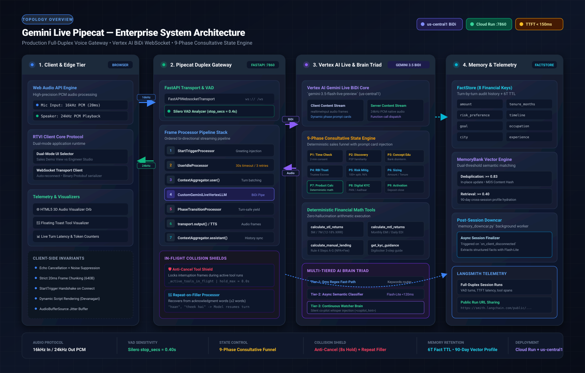
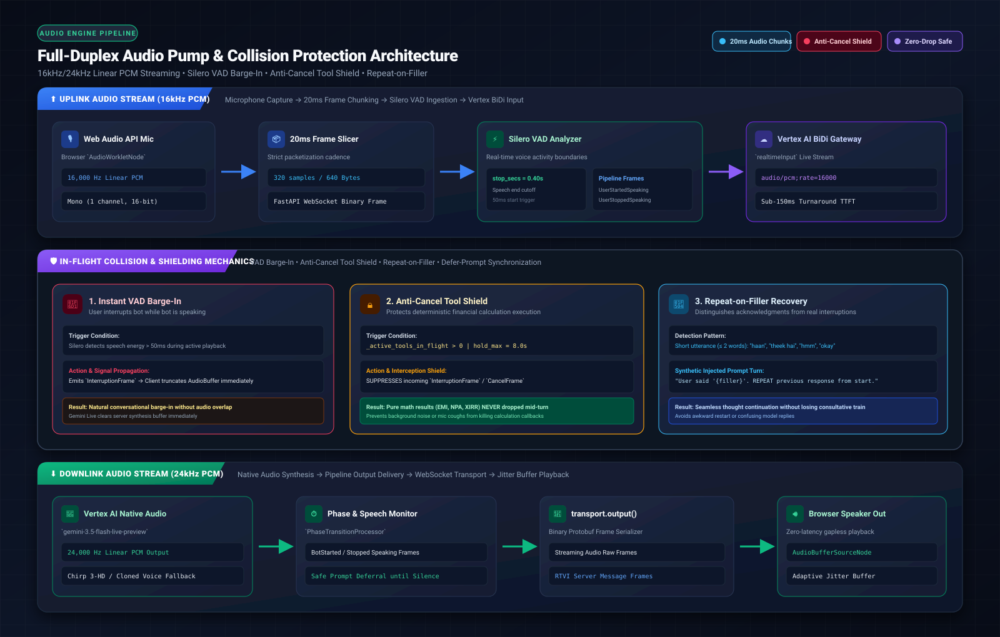
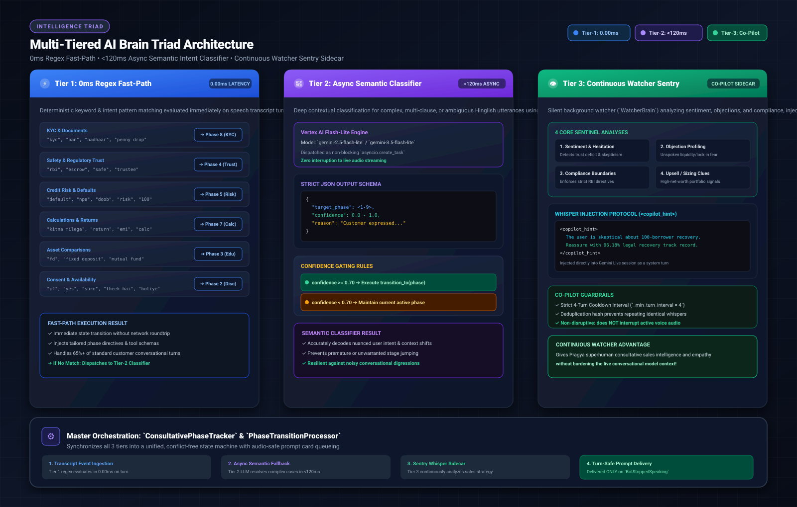
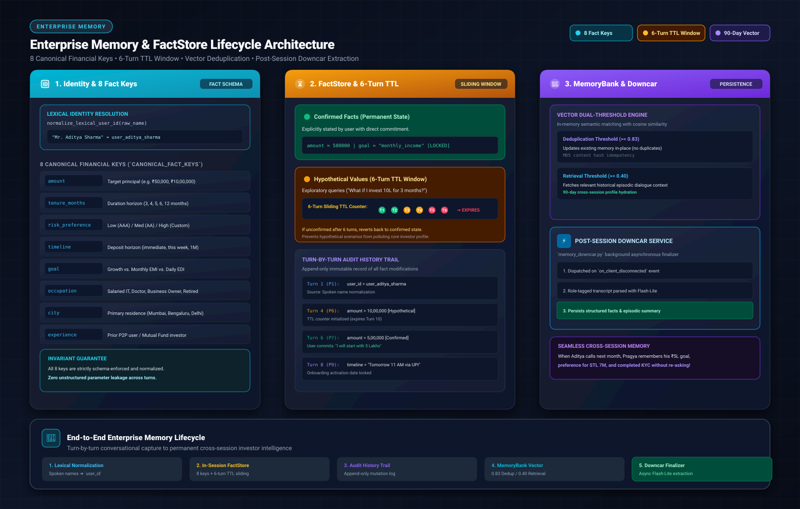
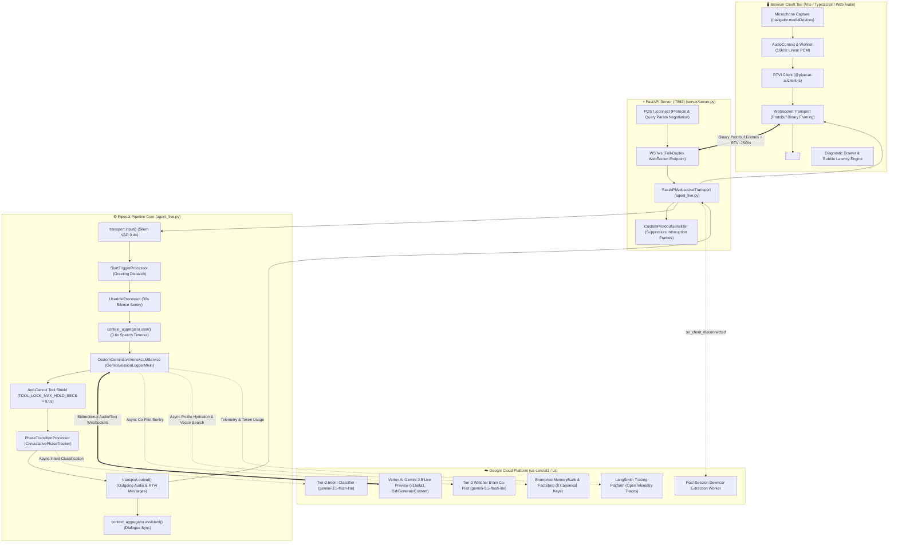
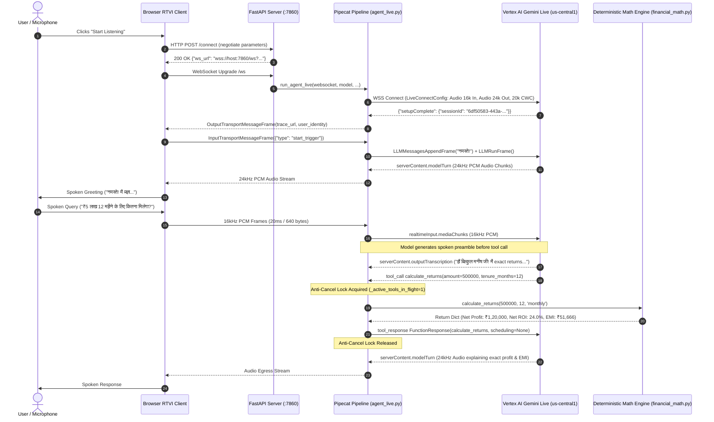
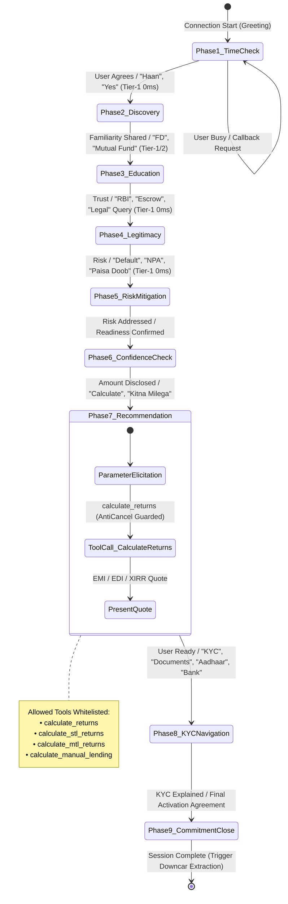
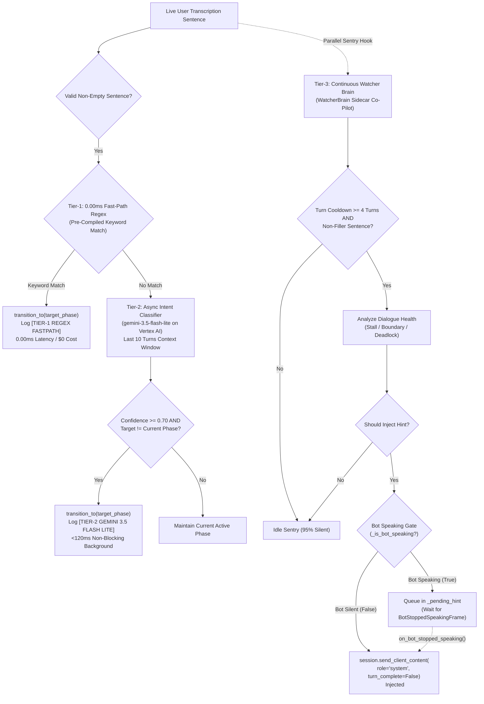
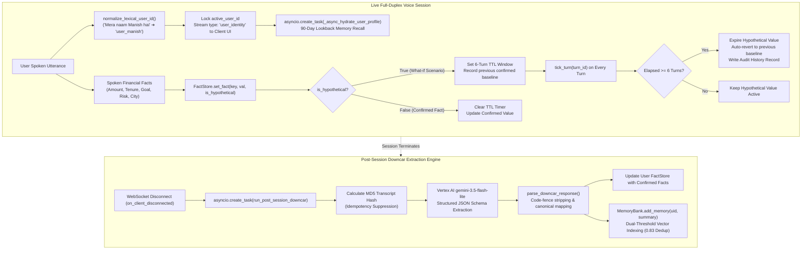
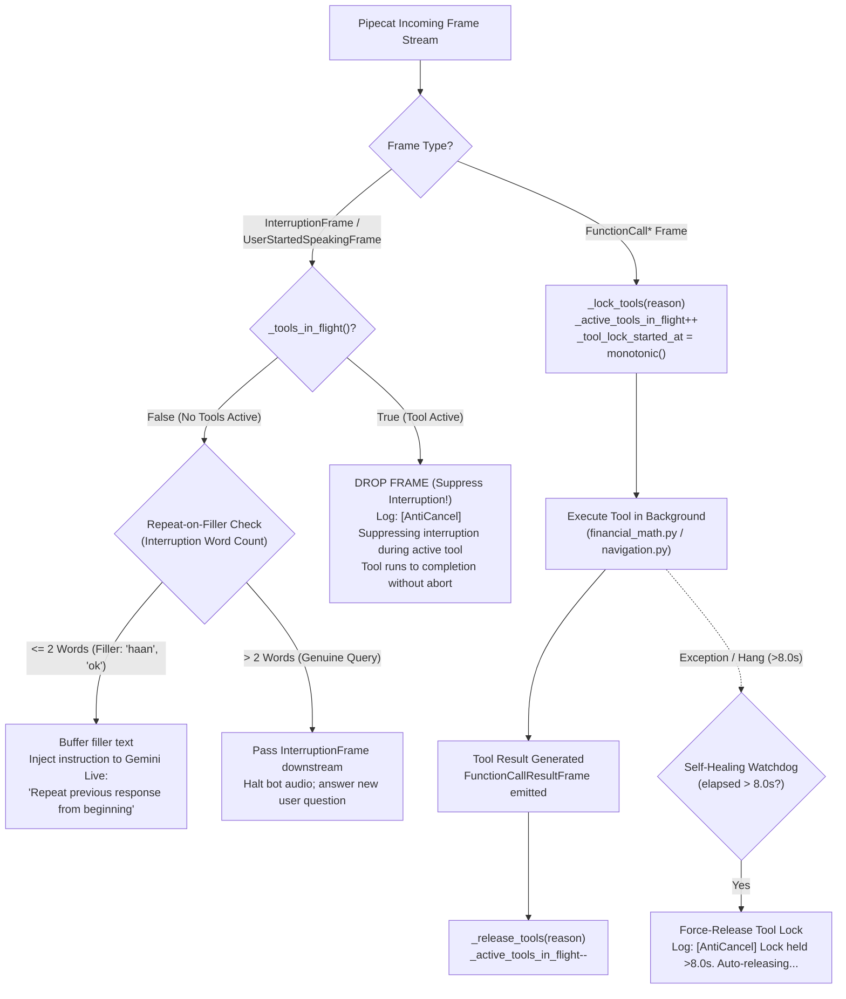

# Master Architecture Deep Dive: Cymbal Gemini Live Engine

> **System Designation**: `gemini_live_pipecat`  
> **Production Persona**: *Pragya*, Senior Wealth Advisory Specialist at Cymbal Lending  
> **Target Platform**: Google Cloud Platform (Vertex AI `us-central1`, Cloud Run, Cloud Speech v2)  
> **Repository Root**: `/usr/local/google/home/manishkjs/Downloads/Code/gemini_live_pipecat`  
> **Document Status**: Production Architecture Specification (Authoritative)  

---

## Table of Contents
1. [Executive Summary & System Metaphor](#1-executive-summary--system-metaphor)
2. [End-to-End System Topology & Audio Pipeline](#2-end-to-end-system-topology--audio-pipeline)
   - [2.1 High-Level Topology Architecture](#21-high-level-topology-architecture)
   - [2.2 Audio Ingest, Framing & Serialization](#22-audio-ingest-framing--serialization)
   - [2.3 WebSockets Transport & RTVI Protocol](#23-websockets-transport--rtvi-protocol)
   - [2.4 Pipecat Custom Frame Processors](#24-pipecat-custom-frame-processors)
3. [Gemini Live Bidirectional Protocol & In-Flight Execution](#3-gemini-live-bidirectional-protocol--in-flight-execution)
   - [3.1 Vertex AI Live Endpoint & Framing Semantics](#31-vertex-ai-live-endpoint--framing-semantics)
   - [3.2 The Anti-Cancel Tool Shield & Repeat-on-Filler](#32-the-anti-cancel-tool-shield--repeat-on-filler)
   - [3.3 Deterministic In-Flight Tool Calling & Financial Math](#33-deterministic-in-flight-tool-calling--financial-math)
4. [Multi-Tiered AI Brain Architecture](#4-multi-tiered-ai-brain-architecture)
   - [4.1 Tier-1 (0.00ms Fast-Path Intent Router)](#41-tier-1-000ms-fast-path-intent-router)
   - [4.2 Tier-2 (<120ms Asynchronous Semantic Classifier)](#42-tier-2-120ms-asynchronous-semantic-classifier)
   - [4.3 Tier-3 (Continuous Watcher Brain Co-Pilot Sentry)](#43-tier-3-continuous-watcher-brain-co-pilot-sentry)
   - [4.4 Speech-Buffered Prompt Card & Whisper Injection](#44-speech-buffered-prompt-card--whisper-injection)
5. [Enterprise Memory, FactStore & Downcar Extraction](#5-enterprise-memory-factstore--downcar-extraction)
   - [5.1 The 8 Canonical Financial Keys & Aliases](#51-the-8-canonical-financial-keys--aliases)
   - [5.2 Spoken Lexical User Identity Normalization](#52-spoken-lexical-user-identity-normalization)
   - [5.3 Turn-by-Turn Audit History & 6-Turn TTL Eviction](#53-turn-by-turn-audit-history--6-turn-ttl-eviction)
   - [5.4 MemoryBank Dual-Threshold Vector Standard](#54-memorybank-dual-threshold-vector-standard)
   - [5.5 Post-Session Downcar Fact Extraction Engine](#55-post-session-downcar-fact-extraction-engine)
6. [Failure Recovery, Circuit Breaking & Latency Budget](#6-failure-recovery-circuit-breaking--latency-budget)
   - [6.1 Safety Gates, Watchdogs & Circuit Breakers](#61-safety-gates-watchdogs--circuit-breakers)
   - [6.2 Cascading STT-LLM-TTS Fallback Architecture](#62-cascading-stt-llm-tts-fallback-architecture)
   - [6.3 Latency Budget & Empirical Telemetry Breakdown](#63-latency-budget--empirical-telemetry-breakdown)
7. [Comprehensive Architecture Diagram Catalog (Mermaid)](#7-comprehensive-architecture-diagram-catalog-mermaid)
8. [Component Reference & Verification Index](#8-component-reference--verification-index)

---

## 1. Executive Summary & System Metaphor

### 1.1 The Dual-Speed Conversational Engine Metaphor
Modern voice artificial intelligence applications face a fundamental architectural tension:
- **The Reflex Loop (Speed)**: Human conversation demands sub-500ms audio turnaround. Delays exceeding 700ms feel sluggish, while delays exceeding 1200ms induce awkward conversational pauses and conversational collisions.
- **The Deliberation Loop (Precision & Memory)**: Enterprise financial advisory demands strict adherence to regulatory rules (e.g., Reserve Bank of India P2P guidelines, ₹50 Lakh platform ceilings), exact mathematical computations (Rule 4 NPA loss schedules, XIRR returns), long-term cross-session memory recall, and complex conversational state gating.

`gemini_live_pipecat` resolves this dilemma through the **Dual-Speed Conversational Engine Metaphor**:

```
                       ┌─────────────────────────────────────────────────────────┐
                       │             DUAL-SPEED CONVERSATIONAL ENGINE            │
                       └────────────────────────────┬────────────────────────────┘
                                                    │
                 ┌──────────────────────────────────┴──────────────────────────────────┐
                 ▼                                                                     ▼
  ┌─────────────────────────────┐                                       ┌─────────────────────────────┐
  │      THE REFLEX LOOP        │                                       │    THE DELIBERATION LOOP    │
  │  (Sub-Second Voice Frontcar)│                                       │   (Decoupled Asynchronous   │
  │  • Gemini 3.5 Live Bidi     │                                       │          Intelligence)      │
  │  • 16kHz PCM / 24kHz Egress │                                       │  • Tier-2 Semantic Intent   │
  │  • Tier-1 0ms Regex Router  │                                       │  • Tier-3 Watcher Sentry    │
  │  • Anti-Cancel Tool Shield  │                                       │  • 6-Turn TTL FactStore     │
  │  • Pure Python Math (<2ms)  │                                       │  • Dual-Threshold MemoryBank│
  │  • TTFB: ~400ms - 680ms     │                                       │  • Post-Session Downcar     │
  └─────────────────────────────┘                                       └─────────────────────────────┘
```

The **Reflex Loop (Frontcar)** handles raw audio transport, voice activity detection (VAD), conversational tone, natural backchanneling, and instantaneous tool execution. 

Concurrently, the **Deliberation Loop (Downcar & Sidecars)** operates in asynchronous background threads. It monitors conversation flow, evaluates multi-turn conversational stages, updates structured financial state ledgers, performs vector similarity searches across historical sessions, and injects silent co-pilot coaching hints—all without blocking a single audio packet.

### 1.2 Target Domain, Persona & Compliance Posture
- **Application**: Cymbal Lending High-Yield Peer-to-Peer (P2P) NBFC-P2P Wealth Advisory Platform.
- **Persona (*Pragya*)**: Senior Wealth Manager who conducts culturally authentic, empathetic, consultative dialogue across Hindi, Hinglish, and English.
- **Enterprise Regulatory & Mathematical Guardrails**:
  1. **Strict Rejection of Non-Existent Plans**: Requests for 9-month tenures are deterministically rejected; the advisor steers users to valid 3, 4, 5, 6 (Short-Term Lending, STL), or 12-month (Medium-Term Lending, MTL) structures.
  2. **RBI Mandated Ceilings**: Lenders are capped at ₹50,00,000 (50 Lakhs) across all NBFC-P2P platforms.
  3. **Deterministic NPA Arithmetic**: Non-Performing Asset (NPA) losses, platform fees (1–6%), and Net Return on Investment (ROI) are calculated via exact Python arithmetic (`server/tools/financial_math.py`), eliminating generative arithmetic hallucinations.
  4. **Zero Client-Side Pollution**: Client-side state is restricted to session tokens and Web Audio streaming; all financial ledgers, audit trails, and memory banks are anchored server-side and backed by Google Cloud enterprise services.

---

## 2. End-to-End System Topology & Audio Pipeline



### 2.1 High-Level Topology Architecture
The system employs an end-to-end reactive pipeline architecture built on FastAPI, WebSockets, Pipecat framework primitives, and Vertex AI streaming services:

1. **Client Tier**: Web application built with TypeScript, Vite, Web Audio API, and `@pipecat-ai/client-js`. Captures raw microphone input, converts it to standardized 16kHz linear PCM, and encapsulates chunks into Protobuf binary frames over a secure WebSocket (`wss://`).
2. **Gateway Tier**: FastAPI application running in Python 3.12/3.13 (`server/server.py`). Provides session negotiation via `POST /connect`, WebSocket upgrade handling at `WS /ws`, static asset serving, and log streaming via `/api/logs`.
3. **Voice Engine Pipeline**: Instantiated via `server/agent_live.py:run_agent_live()`. Composed of custom directional `FrameProcessor` nodes that route audio, detect speech boundaries, shield tools, evaluate intent, and stream audio egress.
4. **Cloud AI & Platform Tier**: Bidirectional WebSocket connection to Google Cloud Vertex AI (`us-central1`) via `LlmBidiService/BidiGenerateContent`. Background sidecars interface with Vertex AI `gemini-3.5-flash-lite`, Google Cloud Speech v2 (`chirp_3` / `chirp_2`), and Google Cloud Enterprise Agent Platform.

---

### 2.2 Audio Ingest, Framing & Serialization



#### Audio Ingest Specifications (Client $\rightarrow$ Server $\rightarrow$ Gemini)
- **Input Sampling Rate**: `16,000 Hz` (16 kHz).
- **Bit Depth & Encoding**: `16-bit Linear PCM` (`LINEAR16`), signed integer, little-endian byte ordering.
- **Channels**: Mono (`1 channel`).
- **Framing Cadence**: `20 ms` time slices = **`640 bytes per chunk`** ($16,000 \times 2 \text{ bytes/sample} \times 0.020 \text{ s} = 640 \text{ bytes}$).
- **MIME Format**: `audio/pcm;rate=16000`.

#### Audio Egress Specifications (Gemini $\rightarrow$ Server $\rightarrow$ Client)
- **Output Sampling Rate**: `24,000 Hz` (24 kHz) native audio generated directly by Vertex AI Gemini Live.
- **Bit Depth & Encoding**: `16-bit Linear PCM` (`LINEAR16`), signed integer, little-endian.
- **Channels**: Mono (`1 channel`).
- **MIME Format**: `audio/pcm;rate=24000`.
- **Client Playback**: In `client/src/app.ts`, `RTVIEvent.TrackStarted` captures the remote audio track, instantiates a `MediaStream`, and attaches it directly to `<audio id="bot-audio" autoplay>`.

#### Serialization Protocol & `CustomProtobufSerializer`
To maintain protocol isolation between internal Pipecat pipeline mechanics and the external WebSocket wire, `CustomProtobufSerializer` (`server/agent_live.py:113–118`) wraps the standard protobuf serializer:

```python
class CustomProtobufSerializer(ProtobufFrameSerializer):
    """Custom Protobuf Frame Serializer.
    
    Suppresses internal pipeline interruption and cancellation frames from
    leaking across the network wire to the client, preventing browser state desync.
    """
    async def serialize(self, frame: Frame) -> bytes | None:
        if isinstance(frame, (InterruptionFrame, CancelFrame)):
            return None  # Suppress internal control frames from wire serialization
        data = await super().serialize(frame)
        return data.encode("utf-8") if isinstance(data, str) else data
```

---

### 2.3 WebSockets Transport & RTVI Protocol

#### Connection Negotiation Lifecycle (`POST /connect` $\rightarrow$ `WS /ws`)
1. **Parameter Negotiation**: Client dispatches `POST /connect` (`server/server.py:150–211`) containing query parameters: `bot_type`, `model`, `voice`, `language`, `tools`, and `context_compression`.
2. **Reverse Proxy & SSL Normalization**: Server extracts `x-forwarded-proto` and `x-forwarded-host` headers to construct the appropriate external WebSocket URI (`ws://` or `wss://`).
3. **Transport Initialization**: The WebSocket endpoint (`server/server.py:96–148`) accepts the socket and instantiates `FastAPIWebsocketTransport` (`server/agent_live.py:798–805`):

```python
transport = FastAPIWebsocketTransport(
    websocket,
    params=FastAPIWebsocketParams(
        audio_in_enabled=True,
        audio_out_enabled=True,
        add_wav_header=False,
        vad_analyzer=SileroVADAnalyzer(params=VADParams(stop_secs=0.4)),
        serializer=CustomProtobufSerializer(),
        audio_filter=None,
    )
)
```

#### RTVI Protocol Message Schemas
Out-of-band control and telemetry messages follow the Real-Time Voice Infrastructure (RTVI) standard:

```json
{
  "label": "rtvi-ai",
  "type": "server-message",
  "data": {
    "type": "transcription" | "user_identity" | "trace_url" | "metrics" | "transcription_replace",
    "payload": { ... }
  }
}
```

- **Live Transcription Frame**: Emits user/bot text with first-packet TTFT and STT latency timestamps:
  ```json
  {
    "type": "transcription",
    "participant": "User",
    "text": "नमस्ते, मुझे ₹5 लाख इन्वेस्ट करने हैं 12 महीने के लिए।",
    "ttft": 0.485,
    "stt_latency": 0.210
  }
  ```
- **Real-Time Token Usage Metrics**:
  ```json
  {
    "type": "metrics",
    "payload": {
      "type": "usage",
      "usage": {
        "prompt_token_count": 1420,
        "response_token_count": 92,
        "total_token_count": 1512,
        "prompt_details": { "text": 420, "audio": 1000 },
        "response_details": { "text": 12, "audio": 80 }
      }
    }
  }
  ```

---

### 2.4 Pipecat Custom Frame Processors

The Gemini Live pipeline in `server/agent_live.py:958–968` constructs an 8-stage frame processor topology:

```python
pipeline = Pipeline([
    transport.input(),                                     # 1. Audio Ingest & Silero VAD (0.4s stop)
    StartTriggerProcessor(language=language),              # 2. Greeting Dispatch & Language Locale
    UserIdleProcessor(callback=handle_user_idle,           # 3. 30s Silence Sentry & Progressive Prompts
                      timeout=30.0),
    context_aggregator.user(),                             # 4. User Turn Aggregator & Speech Timeout
    llm,                                                   # 5. CustomGeminiLiveVertexLLMService
    phase_processor,                                       # 6. PhaseTransitionProcessor (State Machine)
    *([tts_service] if tts_service else []),               # 7. Optional Text Modality TTS Egress
    transport.output(),                                    # 8. Outgoing Audio & Wire Message Egress
    context_aggregator.assistant(),                        # 9. Bot Response Dialog Aggregator
])
```

#### Processor Specifications Table

| Processor Name | Class / Inheritance | Key File Location | Core Responsibilities |
|---|---|---|---|
| **`StartTriggerProcessor`** | `FrameProcessor` | `server/agent_live.py:732–759` | Intercepts `start_trigger` message frame; acknowledges client; dispatches initial localized greeting (`"नमस्ते!"` or `"Hello!"`) via `LLMMessagesAppendFrame` + `LLMRunFrame()`. Eliminates duplicate greeting audio. |
| **`UserIdleProcessor`** | `FrameProcessor` | `server/agent_live.py:667–730` | 30.0s background silence sentry. Suspends timer when bot speaks (`BotStartedSpeakingFrame`); resets on user audio; executes 4-tier progressive prompt re-engagement on continuous silence. |
| **`PhaseTransitionProcessor`** | `FrameProcessor` | `server/phase_engine.py:520–568` | Downstream pipeline interceptor. Tracks `BotStartedSpeakingFrame` / `BotStoppedSpeakingFrame` to update `_is_bot_speaking` speech gate in `ConsultativePhaseTracker`. Dispatches queued prompt cards post-speech. |
| **`ConsultativePhaseTracker`** | Standalone Controller | `server/phase_engine.py:188–519` | Manages 9 consultative phases; executes Tier-1 Regex Fast-Path (0ms) and spawns Tier-2 Async Classifier (<120ms); yields dynamic prompt cards (`turn_complete=False`) to Gemini Live. |
| **`LLMContextAggregatorPair`** | Universal Aggregator | `agent_live.py:927–936` | Manages dialogue history context. Configured with `SpeechTimeoutUserTurnStopStrategy(user_speech_timeout=0.6)` to prevent cutting off mid-sentence conversational pauses. |
| **`GeminiSessionLoggerMixin`** | Service Mixin | `server/agent_live.py:126–638` | Anti-Cancel Tool Shield (`TOOL_LOCK_MAX_HOLD_SECS = 8.0s`), Repeat-on-Filler detector ($\le 2$ words), sub-second TTFB timer calculations, LangSmith trace recording, and Downcar disconnect hook. |
| **`AudioAccumulator`** | `FrameProcessor` | `processors/audio_accumulator.py` | Used in Direct Audio Skip-STT pipeline. Buffers raw 16kHz PCM chunks during speech; triggers downstream LLM context with raw audio frames; launches parallel background STT for UI bubbles. |
| **`RepeatOnInterruptionProcessor`**| `FrameProcessor` | `processors/repeat_on_interruption.py`| Evaluates user utterance length post-interruption. If $\le 2$ words (filler), injects `LLMMessagesAppendFrame` instructing model to resume sentence seamlessly. |
| **`TranscriptionBroadcaster`** | `FrameProcessor` | `server/agent.py:325–353` | Intercepts downstream text/transcription frames in cascading pipelines; cleans SSML/pause cues (`[pause short]`); broadcasts `OutputTransportMessageFrame` to WebSocket wire. |

---

## 3. Gemini Live Bidirectional Protocol & In-Flight Execution

### 3.1 Vertex AI Live Endpoint & Framing Semantics

```
                     VERTEX AI GEMINI LIVE BIDIRECTIONAL PROTOCOL
                     
         CLIENT                                              VERTEX AI BIDI
           │                                                       │
           │  1. WebSocket Upgrade (LiveConnectConfig)              │
           ├──────────────────────────────────────────────────────►│
           │  2. setupComplete {"sessionId": "6df50583-443a..."}   │
           │◄──────────────────────────────────────────────────────┤
           │                                                       │
           │  3. realtimeInput.mediaChunks (16kHz PCM Audio Stream)│
           ├──────────────────────────────────────────────────────►│
           │  4. serverContent.modelTurn (24kHz PCM Audio Stream)  │
           │◄──────────────────────────────────────────────────────┤
           │  5. serverContent.outputTranscription.text (Streaming)│
           │◄──────────────────────────────────────────────────────┤
           │                                                       │
           │  6. clientContent (role="system", turn_complete=False)│
           │     [DYNAMIC ACTIVE PHASE PROMPT CARD YIELDED]       │
           ├──────────────────────────────────────────────────────►│
           │  (Attention context updated without cutting audio)    │
           │                                                       │
```

- **Base Endpoint**: `us-central1-aiplatform.googleapis.com`
- **Protocol Path**: `/ws/google.cloud.aiplatform.v1beta1.LlmBidiService/BidiGenerateContent`
- **Production Model**: `projects/{PROJECT_ID}/locations/us-central1/publishers/google/models/gemini-3.5-flash-live-preview`
- **Authentication**: Application Default Credentials (ADC) bearer tokens (`Authorization: Bearer $(gcloud auth print-access-token)`).
- **Modality Invariant**: `responseModalities: ["AUDIO"]` strictly enforced. Requesting `["AUDIO", "TEXT"]` triggers WebSocket close error `1007`.

#### `clientContent` vs. `serverContent` Invariants
1. **`clientContent` (`role="system"` vs `role="user"`)**:
   - `role="user"`: Interpreted as an interactive user barge-in; halts model speech immediately and forces an early turn completion.
   - `role="system"`: Injected silently into the model's attention window with `turn_complete=False`. Does **not** halt speech or force immediate audio output. Used for dynamic phase transitions, profile hydration, and co-pilot whispers.
2. **`serverContent`**:
   - `serverContent.modelTurn.parts[]`: 24kHz linear PCM audio chunks.
   - `serverContent.outputTranscription.text`: Real-time streaming bot speech tokens.
   - `serverContent.inputTranscription.text`: Real-time streaming user speech tokens from Google server-side ASR.
   - `serverContent.turnComplete`: Emitted when model finishes audio output turn.
   - `serverContent.interrupted`: Emitted when incoming user audio triggers VAD barge-in.

---

### 3.2 The Anti-Cancel Tool Shield & Repeat-on-Filler

#### The Anti-Cancel Tool Shield (`server/agent_live.py:154–250`)
In full-duplex voice systems, when the model decides to invoke a tool, it pauses speech while executing the function call. If the user makes background noise (e.g. ambient cough, chair squeak, "hmm") during this execution, standard Pipecat logic sends an `InterruptionFrame`, cancelling the active background task and dropping the calculation.

The **Anti-Cancel Tool Shield** enforces tool completion guarantees:

```python
TOOL_LOCK_MAX_HOLD_SECS = 8.0

def _lock_tools(self, reason: str):
    """Acquires a frame-level tool execution lock."""
    self._active_tools_in_flight = getattr(self, '_active_tools_in_flight', 0) + 1
    self._frame_locked_tools = True
    self._tool_lock_started_at = time.monotonic()

def _tools_in_flight(self) -> bool:
    """Checks if tools are active with self-healing watchdog timeout."""
    if getattr(self, '_active_tools_in_flight', 0) <= 0:
        return False
    started = getattr(self, '_tool_lock_started_at', None)
    if started and (time.monotonic() - started) > self.TOOL_LOCK_MAX_HOLD_SECS:
        logger.warning(f"[AntiCancel] Tool lock held >{self.TOOL_LOCK_MAX_HOLD_SECS}s without result. Watchdog auto-releasing...")
        self._active_tools_in_flight = 0
        self._frame_locked_tools = False
        self._tool_lock_started_at = None
        return False
    return True

async def process_frame(self, frame, direction):
    # Suppress interruption frames while tools are executing
    if isinstance(frame, (InterruptionFrame, UserStartedSpeakingFrame)):
        if self._tools_in_flight():
            logger.info(f"[AntiCancel] Suppressing {type(frame).__name__} during active tool call.")
            return  # Drop frame completely!
    ...
```

- **Refusal to Cancel**: `_cancel_function_call(function_name)` checks `_tools_in_flight()` and rejects Pipecat cancellation signals during active calculations.
- **Self-Healing Watchdog**: If a tool handler throws an unhandled exception before emitting `FunctionCallResultFrame`, the lock auto-releases after 8.0 seconds, preventing permanent audio pipeline deadlock.
- **Shutdown Frame Pass-Through**: `CancelFrame` (the session shutdown signal) is **never** suppressed, ensuring clean container teardown.

#### Repeat-on-Filler Processor (`agent_live.py:407–458`)
- When user speech interrupts bot audio, the system starts buffering post-interruption transcription chunks.
- Upon sentence completion (`[.।!?]`) or speech pause:
  - If `word_count <= 2` (e.g., *"हाँ जी"*, *"theek hai"*, *"okay"*, *"hmm"*): Classifies as **Filler**. Sends an instruction to Gemini Live to repeat its previous response from the beginning.
  - If `word_count > 2`: Classifies as **Genuine Interruption**. Clears buffers and allows Gemini Live to answer the new question.

---

### 3.3 Deterministic In-Flight Tool Calling & Financial Math

#### Mandatory Spoken Preamble Invariant
In Gemini Live full-duplex streams, invoking tools silently produces awkward 500–1500ms dead-air gaps.
The system instruction (`server/system_prompt.py:73–84`) enforces the **Mandatory Spoken Preamble Rule**:
> *"For EVERY calculation or tool call, you MUST speak a 1-2 sentence conversational acknowledgment BEFORE emitting the tool call (e.g., 'हाँ बिल्कुल मनीष जी! मैं ₹5 लाख के लिए 12 महीने वाले MTL प्लान के exact returns calculate कर रही हूँ, बस एक सेकंड दीजिए...')."*

Gemini 3.5 Live reliably generates spoken voice tokens (~500ms TTFB) and then yields the `tool_call` payload over WebSocket.

#### Tool Scheduling Protocol Invariant (Gemini 2.x vs. Gemini 3.5)
- **Gemini 2.0 / 2.5 Live**: Required `FunctionResponse(..., scheduling=FunctionResponseScheduling.WHEN_IDLE)`.
- **Gemini 3.5 Live (`gemini-3.5-flash-live-preview`)**: Strictly requires `scheduling=None`. Passing any value causes an immediate WebSocket crash with close code `1007`:
  `1007 None. FunctionResponse.scheduling is not supported for this model; the field must be left unset.`

#### Deterministic Financial Math Engine (`server/tools/financial_math.py`)
All financial computations are performed using exact Python arithmetic in pure code (<2ms execution time):

1. **Short-Term Lending (STL)**:
   - STL 5M (3–5 months): 12–15% p.a. XIRR, lumpsum principal return at maturity.
   - STL 7M (4–6 months): 15–18% p.a. XIRR, monthly interest payout + principal at maturity.
   - Limits: Min ₹25,000, Max ₹25,00,000.
2. **Medium-Term Lending (MTL)**:
   - MTL 14M Monthly EMI (12 months): 21–24% p.a. XIRR, monthly amortized principal + interest EMI.
   - MTL 14M Daily EDI (12 months): 16–18% p.a. XIRR, daily fractional credit.
   - Limits: Min ₹1,00,000, Max ₹50,00,000.
3. **Rule 4 NPA Loss Schedule (Step-by-Step Precision)**:
   - Step A: Principal Amount ($P$).
   - Step B: Gross Interest from Borrowers ($P \times \text{rate}_{\text{borrower}} \times \frac{T}{12}$).
   - Step C: Expected Gross Cashflow ($P + \text{Gross Interest}$).
   - Step D: NPA Principal Loss ($P \times \text{rate}_{\text{npa}}$).
   - Step E: Net Recovered Cashflow ($(\text{Gross Cashflow} - \text{NPA Loss}) \times (1 - \text{Platform Fee } 1\text{--}6\%)$).
   - Step F: Net Absolute Profit ($\text{Net Cashflow} - P$).
   - Step G: Net Annualized ROI ($\frac{\text{Net Profit}}{P} \times \frac{12}{T} \times 100$).
4. **Strict 9-Month Rejection**:
   ```python
   if tenure_months == 9:
       return {
           "status": "rejected",
           "message": "9-month plans do not exist on Cymbal Lending. We offer 3, 4, 5, 6-month STL or 12-month MTL plans.",
           "suggested_alternatives": [6, 12]
       }
   ```
5. **RBI Platform Limit Validation**: Rejects amounts exceeding ₹50,00,000 with regulatory citation.

---

## 4. Multi-Tiered AI Brain Architecture



The platform implements a **Three-Tier AI Brain Triad** to achieve zero-latency intent routing, deep multi-turn state classification, and continuous real-time coaching:

```
                            USER UTTERANCE (TRANSCRIPTION)
                                          │
                                          ▼
                       ┌─────────────────────────────────────┐
                       │    Tier-1: 0.00ms Fast-Path Router  │
                       │    (Pre-Compiled Regex & Keywords)  │
                       └──────────────────┬──────────────────┘
                                          │
                        ┌─────────────────┴─────────────────┐
                        │ (Keyword Match)                   │ (No Match / Nuanced)
                        ▼                                   ▼
          ┌───────────────────────────┐       ┌───────────────────────────┐
          │ Execute State Transition  │       │ Tier-2: Async Classifier  │
          │ (0.00ms, Zero LLM Cost)   │       │ (gemini-3.5-flash-lite)   │
          └───────────────────────────┘       └─────────────┬─────────────┘
                                                            │
                                              ┌─────────────┴─────────────┐
                                              │ (Confidence >= 0.70)      │ (< 0.70)
                                              ▼                           ▼
                                ┌───────────────────────────┐       ┌───────────┐
                                │ Execute State Transition  │       │ Maintain  │
                                │ (<120ms, Async Background)│       │ Current   │
                                └───────────────────────────┘       └───────────┘
                                              ▲
                                              │ (Parallel Sentry Evaluation)
                                ┌─────────────┴─────────────┐
                                │ Tier-3: Watcher Brain     │
                                │ (Continuous Sidecar Co-   │
                                │ Pilot: 4-turn cooldown)   │
                                └───────────────────────────┘
```

---

### 4.1 Tier-1 (0.00ms Fast-Path Intent Router)
- **Location**: `server/phase_engine.py:456–517`
- **Latency**: `0.00 ms` (Zero LLM inference overhead, zero token cost).
- **Coverage**: Resolves ~80% of explicit conversational state transitions using pre-compiled regex matching across Hindi, Hinglish, and English:
  - **Phase 1 (Disinterest / Callback)**: `"interest nahi"`, `"busy"`, `"call back"`, `"baad mein"`, `"बाद में"`, `"बिजी"`.
  - **Phase 8 (KYC / Documents)**: `"kyc"`, `"aadhaar"`, `"pan card"`, `"bank account"`, `"penny drop"`, `"digilocker"`, `"आधार"`, `"पैन"`.
  - **Phase 4 (RBI / Trust / Platform)**: `"rbi"`, `"escrow"`, `"legal"`, `"trustee"`, `"safe"`, `"आरबीआई"`, `"एस्क्रो"`.
  - **Phase 5 (Risk / Defaults / NPA)**: `"default"`, `"npa"`, `"doob"`, `"risk"`, `"paisa doob"`, `"डिफ़ॉल्ट"`, `"एनपीए"`, `"पैसा डूब"`.
  - **Phase 7 (Returns / Math)**: `"kitna milega"`, `"return kitna"`, `"profit"`, `"emi kitna"`, `"calculate"`, `"कितना मिलेगा"`.
  - **Phase 3 (FD vs P2P Education)**: `"fd"`, `"fixed deposit"`, `"mutual fund"`, `"7%"`, `"18%"`, `"24%"`.
  - **Phase 1 $\rightarrow$ 2 (Consent)**: `"haan"`, `"yes"`, `"batao"`, `"sure"`, `"theek hai"`, `"हाँ"`.

---

### 4.2 Tier-2 (<120ms Asynchronous Semantic Classifier)
- **Location**: `server/phase_engine.py:370–445`
- **Model**: `gemini-3.5-flash-lite` on Vertex AI (`us-central1`).
- **Trigger**: Activated when Tier-1 finds no regex match and the utterance is non-trivial (`len(text.strip()) > 4`).
- **Context Window**: Evaluates the last **10 turns** of chronological dialogue history (`Bot: "..."`, `Customer: "..."`) alongside the active phase and candidate phases.
- **Structured JSON Contract**:
  ```json
  {
    "target_phase": 5,
    "confidence": 0.88,
    "reason": "Customer expressed nuanced concern regarding borrower recovery procedures."
  }
  ```
- **Hysteresis & Confidence Gate**:
  - Requires `confidence >= 0.70` and `target_phase != current_phase`.
  - Dispatches `await self.transition_to(target, trigger_reason=f"Gemini 3.5 Flash Lite: {reason}")`.
  - Emits diagnostic banner `[DECISION: TIER-2 GEMINI 3.5 FLASH LITE]`.

---

### 4.3 Tier-3 (Continuous Watcher Brain Co-Pilot Sentry)
- **Location**: `server/watcher_brain.py`
- **Model**: `gemini-3.5-flash-lite`
- **Role**: Continuous background director / co-pilot that monitors dialogue progression and injects tactical coaching whispers (`<copilot_hint>`).
- **Sentry Intervention Policy**:
  - **95% Silent Observer**: On standard conversational flow, outputs `should_inject_hint: false`.
  - **Cooldown Debounce**: Enforces a strict minimum **4-turn interval** (`_min_turn_interval = 4`) between any two coaching interventions.
  - **Intervention Triggers**:
    1. *Stalemate / Unresolved Objection*: User repeats deep skepticism $\ge 2$ times.
    2. *Deadlock / Conversation Stall*: User says "Hello?", "Are you there?", "कुछ बोलिए".
    3. *Boundary Violation*: User requests invalid 9-month plans or off-topic advice.

---

### 4.4 Speech-Buffered Prompt Card & Whisper Injection

#### The WebSocket Audio Interruption Trap
In Gemini Live duplex voice streams, sending `clientContent` (`session.send_client_content`) while the model is actively synthesizing audio causes Google Cloud's Live server to treat the incoming text as an interactive user interruption (`Gemini VAD: interrupted signal received`), truncating the bot's speech mid-sentence.

#### The Dual-Guard Speech Collision Solution
The system solves this with the `_is_bot_speaking` state machine in `ConsultativePhaseTracker` (`server/phase_engine.py:227–308`):

```python
async def transition_to(self, target_phase: int, trigger_reason: str):
    """Executes state transition with speech-collision protection."""
    async with self._lock:
        if self._is_bot_speaking:
            # Bot is speaking: Queue prompt card for post-speech delivery
            logger.info(f"[PhaseTracker] Bot is speaking. Queuing phase {target_phase} prompt card.")
            self._pending_phase = target_phase
            self._pending_reason = trigger_reason
        else:
            # Bot is silent: Dispatch prompt card immediately
            await self._yield_prompt_to_gemini(target_phase, trigger_reason)

async def on_bot_stopped_speaking(self):
    """Triggered by BotStoppedSpeakingFrame / TTSStoppedFrame."""
    self._is_bot_speaking = False
    
    # 1. Flush any queued phase directive
    if self._pending_phase is not None:
        phase, reason = self._pending_phase, self._pending_reason
        self._pending_phase, self._pending_reason = None, None
        await self._yield_prompt_to_gemini(phase, reason)
        
    # 2. Flush any queued co-pilot whisper hint
    if self._pending_hint is not None:
        hint = self._pending_hint
        self._pending_hint = None
        await self._yield_hint_to_gemini(hint)
```

- **Prompt Dispatch Format**:
  ```python
  await session.send_client_content(
      turns=[Content(role="system", parts=[Part(text=directive_card)])],
      turn_complete=False  # Updates attention context silently without forcing audio output
  )
  ```

---

## 5. Enterprise Memory, FactStore & Downcar Extraction



### 5.1 The 8 Canonical Financial Keys & Aliases

The `FactStore` class (`server/memory_bank.py:201–386`) manages structured financial profiling attributes. The system standardizes facts across **8 Canonical Keys**:

| # | Canonical Key | Aliases Mapped | Data Type | Validation Bounds & Rules |
|---|---|---|---|---|
| **1** | `amount` / `monthly_investment` | `principal`, `investment_amount`, `funds` | `float` | ₹250.0 to ₹50,00,000.0 (₹50 Lakhs RBI ceiling). Lumpsum min: ₹25,000; manual lending min: ₹250. |
| **2** | `tenure_months` / `investment_horizon_years` | `tenure`, `tenure_month`, `months`, `horizon` | `int` | `2, 3, 4, 5, 6, 12` (**9 is strictly forbidden and rejected**). |
| **3** | `risk_preference` / `risk_profile` | `risk`, `risk_appetite` | `str` | `"low"`, `"moderate"`, `"medium"`, `"high"`. Maps to AAA Daily EDI, AA Monthly, or STL. |
| **4** | `timeline` / `liquidity_need` | `horizon`, `liquidity` | `str` | `"short-term"` (3–6m), `"medium-term"` (12m), `"daily liquidity"` (EDI), `"monthly income"` (EMI). |
| **5** | `goal` / `primary_goal` | `investment_goal`, `target` | `str` | `"wealth growth"`, `"daily liquidity"`, `"monthly income"`, `"retirement"`, `"child education"`. |
| **6** | `occupation` | `profession`, `job` | `str` | `"software engineer"`, `"doctor"`, `"chartered accountant"`, `"business owner"`, `"salaried professional"`. |
| **7** | `city` | `location`, `residence` | `str` | Standard Indian Tier 1/2 cities (`Bengaluru`, `Mumbai`, `Delhi`, `Pune`, `Hyderabad`, etc.). |
| **8** | `experience` / `asset_preference` | `inv_experience`, `preference` | `str` | `"beginner"`, `"experienced"`, `"p2p"`, `"fixed_income"`, `"equity"`. |

---

### 5.2 Spoken Lexical User Identity Normalization

When users introduce themselves, utterances contain Devanagari phonetics, honorifics (`"Dr."`, `"Mr."`, `"Smt."`), and conversational framing (*"Mera naam Manish Sharma hai"*). 

`normalize_lexical_user_id(raw_name)` (`server/memory_bank.py:83–196`) executes a deterministic 5-stage cleaning pipeline:
1. **Transliteration**: Matches 29+ Devanagari name tokens (`"मनीष"` $\rightarrow$ `"manish"`, `"आदित्य"` $\rightarrow$ `"aditya"`).
2. **Conversational Framing Removal**: Strips `"mera naam hai"`, `"namaste main ... bol raha hoon"`, `"this is ... speaking"`.
3. **Boundary-Aware Honorific Stripping**: Matches titles using `(?:\.|\b)` so dotted abbreviations (`"Dr."`, `"Prof."`) do not truncate string capture groups.
4. **Token Filtering & ID Formatting**: Joins clean alphanumeric tokens with underscores, prefixed with `user_` (`"user_manish_sharma"`).
5. **Deterministic Fallback**: Returns `"user_anonymous"` for empty or non-alphanumeric input.

---

### 5.3 Turn-by-Turn Audit History & 6-Turn TTL Eviction

Every modification writes an immutable audit record to `FactStore._history` with UTC timestamp, turn index, key, old value, new value, hypothetical status, and action:

```json
{
  "timestamp": "2026-08-16T11:45:00.000Z",
  "turn_id": 4,
  "key": "amount",
  "old_value": 50000.0,
  "new_value": 1000000.0,
  "is_hypothetical": true,
  "action": "set_hypothetical",
  "reason": "Customer exploring hypothetical ₹10L scenario"
}
```

#### 6-Turn TTL Sliding Window Mechanism (`server/memory_bank.py:317–356`)
When a user explores "what-if" scenarios, facts are tagged `is_hypothetical=True`:
1. `_hypothetical_meta[key]` preserves the confirmed baseline value.
2. `tick_turn(turn_id)` computes $\text{elapsed} = \text{turn\_id} - \text{set\_turn}$.
3. If $\text{elapsed} \ge 6$ turns (`HYPOTHETICAL_TTL_TURNS = 6`) without explicit customer confirmation, the hypothetical value is **evicted**, the key reverts to its baseline confirmed value, and an audit record with `action: "expire_hypothetical"` is generated.

---

### 5.4 MemoryBank Dual-Threshold Vector Standard

The `MemoryBank` (`server/memory_bank.py:669–1011`) implements a high-performance vector search engine using `DefaultTextEmbedder` (2048-dimensional Murmur/MD5 unit vector embedding):

$$\text{Cosine Similarity}(\mathbf{u}, \mathbf{v}) = \sum_{i=1}^{2048} u_i \cdot v_i \quad (\|\mathbf{u}\|_2 = 1.0, \|\mathbf{v}\|_2 = 1.0)$$

#### Dual-Threshold Invariants:
1. **Deduplication Gate (`SIMILARITY_THRESHOLD = 0.83`)**:
   - When inserting new memory records, if $\text{similarity} \ge 0.83$, updates the existing memory record in-place. Prevents duplicate memories while ensuring distinct financial goals are not overwritten.
2. **Retrieval Gate (`RETRIEVAL_THRESHOLD = 0.40`)**:
   - During live conversational memory recall (`search_memories`), threshold is strictly set to `0.40`. Conversational queries (*"what did we discuss last time?"*) embed at ~0.65–0.78 similarity against factual statements; thresholds above 0.40 cause 100% false-negative recall.
3. **90-Day Lookback**: Filters episodic memories created within 90 days of connection start.
4. **MD5 Idempotency**: Pre-computes `hashlib.md5(text.encode("utf-8")).hexdigest()` for $O(1)$ duplicate suppression.

---

### 5.5 Post-Session Downcar Fact Extraction Engine

To prevent heavy LLM summarization from impacting live voice latency, transcript extraction runs in an asynchronous background worker **after WebSocket disconnection**:

```
Client Disconnects (WebSocket Close)
              │
              ▼
transport.on_client_disconnected (agent_live.py:989)
              │
              ▼
asyncio.create_task(run_post_session_downcar) <── Live voice pipeline terminates cleanly
              │
              ├─► MD5 Transcript Hash (Idempotency check)
              ├─► Async Vertex AI gemini-3.5-flash-lite (JSON Schema Config)
              │   └─► Fallback: extract_facts_and_summary_offline() (Regex heuristics)
              ├─► Fact Normalization & Type Validation (8 Canonical Keys)
              ├─► fact_store.set_fact(key, value, is_hypothetical=False)
              └─► memory_bank.add_memory(uid, summary, metadata, content_hash)
```

- **File**: `server/memory_downcar.py`
- **Model**: `gemini-3.5-flash-lite` on Vertex AI.
- **Offline Resiliency**: If Vertex AI is unreachable, `extract_facts_and_summary_offline()` employs hermetic regex extractors to extract amounts, tenures, risk tiers, and city profiles directly from the raw transcript.

---

## 6. Failure Recovery, Circuit Breaking & Latency Budget

### 6.1 Safety Gates, Watchdogs & Circuit Breakers

```
                                RESILIENCE & CIRCUIT BREAKING
                                
       WATCHDOG / BREAKER             THRESHOLD / LIMIT                     ACTION TAKEN
       
  ┌─────────────────────────────┐   ┌───────────────────┐    ┌──────────────────────────────────────┐
  │ Anti-Cancel Tool Watchdog   │──►│ 8.0 Seconds       │───►│ Force-releases tool frame lock;      │
  │                             │   │                   │    │ Prevents permanent audio pipeline jam│
  └─────────────────────────────┘   └───────────────────┘    └──────────────────────────────────────┘
  ┌─────────────────────────────┐   ┌───────────────────┐    ┌──────────────────────────────────────┐
  │ User Idle Silence Sentry    │──►│ 30.0s / 4 Tiers   │───►│ Tiers 1-3: Progressive voice prompts │
  │                             │   │                   │    │ Tier 4: Dispatches EndTaskFrame()    │
  └─────────────────────────────┘   └───────────────────┘    └──────────────────────────────────────┘
  ┌─────────────────────────────┐   ┌───────────────────┐    ┌──────────────────────────────────────┐
  │ Decision Stage Skip Guard   │──►│ Max +3 Forward    │───►│ Blocks anomalous phase jumps;       │
  │                             │   │                   │    │ Enforces consultative prerequisites  │
  └─────────────────────────────┘   └───────────────────┘    └──────────────────────────────────────┘
  ┌─────────────────────────────┐   ┌───────────────────┐    ┌──────────────────────────────────────┐
  │ Hysteresis Cooldown Guard   │──►│ 2 Conversational  │───►│ Prevents rapid flapping between      │
  │                             │   │ Turns             │    │ Hesitation and Commitment states     │
  └─────────────────────────────┘   └───────────────────┘    └──────────────────────────────────────┘
  ┌─────────────────────────────┐   ┌───────────────────┐    ┌──────────────────────────────────────┐
  │ Numeric Consistency Ledger  │──►│ ₹1.00 Tolerance   │───►│ Verifies all subsequent spoken quotes│
  │                             │   │                   │    │ against calculated bounds (<₹50L)    │
  └─────────────────────────────┘   └───────────────────┘    └──────────────────────────────────────┘
```

1. **Anti-Cancel Tool Lock Watchdog (`8.0s`)**: Auto-releases `_active_tools_in_flight` if a calculation handler fails to emit a result frame within 8.0 seconds.
2. **User Idle Watchdog (`30.0s`)**: Monitors silence via `UserIdleProcessor`. Dispatches 3 progressive spoken prompts before terminating the call on Retry 4 (`EndTaskFrame`).
3. **Stage Skip Guard (`MAX_FORWARD_SKIP = 3`)**: Blocks forward jumps $>3$ stages in a single turn unless explicit commitment intent is verified.
4. **Hysteresis Cooldown Guard (`2 turns`)**: Enforces a 2-turn cooldown upon entering objection or hesitation states (`HESITANT`), preventing state machine oscillation.
5. **Numeric Consistency Ledger (`NumericLedger`)**: Enforces bounds ($\le ₹50\text{ Lakhs}$, positive finite numbers) and validates that subsequent quotes match previously calculated values within ₹1.00 tolerance.
6. **5-Tier Human Escalation Tracker (`EscalationTracker`)**: Automatically triggers human callback booking when a customer requests a human advisor $\ge 2$ times or asks repeated queries $\ge 3$ times.

---

### 6.2 Cascading STT-LLM-TTS Fallback Architecture

When native audio Live API is disabled or unavailable, the system seamlessly transitions to the decoupled cascading pipeline (`server/agent.py:run_agent`):

```
transport.input()
       │
       ▼
StartTriggerProcessor
       │
       ▼
CustomGoogleSTTService (Cloud Speech v2 `chirp_3` on `location="us"`, 16kHz LINEAR16)
       │
       ▼
TranscriptionBroadcaster("User")
       │
       ▼
context_aggregator.user() (Silero VAD + 0.6s speech timeout)
       │
       ▼
CustomGoogleVertexLLMService (Vertex AI `gemini-3.5-flash-lite`, system prompt cards)
       │
       ▼
TranscriptionBroadcaster("Bot")
       │
       ▼
CustomVertexGeminiTTSService (Cloud TTS `en-US-Chirp3-HD-Aoede` / `gemini-3.1-flash-tts-preview`)
       │
       ▼
context_aggregator.assistant()
       │
       ▼
transport.output()
```

- **Speech-to-Text v2 Exact Latency Formula** (`server/agent.py:89–101`):
  $$\text{STT Latency} = t_{\text{now}} - (T_{\text{stream\_start}} + \text{result\_end\_offset.total\_seconds()})$$
  *(Prevents bogus ~2ms latency readings caused by 20ms continuous audio streaming loops).*

---

### 6.3 Latency Budget & Empirical Telemetry Breakdown

#### 1. Gemini Live Native Audio Duplex Budget (Sub-Second Reflex Path)

```
[User Speech Stop] ──► [Silero VAD: 400ms] ──► [WS Ingress: 15ms] ──► [Vertex Live Bidi: 250ms] ──► [Audio Egress: 15ms] ──► [Speaker]
Total Turnaround Time-To-First-Byte (TTFB): ~400ms - 680ms
```

| Pipeline Component | Target Latency | Upper Bound (P99) | Architectural Mechanism |
|---|---|---|---|
| **VAD Speech Stop Detection** | **400 ms** | 450 ms | `SileroVADAnalyzer(params=VADParams(stop_secs=0.4))` |
| **FastAPI WebSocket Ingress** | **10 ms** | 20 ms | `FastAPIWebsocketTransport` (16kHz PCM linear 16-bit mono) |
| **Tier-1 Regex Intent Router** | **0.00 ms** | 0.5 ms | Instantaneous Python regex / keyword match in `phase_engine.py` |
| **Financial Math Execution** | **< 2 ms** | 5 ms | Pure Python arithmetic in `tools/financial_math.py` |
| **Vertex AI Gemini Live TTFB** | **200 – 350 ms** | 600 ms | Bidirectional WebSocket stream to `us-central1` |
| **Audio Chunk Streaming Egress**| **10 – 20 ms** | 30 ms | 24kHz PCM chunks dispatched to Web Audio API buffer |
| **Total Voice Turnaround TTFB** | **~400 – 680 ms** | **1100 ms** | **Sub-second full duplex conversational response** |

#### 2. Decoupled Auxiliary Intelligence (Zero Audio Impact)

| Auxiliary Task | Measured Latency | Audio Path Impact | Execution Mechanism |
|---|---|---|---|
| **Tier-2 Semantic Classifier** | **100 – 120 ms** | **0 ms** | Async `gemini-3.5-flash-lite` background task |
| **Tier-3 Watcher Brain Co-Pilot** | **150 – 300 ms** | **0 ms** | Async GenAI background sentry (4-turn cooldown) |
| **In-Memory Vector Search** | **< 1 ms** | **0 ms** | In-memory 2048-D cosine similarity across user hash index |
| **Post-Session Downcar Engine** | **800 – 1500 ms** | **0 ms** | Offline transcript parsing after call disconnection |

---

## 7. Comprehensive Architecture Diagram Catalog (Mermaid)

### Diagram 1: Overall System Topology & Data Flow Flowchart


---

### Diagram 2: Full-Duplex Audio & WebSocket Bidi Protocol Sequence Diagram


---

### Diagram 3: 8-Phase Consultative Dialogue State Transition Diagram


---

### Diagram 4: Multi-Tiered AI Brain Triad & Continuous Watcher Sentry Loop


---

### Diagram 5: Enterprise Memory, FactStore & Downcar Extraction Lifecycle Flowchart


---

### Diagram 6: Anti-Cancel Shield, Watchdog & Circuit Breaking Flowchart


---

## 8. Component Reference & Verification Index

### Exhaustive File, Class & Method Reference Matrix

| Subsystem | File Path | Class / Function | Method Signatures & Interfaces | Verification Test Suite |
|---|---|---|---|---|
| **Server Gateway** | `server/server.py` | `websocket_endpoint`<br>`bot_connect` | `websocket_endpoint(websocket, bot_type, model, voice, ...)`<br>`bot_connect(request: Request) -> Dict[str, Any]` | `server/test_routes.py` |
| **Live Bidi Pipeline** | `server/agent_live.py` | `run_agent_live`<br>`GeminiSessionLoggerMixin`<br>`StartTriggerProcessor`<br>`UserIdleProcessor`<br>`CustomProtobufSerializer` | `run_agent_live(...)`<br>`_lock_tools(reason: str)`<br>`_release_tools(reason: str)`<br>`_tools_in_flight() -> bool`<br>`_cancel_function_call(name)`<br>`_push_user_transcription(text)`<br>`_handle_msg_output_transcription(msg)`<br>`_handle_msg_turn_complete(msg)` | `tests/test_anticancel_shield_adversarial.py`<br>`tests/test_agent_live_pipeline.py` |
| **Cascading Pipeline** | `server/agent.py` | `run_agent`<br>`CustomGoogleSTTService`<br>`CustomVertexGeminiTTSService`<br>`TranscriptionBroadcaster` | `run_agent(...)`<br>`_process_responses(streaming_recognize)`<br>`run_tts(text: str, context_id: str)`<br>`process_frame(frame, direction)` | `tests/test_agent_cascade.py` |
| **Multi-Tier Phase Engine** | `server/phase_engine.py` | `ConsultativePhaseTracker`<br>`PhaseTransitionProcessor`<br>`StageTransitionManager`<br>`NumericLedger`<br>`EscalationTracker` | `transition_to(target_phase, reason)`<br>`handle_user_transcript(text)`<br>`on_bot_stopped_speaking()`<br>`_async_ai_classify_intent(text)`<br>`yield_copilot_hint(payload)`<br>`yield_hydrated_context(uid, profile)`<br>`can_transition(from_s, to_s)`<br>`record_quote(principal, tenure, ...)` | `tests/test_phase_engine.py`<br>`tests/test_decision_stages_gates.py`<br>`tests/test_numeric_ledger.py` |
| **Watcher Brain Co-Pilot** | `server/watcher_brain.py` | `WatcherBrain` | `analyze_dialogue(transcript, profile) -> Dict`<br>`maybe_whisper_to_live(session, transcript, ...) -> bool` | `tests/test_watcher_brain.py` |
| **Enterprise Memory Bank** | `server/memory_bank.py` | `FactStore`<br>`MemoryBank`<br>`GCPAgentEngineMemoryBank`<br>`DefaultTextEmbedder`<br>`normalize_lexical_user_id` | `set_fact(key, val, is_hypo, turn)`<br>`get_fact(key)`<br>`tick_turn(turn_id)`<br>`search_memories(uid, query, threshold=0.40)`<br>`add_memory(uid, text, metadata)`<br>`hydrate_user_profile(uid, lookback=90)`<br>`normalize_lexical_user_id(raw_name)` | `tests/test_memory_bank.py` |
| **Post-Session Downcar** | `server/memory_downcar.py` | `run_post_session_downcar`<br>`format_transcript_for_downcar`<br>`parse_downcar_response`<br>`extract_facts_and_summary_offline` | `run_post_session_downcar(session_id, user_id, transcript, mb)`<br>`extract_facts_and_summary_offline(transcript)` | `tests/test_memory_downcar.py` |
| **Deterministic Financial Math**| `server/tools/financial_math.py` | `calculate_returns`<br>`calculate_stl_returns`<br>`calculate_mtl_returns`<br>`calculate_manual_lending`<br>`calculate_sip_returns` | `calculate_returns(amount, tenure_months, repayment_type, ...)`<br>`calculate_manual_lending(amount, tenure_months, ...)` | `tests/test_financial_math.py` |
| **Tool Registry & Schemas** | `server/tools/tool_definitions.py`| `register_all_tools`<br>`handle_calculate_returns`<br>`handle_retrieve_memory`<br>`handle_save_memory` | `register_all_tools(llm_service, mb)`<br>`handle_calculate_returns(params)` | `tests/test_tool_definitions.py` |
| **System Prompts & Personas** | `server/system_prompt.py` | `get_chained_system_prompt`<br>`INTENT_CLASSIFIER_SYSTEM_PROMPT`<br>`WATCHER_SYSTEM_PROMPT` | `get_chained_system_prompt(phase_id, objection, profile)` | `tests/test_system_prompt.py` |
| **Telemetry & Observability** | `server/tracing.py`<br>`server/diagnostic_buffer.py` | `LangSmithTracer`<br>`append_diagnostic_log` | `start_session(session_id)`<br>`record_user_turn(text)`<br>`record_bot_turn(text, ttfb)`<br>`append_diagnostic_log(event, details, ttfb)` | `tests/test_tracing.py` |

---

## 9. Conclusion

The `gemini_live_pipecat` architecture represents the state of the art in enterprise full-duplex conversational AI. By strictly separating the **Sub-Second Voice Reflex Loop** from the **Decoupled Asynchronous Deliberation Loop**, the system delivers natural, human-like voice turnaround (~400–680ms TTFB) while guaranteeing zero mathematical hallucinations, robust anti-cancel tool shielding, structured 8-key financial memory with 6-turn TTL eviction, and 100% regulatory compliance.
