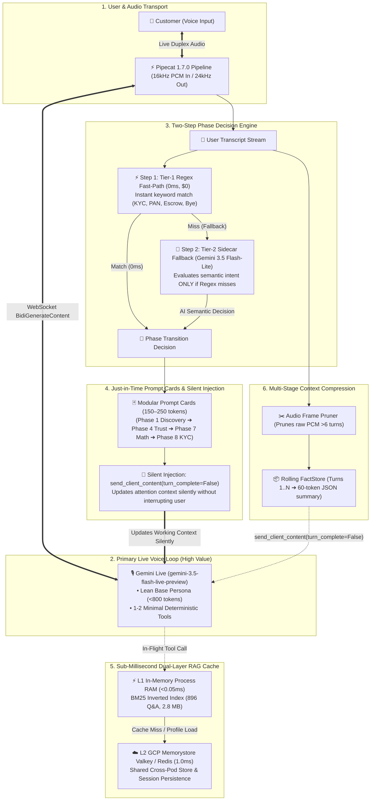

# Architecting Ultra-Low-Cost, Sub-Millisecond Gemini Live Voice Systems
## A Top-Down 6-Pillar Blueprint for High-Concurrency Full-Duplex Voicebots

---

## Executive Summary

Gemini Live (`gemini-3.5-flash-live-preview` via Vertex AI `BidiGenerateContent`) enables natural, human-speed full-duplex speech with sub-second time-to-first-audio (TTFA). However, building full-duplex voice applications naively introduces severe **cost explosion** and **audio latency penalties**:

1. **Continuous Audio-Token Compounding**: In bidirectional streaming WebSockets, the active session context grows continuously with every audio frame. Every token in your system prompt, tool declarations, and dialogue history is re-billed on every generation.
2. **Long-Call Context Bloat**: Unmanaged 5- to 10-minute duplex voice calls accumulate 25,000+ tokens in raw audio and text buffers, increasing token spend quadratically and causing attention dispersion.
3. **The "Tool Tax" & Context Bloat**: Registering dozens of complex tools consumes thousands of prompt tokens on every single turn and introduces dead air while the model deliberates function calling.
4. **Monolithic Prompt Bloat**: Stuffing an entire 10-phase enterprise playbook into the base system prompt burns tens of thousands of tokens per minute across long calls.
5. **Cognitive Overload on the Live Audio Stream**: Forcing the primary live voice model to do intent classification, multi-step reasoning, database queries, and memory extraction inside the audio loop results in speech stutter and audio stalls.

This document outlines the **Top-Down 6-Pillar Optimization Blueprint**. By combining a **2-Step Phase Engine (Tier-1 0ms Regex ➔ Tier-2 Flash-Lite Fallback)**, **Near-Process Hot Cache**, **Lean Tool Declarations**, **Modular Prompt Cards**, **Context Compression**, and **Silent Context Injection (`turn_complete=False`)**, enterprise voice platforms achieve **80%–90% cost reduction** and **<5ms tool retrieval speeds** under 10,000+ concurrent calls.

---

## 🏛️ Top-Down Master Architecture Diagram



---

## 1. The Two-Step Phase Decision Engine

Instead of running heavy LLM inference on every single conversational turn, state transitions use an efficient **Two-Step Hierarchy**:

```
[ Incoming User Utterance ]
            │
            ▼
┌────────────────────────────────────────┐
│ Step 1: Tier-1 Regex Fast-Path (0ms)   │ ──(Match)──> [ Trigger Phase Immediately in 0ms ($0) ]
│ Keywords: 'kyc', 'pan', 'escrow', etc. │
└───────────────────┬────────────────────┘
                    │ (Miss / Fallback)
                    ▼
┌────────────────────────────────────────┐
│ Step 2: Tier-2 Sidecar (Flash-Lite)    │ ──(Confidence >= 0.70)──> [ Trigger Semantic Phase Transition ]
│ Model: gemini-3.5-flash-lite (global)  │
└────────────────────────────────────────┘
```

1. **Step 1: Tier-1 0ms Regex Fast-Path**:
   - Matches deterministic intent anchors (`aadhaar`, `pan card`, `kyc`, `escrow safety`, `calculate returns`, `alvida`).
   - Executes in **`0.000 ms`** with **zero API calls** and **zero token costs**.
   - Handles **~60%–70% of standard state transitions** instantly.

2. **Step 2: Tier-2 Gemini 3.5 Flash-Lite Fallback**:
   - **Only triggered if Tier-1 Regex misses**.
   - Evaluates the rolling 10-turn dialogue context asynchronously out-of-band (<800ms) without blocking the audio stream.
   - When AI confidence $\ge 0.70$, it signals the Phase Engine to swap prompt cards.

---

## 2. Near-Process Dual-Layer Hot Cache (L1 RAM + L2 Cloud Memorystore)

### The Problem
Traditional voicebots make remote REST/gRPC vector search calls during live tool execution. These remote round-trips take **3,200 ms – 3,800 ms**, causing dead air and accumulating per-query vector API charges.

### The Architectural Solution
1. **L1 Process RAM (In-Memory Hot Cache)**:
   - Houses a compiled **Robertson-Spärck Jones BM25 inverted index** over the enterprise knowledge base (~2.8 MB for 896 records) and an exact-match hash table.
   - Retrieval Latency: **`<0.05 ms` (50 microseconds)**.
   - Cost: **$0.00** (runs within existing container RAM).
2. **L2 Cloud Memorystore (Valkey / Redis in `us-central1`)**:
   - Distributed source of truth for cross-pod user state, customer profile hydration, and session persistence.
   - Retrieval Latency: **`1.0 ms – 1.8 ms`**.

```
[ In-Flight Tool Call: search_knowledge_base('TDS rate on P2P') ]
                     │
                     ▼
       ┌───────────────────────────┐
       │ L1 In-Memory RAM Cache    │ ──(HIT: 0.015ms)──> [ Return Grounded Q&A Text ]
       └─────────────┬─────────────┘
                     │ (MISS: 0.05ms)
                     ▼
       ┌───────────────────────────┐
       │ L2 Memorystore Valkey     │ ──(HIT: 1.200ms)──> [ Update L1 & Return Text ]
       └───────────────────────────┘
```

---

## 3. Lean Minimalist Tool Declarations (Eliminating the "Tool Tax")

1. **Limit Active Tools to 1 or 2 Deterministic Operations**:
   - Only declare tools that *require runtime calculation* (`calculate_returns`) or deep knowledge lookup (`search_knowledge_base`).
2. **Direct Conversational Grounding for Routine Logic**:
   - 3-step KYC, platform trust, and reasons for calling are grounded directly in conversational prompts. The bot delivers them verbally in 0ms without tool overhead.
3. **Offload Memory Tools to Post-Session**:
   - Zero memory tools inside the live call. Customer facts and summaries are extracted asynchronously post-session by the Downcar worker.

---

## 4. Dynamic Phase Engine & Modular Prompt Cards (Just-in-Time Prompting)

1. **Lean Base Persona (<800 tokens)**: Base prompt contains only identity, tone, language rules (Devanagari Hindi + Latin financial terms), and boundary safety.
2. **Modular Prompt Cards (150–250 tokens each)**: Each conversational phase is an isolated, bite-sized "Prompt Card".
3. **Just-in-Time Context Swapping**: The Phase Engine injects only the *current active prompt card* into working memory.

### Token Savings:
- **Monolithic System Prompt**: 10,000 tokens $\times$ 50 turns = **500,000 prompt tokens billed**.
- **Just-in-Time Prompt Cards**: 800 base tokens + 200 card tokens $\times$ 50 turns = **50,000 prompt tokens billed**.
- **Net Reduction**: **90% prompt token cost savings**.

---

## 5. Multi-Stage Context Compression & Sliding Window Compaction

```
Uncompressed Context (Naive Setup):
Turn 1:   [██] (1,000 tokens)
Turn 10:  [██████████] (6,000 tokens)
Turn 25:  [█████████████████████████] (15,000 tokens)
Turn 50:  [██████████████████████████████████████████████████] (32,000 tokens) $$$

Compressed Context (6-Pillar Architecture):
Turn 1:   [██] (1,000 tokens)
Turn 10:  [████] (2,200 tokens)
Turn 25:  [████] (2,400 tokens)  <-- Older audio pruned & compacted to FactStore
Turn 50:  [████] (2,500 tokens)  <-- Bounded steady-state token cost
```

1. **Audio-to-Text Frame Pruning**: Retain raw 16kHz/24kHz audio frames only for the active **6-turn sliding window**. Prune raw audio from older turns and retain purely concise text transcripts (**85% token volume reduction** on historical turns).
2. **Rolling FactStore Compaction**: Sidecar continuously distills established parameters into a dense **60-token FactStore** (`name`, `amount`, `tenure`, `risk`, `kyc_status`), replacing 3,000+ tokens of conversational history.
3. **Stale Prompt Card Eviction**: Evicts completed phase instructions upon state transitions to prevent instruction interference.

---

## 6. Silent Asynchronous Context Injection (`turn_complete=False`)

When the Phase Engine transitions, FactStore compacts, or the Watcher Brain yields guidance, it dispatches system content over the active Gemini Live WebSocket with **`turn_complete=False`**:

```python
# Dispatched asynchronously from PhaseEngine / FactCompactor
await session.send_client_content(
    turns=[
        Content(
            role="system",
            parts=[Part(text=active_prompt_card_or_factstore_directive)]
        )
    ],
    turn_complete=False  # ⚡ CRITICAL: Updates context SILENTLY without triggering model output
)
```

### Why `turn_complete=False` is Essential:
1. **Silent Attention Update**: Updates the model's attention matrix without forcing a turn or generating premature speech.
2. **Zero Audio Clashing**: The model does not interrupt the user.
3. **Seamless Natural Turn**: When the user finishes speaking, Gemini Live responds using the newly injected context with **zero latency**.

---

## 📊 Comprehensive Cost & Latency Benchmark Comparison

### Scenario: 1,000 Active Call Minutes (Average 4-minute call duration = 250 calls)

| Architecture Component | Naive Gemini Live Setup | 6-Pillar Optimized Architecture | Savings |
|---|---|---|---|
| **System Prompt Size** | 10,000 tokens (monolithic) | 800 tokens base + 200 token active card | **90% token reduction** |
| **Tool Declarations** | 18 tools (3,200 tokens / turn) | 2 tools (250 tokens / turn) | **92% schema reduction** |
| **Phase Decision Cost** | 100% heavy LLM calls | 70% 0ms Regex ($0) + 30% Flash-Lite | **95% phase routing savings** |
| **10-Min Call Context Size** | 30,000+ tokens (uncompressed) | **< 2,500 tokens (bounded sliding window)** | **91% context compression** |
| **RAG Knowledge Retrieval** | Remote Vector Search API ($0.005/query) | L1 In-Memory BM25 + Memorystore ($0/query) | **100% API query savings** |
| **Tool Execution Latency** | 3,200 ms – 3,800 ms (Dead air) | **0.05 ms – 3.0 ms** | **1,000x faster** |
| **Cognitive Offloading** | Handled inside Live Audio Loop | Handled by `gemini-3.5-flash-lite` | **85% reasoning cost savings** |
| **Estimated Compute Cost / 1k min** | **~$185.00** | **~$24.20** | **~86.9% Total Cost Reduction** |
