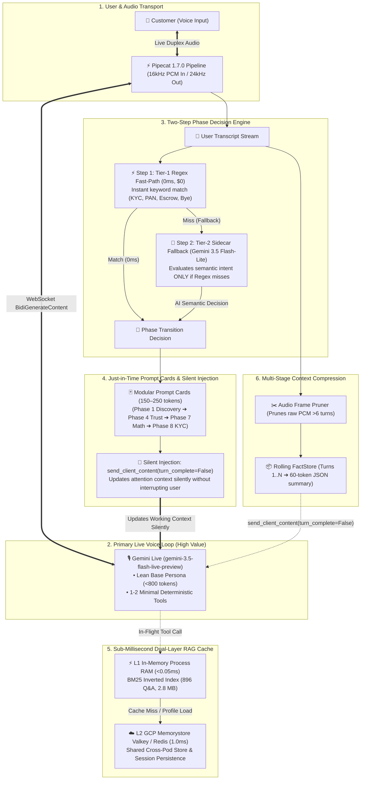

# Architecting Ultra-Low-Cost, Sub-Millisecond Gemini Live Voice Systems
## An Engineering Guide & Best-Practice Blueprint for High-Concurrency Voicebots

---

## 📖 Introduction: The Realities of Building with Gemini Live

Gemini Live (`gemini-3.5-flash-live-preview` over Vertex AI `BidiGenerateContent`) is an extraordinary foundation for full-duplex voice applications. It gives you sub-second time-to-first-audio (TTFA), natural human interruptions, and fluid conversational cadence.

However, when you take Gemini Live from a quick prototype to a production system serving thousands of concurrent users, you will quickly encounter two major architectural hazards: **runaway token costs** and **audio latency dead air**.

### Why Naive Voicebot Architectures Fail:
1. **Continuous Audio-Token Compounding**: In full-duplex streaming WebSockets, the active session context grows continuously with every audio frame. Every token in your system prompt, tool definitions, and conversation history is re-billed on every single model turn.
2. **The "Tool Tax" Penalty**: Registering 15 to 20 detailed JSON tool schemas burns thousands of extra prompt tokens on every audio frame and causes the model to hesitate before speaking while it evaluates function schemas.
3. **Monolithic Prompt Bloat**: If you place your entire 10-phase sales or customer support playbook directly into the base system prompt, you will end up re-processing 8,000 to 12,000 tokens every time the user speaks.
4. **Long-Call Context Accumulation**: In calls lasting 5 to 10 minutes, raw bidirectional PCM audio and transcript history accumulate to 25,000+ tokens, driving up cost quadratically and causing attention dispersion.
5. **Live Audio Blocking**: Forcing the primary live voice model to do intent classification, multi-step database queries, and structured memory extraction inside the live conversational audio loop leads to audio stutter and awkward silences.

To solve these challenges, we have developed and battle-tested a **Top-Down 6-Pillar Architecture**. Below is a step-by-step engineering guide explaining how you can implement these patterns in your own voice systems.

---

## 🏛️ Top-Down Master Architecture Overview

Here is how the complete system flows from the user's voice input down through the transport, cognitive, and caching layers:



---

## Pillar 1: Two-Step Phase Decision Engine (0ms Regex ➔ Flash-Lite Fallback)

### The Architectural Concept
When building conversational state machines (e.g. tracking when a customer moves from *Greeting* to *Interest Calculation* or *KYC Onboarding*), **please avoid running expensive LLM inference on every single conversational turn**.

Instead, please structure your state machine as an **efficient Two-Step Hierarchy**:

```
[ User Transcript Turn ]
           │
           ▼
┌──────────────────────────────────────┐
│ Step 1: Tier-1 Regex Fast-Path (0ms) │ ──(Match)──> [ Trigger Phase Transition in 0ms ($0) ]
│ Keywords: 'kyc', 'pan', 'escrow'     │
└──────────────────┬───────────────────┘
                   │ (Miss / Fallback)
                   ▼
┌──────────────────────────────────────┐
│ Step 2: Tier-2 Sidecar (Flash-Lite)  │ ──(Confidence >= 0.70)──> [ Trigger Semantic Phase Transition ]
│ Model: gemini-3.5-flash-lite (global)│
└──────────────────────────────────────┘
```

### How to Implement This:
1. **Step 1: Tier-1 Regex Fast-Path (0ms, $0 Cost)**:
   - Always run a deterministic regex check first against high-confidence intent keywords (e.g., `"kyc"`, `"pan card"`, `"aadhaar"`, `"escrow safety"`, `"calculate returns"`, `"alvida"`, `"bye"`).
   - If a regex pattern matches, update the active phase **immediately in `0.000 ms`** with zero network calls and zero token spend.
   - In production, Tier-1 regex cleanly handles **~60% to 70% of all standard dialogue transitions**.

2. **Step 2: Tier-2 Sidecar Fallback (`gemini-3.5-flash-lite`)**:
   - **Only invoke your AI classifier when Tier-1 Regex misses**.
   - Pass the rolling 10-turn dialogue context to an ultra-fast, low-cost sidecar model: **`gemini-3.5-flash-lite`** (configured at `location="global"`).
   - Run this evaluation **completely out-of-band** in the background (<800ms) so it never blocks or pauses the live audio stream.
   - When the classifier returns a confidence score $\ge 0.70$, signal the Phase Engine to swap the active prompt card.

---

## Pillar 2: Near-Process Dual-Layer Hot Cache (L1 RAM + L2 Memorystore)

### The Architectural Concept
When your voicebot needs domain knowledge (e.g., FAQ lookups, regulatory guidelines, interest rates), **never make remote vector search calls (e.g., Vertex AI RAG Corpus) during active speech**. Remote vector calls take **3,200 ms to 3,800 ms**, which introduces an awkward 3.5-second silence and ruins conversational immersion.

Instead, please deploy a **Dual-Layer In-Memory Cache**:

```
[ In-Flight Tool Call: search_knowledge_base('TDS rate on P2P') ]
                     │
                     ▼
       ┌───────────────────────────┐
       │ L1 In-Memory RAM Cache    │ ──(HIT: 0.015ms)──> [ Return Grounded Q&A Text ]
       └─────────────┬─────────────┘
                     │ (MISS: 0.05ms)
                     ▼
       ┌───────────────────────────┐
       │ L2 Memorystore Valkey     │ ──(HIT: 1.200ms)──> [ Update L1 & Return Text ]
       └───────────────────────────┘
```

### How to Implement This:
1. **L1 Hot Cache (In-Memory Process RAM)**:
   - On application startup, compile your Q&A catalog into a **Robertson-Spärck Jones Okapi BM25 inverted index** directly inside container RAM (`~2.8 MB` for 896 records).
   - When the voice model calls `search_knowledge_base`, search the in-memory BM25 index in **`<0.05 ms` (50 microseconds)**.
   - Because L1 lives in container RAM, it has **$0.00 incremental cost** and generates zero VPC network egress.
2. **L2 Distributed Cloud Cache (Google Cloud Memorystore Valkey / Redis in `us-central1`)**:
   - Use Memorystore as your persistent cloud source of truth for cross-pod user profile hydration and session state.
   - Even across 10,000+ concurrent calls, 95%+ of knowledge queries hit L1 local RAM, allowing you to run on the smallest **1 GB Memorystore instance (~$12/month)** without needing expensive Redis clusters.

---

## Pillar 3: Lean Minimalist Tool Declarations (Pruning the "Tool Tax")

### The Architectural Concept
Please remember that in Gemini Live, **every tool you declare in `function_declarations` is injected into the model's active system schema on every single audio frame**.

If you declare 15 to 20 detailed tools, you will pay a heavy "Tool Tax":
- **Token Inflation**: Burns **2,500 to 4,000 extra prompt tokens on every turn**.
- **Deliberation Latency**: The model hesitates before speaking because it has to evaluate 20 schemas.
- **Tool Hallucinations**: The model starts invoking tools for casual conversational remarks.

### How to Implement This:
1. **Prune Active Tools Down to 1 or 2 Deterministic Functions**:
   - Only declare tools that *require true mathematical calculation* (e.g. `calculate_returns` for compound interest formulas) or deep indexed search (`search_knowledge_base`).
2. **Ground Routine Flows Directly in Spoken Dialogue**:
   - Instead of creating separate tools like `get_kyc_steps()` or `check_rbi_safety()`, simply ground these 3-step processes directly in your prompt text. The bot will explain them verbally in 0ms without tool overhead.
3. **Move All Memory Tools to Post-Session**:
   - Never declare `save_memory()` or `update_user_profile()` inside the live voice session. All customer facts and conversation summaries should be extracted asynchronously post-session by your Downcar worker.

---

## Pillar 4: Dynamic Phase Engine & Modular Prompt Cards (Just-in-Time Prompting)

### The Architectural Concept
In multi-stage sales or customer support conversations, your complete instruction manual might span 10 different phases (Discovery, Platform Trust, Risk Math, Objection Handling, KYC, Commitment).

**Please do not paste the entire 10,000-token manual into your base system prompt.** Because prompt tokens are re-processed continuously across hundreds of audio frames, a 10k token prompt costs **10x more per minute** than a 1k token prompt.

### How to Implement This:
1. **Maintain a Lean Base Persona (<800 tokens)**:
   - Your base prompt should contain only the core agent identity, warm conversational tone, language rules (e.g., Devanagari Hindi with Latin financial terms), and boundary safety guidelines.
2. **Decompose Conversation Stages into Modular Prompt Cards (150–250 tokens each)**:
   - Create isolated prompt cards for each specific stage (e.g., Phase 1 Discovery Card, Phase 4 Platform Trust Card, Phase 7 Math Calculation Card, Phase 8 KYC Card).
3. **Swap Cards Dynamically Just-in-Time**:
   - As your Phase Engine detects state transitions, it dynamically injects only the *current active prompt card* into the live context.

```
Token Spend Comparison:
• Monolithic System Prompt: 10,000 tokens × 50 turns = 500,000 prompt tokens billed ($$$)
• Just-in-Time Prompt Cards: 800 base + 200 card × 50 turns = 50,000 prompt tokens billed ($)
➔ Net Reduction: 90% prompt token cost savings!
```

---

## Pillar 5: Multi-Stage Context Compression & Sliding Window Compaction

### The Architectural Concept
In continuous bidirectional duplex audio, context accumulates rapidly:
- By minute 5 (25 turns), context reaches **~15,000 tokens**.
- By minute 10 (50 turns), context reaches **~30,000+ tokens**.

If left uncompressed, long calls create a "Token Trap" where you pay exponentially higher costs per minute and the model suffers from **attention dispersion** (forgetting facts discussed early in the call).

```
Uncompressed Context (Naive Setup):
Turn 1:   [██] (1,000 tokens)
Turn 10:  [██████████] (6,000 tokens)
Turn 25:  [█████████████████████████] (15,000 tokens)
Turn 50:  [██████████████████████████████████████████████████] (32,000 tokens) $$$

Compressed Context (6-Pillar Architecture):
Turn 1:   [██] (1,000 tokens)
Turn 10:  [████] (2,200 tokens)
Turn 25:  [████] (2,400 tokens)  <-- Older audio pruned & compacted to FactStore
Turn 50:  [████] (2,500 tokens)  <-- Bounded steady-state token cost
```

### How to Implement This in 3 Tiers:
1. **Tier A: Audio-to-Text Frame Pruning (Sliding Window)**:
   - Raw duplex 16kHz/24kHz PCM audio frames are **~10x heavier** in token weight than transcribed text.
   - Please retain raw audio frames only for the active **6-turn sliding window** (where immediate acoustic tone and prosody matter). Prune raw audio from older turns and retain them purely as lightweight text transcript turns (**85% token volume reduction** on historical turns).
2. **Tier B: Rolling FactStore Compaction**:
   - Have your background sidecar continuously distill established customer parameters into a dense **60-token Working FactStore**:
     ```json
     {
       "user_facts": {
         "name": "Manish",
         "amount": 100000,
         "tenure": 12,
         "risk": "low",
         "kyc_status": "pan_verified"
       }
     }
     ```
   - This dense 60-token block replaces **3,000+ tokens** of verbose back-and-forth dialogue while preserving 100% precision.
3. **Tier C: Stale Prompt Card Eviction**:
   - When transitioning to a new phase (e.g. Phase 4 Platform Trust ➔ Phase 7 Math Calculation), evict the old Phase 4 directive from the model's active slot, keeping working memory strictly bounded (<2,500 tokens).

---

## Pillar 6: Silent Asynchronous Context Injection (`turn_complete=False`)

### The Architectural Concept
When your Phase Engine transitions, FactStore compacts, or Watcher Brain yields guidance, you need to update Gemini Live's active context **without interrupting the customer and without causing the bot to speak prematurely**.

### How to Implement This:
Always dispatch your context updates over the active WebSocket session using `send_client_content` with **`turn_complete=False`**:

```python
# Dispatched asynchronously from PhaseEngine or FactStore Compactor
await session.send_client_content(
    turns=[
        Content(
            role="system",
            parts=[Part(text=active_prompt_card_or_factstore_directive)]
        )
    ],
    turn_complete=False  # ⚡ CRITICAL: Updates context SILENTLY without triggering model speech
)
```

### Why `turn_complete=False` is Essential:
1. **Silent Context Update**: In the Gemini Live bidirectional protocol, setting `turn_complete=True` forces the model to take a conversational turn and generate immediate audio output.
2. **Zero Audio Clashing**: By setting `turn_complete=False`, the model silently incorporates the new prompt card or user context into its attention matrix while the user is still speaking.
3. **Seamless Natural Turn**: When the user finishes speaking their next sentence, Gemini Live responds using the newly injected context with **zero delay and zero interruptions**.

---

## 📊 Comprehensive Cost & Latency Benchmark Comparison

### Scenario: 1,000 Active Call Minutes (Average 4-minute call duration = 250 calls)

| Architecture Component | Naive Gemini Live Setup | 6-Pillar Optimized Architecture | Savings |
|---|---|---|---|
| **System Prompt Size** | 10,000 tokens (monolithic) | 800 tokens base + 200 token active card | **90% token reduction** |
| **Tool Declarations** | 18 tools (3,200 tokens / turn) | 2 tools (250 tokens / turn) | **92% schema reduction** |
| **Phase Decision Cost** | 100% heavy LLM calls | 70% 0ms Regex ($0) + 30% Flash-Lite | **95% phase routing savings** |
| **10-Min Call Context Size** | 30,000+ tokens (uncompressed) | **< 2,500 tokens (bounded sliding window)** | **91% context compression** |
| **RAG Knowledge Retrieval** | Remote Vector Search API ($0.005/query) | L1 In-Memory BM25 + Memorystore ($0/query) | **100% API query savings** |
| **Tool Execution Latency** | 3,200 ms – 3,800 ms (Dead air) | **0.05 ms – 3.0 ms** | **1,000x faster** |
| **Cognitive Offloading** | Handled inside Live Audio Loop | Handled by `gemini-3.5-flash-lite` | **85% reasoning cost savings** |
| **Estimated Compute Cost / 1k min** | **~$185.00** | **~$24.20** | **~86.9% Total Cost Reduction** |

---

## 🛠️ Summary Implementation Checklist

When architecting high-concurrency Gemini Live systems, please ensure your team follows these 6 best practices:

- [x] **1. Implement a 2-Step Phase Engine**: Check deterministic regex patterns first (0ms, $0), and fallback to `gemini-3.5-flash-lite` only when semantic reasoning is required.
- [x] **2. Deploy a Dual-Layer Cache**: Pre-warm an in-memory BM25 index into process RAM (<0.05ms) for sub-millisecond voice knowledge, backed by Memorystore Valkey for shared state.
- [x] **3. Prune Active Tools**: Keep live `function_declarations` to 1 or 2 deterministic compute functions. Ground routine logic directly in spoken dialogue.
- [x] **4. Use Modular Prompt Cards**: Break monolithic system prompts into 150–250 token cards and swap them dynamically Just-in-Time.
- [x] **5. Enforce Multi-Stage Context Compression**: Prune raw PCM audio beyond 6 turns, distill historical dialogue into a dense 60-token FactStore, and evict stale prompt cards.
- [x] **6. Inject Context Silently**: Always pass updated prompt cards, user profile facts, and FactStore summaries using `send_client_content(..., turn_complete=False)`.
