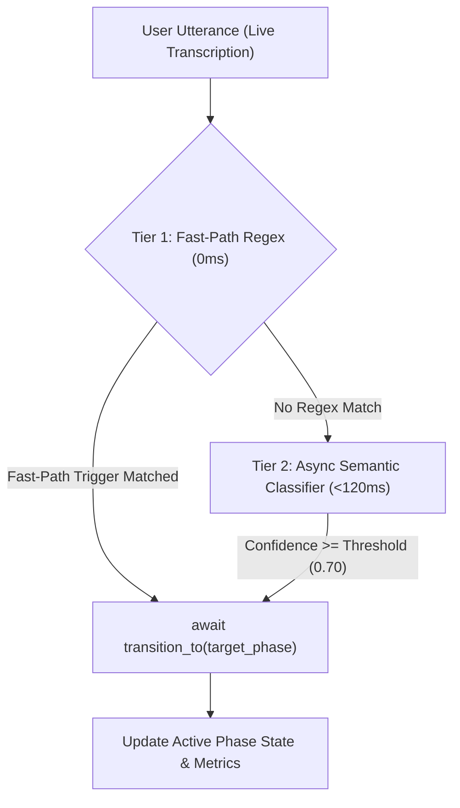

# Gemini Live Voice Engine & Duplex Protocol Reference

> [!IMPORTANT]
> **Canonical Voice Repository**: `gemini_live_pipecat` (`/usr/local/google/home/manishkjs/Downloads/Code/gemini_live_pipecat`) is the **sole canonical repository** for all Gemini Live, Pipecat duplex voice, and STT/TTS cascading applications.
> **Branch-First Rule**: ALL new voice projects, customer POCs (e.g. Lenskart, Groww, Swiggy, Lenden), and major features MUST be developed on dedicated Git branches within `gemini_live_pipecat` (e.g. `feat/<name>`, `customer/<name>`). Never create duplicate standalone voice folders in the workspace.

---

## 1. Protocol, Endpoints & Framing Matrix

| Parameter | AI Studio (Public Prod) | AI Studio (Internal / Dogfood) | Vertex AI (GA Production) |
|---|---|---|---|
| **Base Host** | `generativelanguage.googleapis.com` | `autopush-generativelanguage.sandbox.googleapis.com` | `us-central1-aiplatform.googleapis.com` |
| **API Version** | `v1alpha` or `v1beta` | `v1alpha` | `v1beta1` |
| **WebSocket Path** | `/ws/google.ai.generativelanguage.{ver}.GenerativeService.BidiGenerateContent` | `/ws/google.ai.generativelanguage.v1alpha.GenerativeService.BidiGenerateContent` | `/ws/google.cloud.aiplatform.v1beta1.LlmBidiService/BidiGenerateContent` |
| **Auth Method** | `?key=$GEMINI_API_KEY` | `Authorization: Bearer $(gcloud auth print-access-token)` | `Authorization: Bearer $(gcloud auth print-access-token)` (ADC) |
| **Headers** | `Content-Type: application/json` | `x-goog-user-project: <PROJECT_ID>`<br>`Content-Type: application/json` | `Content-Type: application/json` |
| **Operational Model** | `models/gemini-3.1-flash-live-preview` | `models/gemini-3.5-live-preview` | `projects/<PROJECT_ID>/locations/us-central1/publishers/google/models/gemini-3.5-flash-live-preview` |
| **Gemini 3.5 Live Status** | ❌ Gated (`1008 Policy Violation`) | ⚠️ Internal Dogfood Only | ✅ **100% Operational (Full Duplex Voice)** |

### Protocol & Framing Invariants
* **Error `1008` & Gating**: `gemini-3.5-live-preview` is experiment-gated on public AI Studio gateways. For production 3.5 Live voice, always route through **Vertex AI Enterprise** (`v1beta1`).
* **Session Lifecycle Rotation (10–15 min)**: The server terminates sessions periodically with `1008` after emitting `session_resumption_update`. Reconnect using `session_resumption_handle=new_handle`.
* **Modality Enforcement**: `responseModalities: ["AUDIO"]` only. Sending `["AUDIO", "TEXT"]` triggers close code `1007`.
* **Audio Formats**: Input must be PCM 16kHz 16-bit little-endian mono (`audio/pcm;rate=16000`). Output is PCM 24kHz 16-bit mono (`audio/pcm;rate=24000`).
* **Setup Handshake ACK**: Vertex AI yields `{"setupComplete": {"sessionId": "<UUID>"}}`.

---

## 2. Speech-to-Text v2 Routing & Configuration
* **`chirp_3` (Cloud Speech v2 Multilingual)**:
  - **Location Invariant**: MUST use `location="us"` (US Multi-Region) with endpoint `us-speech.googleapis.com`. `us-central1` fails with `400 Expected resource location to be global, but found us`.
  - **Languages**: `[Language("en-US"), Language("hi-IN")]` for simultaneous multilingual transcription.
  - **Streaming**: `enable_interim_results=True` for real-time partials.
* **`chirp_2`**: Hosted in `location="us-central1"` (`us-central1-speech.googleapis.com`).
* **`latest_long` / `latest_short` / `telephony`**: Available in `us-central1` / `global`.

---

## 3. IAM Permissions & Local Dev Tunneling

### Required Roles by Service
* **Vertex AI Live & LLMs**: `roles/aiplatform.user` (`aiplatform.endpoints.predict`).
* **Speech-to-Text v2**: `roles/speech.client` (`speech.recognizers.recognize`).
* **Text-to-Speech**: `roles/texttospeech.client` (`texttospeech.synthesize`).
* **ADC Quota Project**: User credentials require `gcloud auth application-default set-quota-project <PROJECT_ID>`.

### SSH Tunneling Invariant (Cloudtop VM $\rightarrow$ macOS Laptop)
* **NEVER** use synthetic Uberproxy PENs (breaks WebSocket `wss://` upgrade).
* **ALWAYS** forward the port over SSH:
  ```bash
  ssh -L 7860:localhost:7860 <vm_name>.c.googlers.com
  ```
  Open `http://localhost:7860/` in Chrome (treated as `isSecureContext === true` for microphone access).

---

## 4. Duplex Voice Pipeline & VAD Configuration

* **Native Audio Transport**:
  ```python
  transport = FastAPIWebsocketTransport(
      websocket=websocket,
      params=FastAPIWebsocketTransport.Params(
          audio_out_enabled=True,
          audio_in_enabled=True,
          vad_enabled=True,
          vad_analyzer=SileroVADAnalyzer(params=VADParams(stop_secs=0.4)),
          serializer=CustomProtobufSerializer(),
      )
  )
  ```
* **Context Compression**: Set `context_compression: true` with `trigger_tokens: 20000` to prevent context crashes in long calls.
* **Greeting Turn Invariant (Anti-Duplicate Audio)**:
  - In `StartTriggerProcessor.process_frame()`, push **ONLY** `LLMRunFrame()`.
  - **NEVER** push both `LLMContextFrame` AND `LLMRunFrame()`. `LLMUserAggregator` emits context automatically upon `LLMRunFrame()`; pushing both triggers parallel back-to-back speech.

---

## 5. Live Observability & Diagnostic Buffer
* **Zero-Disk In-Memory Ring Buffer**: Intercept Loguru and Python logging into `deque(maxlen=1500)` in `diagnostic_buffer.py`. Served via `GET /api/logs` and `POST /api/logs/clear` (1.5s client poll).
* **Token Fragment Filtering**: Never log single-word streaming fragments.
  - **User**: Flush complete sentences upon EOS punctuation (`.`, `।`, `?`, `!`) or VAD stop.
  - **Bot**: Accumulate in `_bot_turn_text_buffer`; log complete turn upon `_handle_msg_turn_complete` or `_handle_msg_interrupted`.

---

## 6. Latency Measurement & Telemetry Invariants

### A. First-Packet Live TTFB (Gemini Live)
Calculate TTFT on whichever arrives first (text transcription or audio chunk):
```python
if getattr(self, '_current_turn_ttft', None) is None and getattr(self, '_my_ttfb_start', None) is not None:
    self._current_turn_ttft = time.time() - self._my_ttfb_start
    self._my_ttfb_start = None
```

### B. Speech-to-Text v2 Exact Latency (`CustomGoogleSTTService`)
* **The 2ms Audio Stream Trap**: Continuous raw audio frames flow every 20ms during silence. Calculating `now - last_audio_time` yields bogus ~2ms readings.
* **Exact Speech Offset Formula**:
  $$\text{STT Latency} = t_{\text{now}} - (T_{\text{stream\_start}} + \text{result\_end\_offset.total\_seconds()})$$
* **`datetime.timedelta` SDK Invariant**: In Google Cloud Speech v2 Python SDK, `result_end_offset` is a native `datetime.timedelta` object (`dur.total_seconds()`), not a protobuf with `.nanos`.
```python
class CustomGoogleSTTService(GoogleSTTService):
    async def _request_generator(self):
        self._stream_start_wall_time = time.time()
        async for req in super()._request_generator():
            yield req

    async def _process_responses(self, streaming_recognize):
        async for response in streaming_recognize:
            for result in response.results:
                if result.is_final:
                    now = time.time()
                    stt_latency = None
                    if getattr(result, "result_end_offset", None) and self._stream_start_wall_time:
                        dur = result.result_end_offset
                        offset_secs = dur.total_seconds() if hasattr(dur, "total_seconds") else float(dur)
                        speech_ended_wall = self._stream_start_wall_time + offset_secs
                        elapsed = now - speech_ended_wall
                        if 0.05 <= elapsed <= 15.0:
                            stt_latency = elapsed
                    if stt_latency is not None:
                        await self.push_frame(OutputTransportMessageFrame(message={
                            "label": "rtvi-ai", "type": "server-message",
                            "data": {'type': 'metrics', 'payload': {'type': 'stt_latency', 'value': stt_latency}}
                        }))
```

### C. Strict Metric Binding & Turn Buffering
* **Label Binding**: `isCascade = this.connectedBotType === "tts-llm-stt"`.
  - **Gemini Live**: STRICTLY displays **`⚡ Live TTFB: {ms}ms`**.
  - **STT-LLM-TTS**: STRICTLY displays **`STT: {ms}ms | ⚡ LLM TTFB: {ms}ms | TTS: {ms}ms`**.
* **Async Turn Buffering (`pendingLLMLatency`)**: Store early-arriving LLM latencies in a buffer and bind directly when creating the bot DOM bubble (prevents latching onto the previous turn's bubble).
* **Cross-Turn Metric Flushing**: `resetMetrics()` must purge all latency buffers on every connection start.
* **TTFB Timer Sanity Guard**: Cap all TTFB turnaround timers at `< 15.0s` to prevent idle leaks.

---

## 7. Tool-Calling Architecture & Non-Blocking Invariants (b/511092080, b/543365708)

### A. Session Resumption Handles vs. Stable Session IDs
* **Ephemeral Handles**: Live API mints a new `session_resumption_handle` after **every single turn**.
* **Stable Session ID**: All turn handles map to a single immutable **Session ID** (`6df50583-443a-4116-845f-f39cbea8d807`). Always index logs, CRM records, and LangSmith traces by the true Session ID.

### B. Eliminating Redundant Tool-Call Loops
* **The Anti-Pattern**: Embedding large (~25k token) state machines, decision trees, or `loadSkill` sub-prompts in the System Instruction (SI). Real-time models will loop on tool calls.
* **The 3 Architecture Invariants**:
  1. **Application-Layer State Machines**: Move deterministic state routing into the Python/client application layer.
  2. **Lean System Instructions**: Keep persona, voice style, tone, and safety in the SI; strip out LOB decision trees.
  3. **Dynamic Tool Allow-Lists**: Expose ONLY the minimal subset of tools valid for the active conversation state.

### C. Non-Blocking Function Calling (`behavior: NON_BLOCKING`)
* **Setup Declaration**: Declare `behavior: "NON_BLOCKING"` in `function_declarations`.
* **❌ Anti-Pattern 1 (Prompt Hijacking)**: Never intercept tool calls to dispatch `send_client_content("speak exactly: Sure, let me check...")` with `turn_complete=True`. This breaks the causal conversational context.
* **❌ Anti-Pattern 2 (Conflicting VAD Flags)**: Do not set `automatic_activity_detection.disabled = true` while manually firing `turn_complete=True` on tool dispatches.
* **✅ Correct Pattern**:
  1. Guide persona in System Instruction to acknowledge speech naturally.
  2. Execute the tool asynchronously in background via `asyncio.create_task(...)`.
  3. Send `tool_response` (`FunctionResponse`) directly over the live WebSocket upon completion.

### D. Gemini 2.x vs. Gemini 3.5 Tool Response Scheduling Protocol
* **Gemini 2.0 / 2.5 Live**: Non-blocking tool responses require `scheduling: "WHEN_IDLE"` (`FunctionResponseScheduling.WHEN_IDLE`).
* **Gemini 3.5 Live (`gemini-3.5-flash-live-preview`)**: The Live API strictly requires `scheduling` to be left **unset** (`None`). Passing any value for `scheduling` causes an immediate WebSocket close with `1007 None. FunctionResponse.scheduling is not supported for this model; the field must be left unset.`
* **Session Handler Implementation Pattern**:
  ```python
  effective_scheduling = None if "3." in (self.model or "") else scheduling
  func_response = types.FunctionResponse(
      id=function_id,
      name=function_name,
      response=result_payload,
      scheduling=effective_scheduling,
  )
  ```

### E. Multi-Turn Spoken Acknowledgment Dynamics (2.5 vs. 3.5)
* **The Multi-Turn Silence Issue in 2.5**: `gemini-live-2.5-flash-native-audio` reliably produces spoken intro voice before tool dispatch on Turn 1, but frequently skips spoken intro tokens (`completed_chunks: 0`) on subsequent follow-up queries (Turn 2+), causing dead silence during long background tool runs.
* **Gemini 3.5 Live Advantage**: `gemini-3.5-flash-live-preview` reliably generates spoken intro voice before tool dispatch on **every single turn** (initial and follow-up turns), with ~500ms TTFB. It is the recommended model for interactive multi-turn non-blocking tool calling.
* **Mandatory Multi-Turn Prompting Guard**:
  1. Explicitly prompt the model: *"For EVERY query or tool call, including follow-up questions, you MUST generate a verbal acknowledgment before emitting the tool call."*
  2. Include multi-turn consecutive few-shots showing Turn 1 (Query -> Voice -> Tool) followed immediately by Turn 2 (Follow-up Query -> Voice -> Tool).

### G. Mandatory Anti-Hallucination Tool Trigger Pattern
* **The Silent Hallucination Trap**: When System Instructions provide conversational sample phrasing for tool usage (e.g. *"Speak warmly: 'Let me check that for you...'"*), the Live model frequently speaks the template phrasing and attempts to answer without executing the required tool call.
* **The Mandatory Trigger Rule**:
  - Always pair conversational preambles with explicit imperative requirements in the tool schema and System Instruction:
    `"Whenever user asks [query_type], you MUST execute [tool_name]. NEVER guess or answer from knowledge."`
  - Ensure tool parameter schemas have robust default fallbacks (e.g., `user_id="current_user"` resolving to active session context).

---

## 8. Dynamic Context Steering & Two-Tier Intent Routing Protocols

### A. `clientContent` Mid-Session Context Invariants (`role="system"` vs `role="user"`)
* **The Barge-In Trap**: Calling `session.send_client_content()` with `role="user"` acts as an interactive user interruption (barge-in), which immediately halts model speech and forces an early turn completion.
* **The Non-Interrupting System Turn Invariant**:
  - To dynamically inject active phase directives, updated business context, or profile hydration mid-session, dispatch turns using **`role="system"`** with `turn_complete=False`.
  - **Speech Gate Invariant**: If the bot is actively generating speech, queue prompt directives until `BotStoppedSpeakingFrame` / `TTSStoppedFrame` or dispatch as a non-interrupting system turn to prevent race conditions in turn generation.
```python
# Correct Pattern for mid-session prompt directive yielding:
await session.send_client_content(
    turns=[
        Content(
            role="system",
            parts=[Part(text=f"[ACTIVE_DIRECTIVE]\n{directive_text}")]
        )
    ],
    turn_complete=False
)
```

### B. Two-Tier Low-Latency Intent & Phase Routing Architecture
* **The Problem**: Running large LLM prompts synchronously in the critical voice path adds 500–1200ms latency. Relying solely on regex causes rigid conversational failures on nuanced phrasing.
* **The Two-Tier Architecture Pattern**:
  1. **Tier 1 (Instant 0ms Fast-Path)**: Regex and keyword evaluation on transcribed user sentences for high-confidence explicit intents (e.g., direct calculations, KYC queries, callback requests).
  2. **Tier 2 (Async Background LLM - `gemini-3.5-flash-lite`)**: When Tier 1 finds no match, fire a non-blocking background task (`asyncio.create_task`) with a concise classification schema (`target_state`, `confidence`, `reason`). Note: `gemini-3.5-flash-lite` MUST use `location="global"` on Vertex AI.
  3. **Hysteresis & Confidence Gate**: Only transition states if `confidence >= 0.70` and target state is valid.
  4. **Structured Decision Logging**: Emit explicit structured banners distinguishing between `[TIER-1 REGEX FASTPATH]`, `[TIER-2 GEMINI 3.5]`, and `[TOOL EXECUTION]`.

---

## 9. Cloud-Native Enterprise Memory Bank & Dynamic Identity Resolution

### A. Zero Local Storage Invariant
* **Production Rule**: Production memory systems must never store user facts or conversation dumps in local JSON, SQLite, or lock files. All persistence, hydration, and search must query the Google Cloud Enterprise Agent Platform (`agentplatform.Client.agent_engines.memories`) directly.

### B. Dual-Threshold Vector Separation Standard
* **Deduplication Gate (`0.83`)**: When deciding whether to promote/update an existing memory or insert a new one, enforce `score >= 0.83`. Never lower this below `0.83` or distinct facts will overwrite each other.
* **Retrieval Gate (`0.40`)**: For semantic search recall, strictly use `threshold = 0.40`. Conversational questions and factual assertions embed at `~0.65 - 0.78` cosine similarity; higher thresholds cause false-negative recall.

### C. Dynamic Lexical Identity Resolution
* **The Static Dictionary Failure**: Hardcoded transliteration dictionaries fail on unseen names or accents.
* **The Cloud-Native Resolution Pattern**:
  1. Poll all live registered `scope.user_id`s directly from the Cloud Reasoning Engine (`client.agent_engines.memories.list(name=engine_id)`).
  2. Perform fuzzy/token similarity matching (`difflib.get_close_matches` / token containment with threshold `0.70`) against the spoken utterance (supporting both native script and Latin transliteration).
  3. If a match is found, bind to the existing cloud user ID; otherwise, generate a sanitized new canonical ID (`user_<name>`).

---

## 10. Deployment, Lifecycle & Branch-First Release Discipline

### A. Project & Branching Workflow
1. **Canonical Repository**: All voice projects live inside `gemini_live_pipecat/`.
2. **Branch-First Rule**: Create all new POCs/features on a dedicated branch off `main`:
   ```bash
   cd /usr/local/google/home/manishkjs/Downloads/Code/gemini_live_pipecat
   git checkout main && git pull origin main
   git checkout -b feat/<project-or-customer-name>
   ```
3. **Pre-Merge Commit**: Stage, commit, and push all changes to the feature branch before switching branches.
4. **Automated Test Gate**: Run `./server/venv/bin/python server/test_routes.py` (must pass 100%).
5. **Clean Merge & Remote Cleanup**:
   ```bash
   git checkout main && git pull origin main
   git merge <branch-name> --no-edit && git push origin main
   git branch -d <branch-name> && git push origin --delete <branch-name>
   ```

### B. Asynchronous Deployment Monitoring ("Timer Boy" Invariant)
When launching long-running commands (`gcloud run deploy`, multi-stage builds), **ALWAYS** schedule a background timer:
```json
{
  "DurationSeconds": 30,
  "Prompt": "Check Cloud Run deployment progress for task <task-id>",
  "TimerCondition": "<task-id>"
}
```

### C. Multi-Stage Dockerfile Pattern
```dockerfile
# Stage 1: Build client
FROM node:18-slim as client
WORKDIR /app/client
COPY client/package*.json ./
RUN npm install
COPY client/ ./
RUN npm run build

# Stage 2: Build server
FROM python:3.12 as server
WORKDIR /app
RUN apt-get update && apt-get install -y build-essential libjpeg-dev zlib1g-dev libsndfile1-dev && rm -rf /var/lib/apt/lists/*
COPY server/requirements.txt .
RUN pip install --no-cache-dir -r requirements.txt && python -m spacy download en_core_web_sm
COPY server/ .
COPY --from=client /app/client/dist ./client/dist
EXPOSE 7860
ENV GOOGLE_ENTRYPOINT="python server.py"
CMD ["python", "server.py"]
```

### D. Gold-Standard Production Deployment Command
```bash
gcloud run deploy v2v-demo \
  --source . \
  --platform managed \
  --region us-central1 \
  --project deep-clock-339817 \
  --ingress all \
  --allow-unauthenticated \
  --memory 2Gi \
  --cpu 2 \
  --no-cpu-throttling \
  --cpu-boost \
  --min-instances 1 \
  --max-instances 100 \
  --concurrency 80 \
  --timeout 3600 \
  --service-account 853612069841-compute@developer.gserviceaccount.com \
  --network default \
  --subnet default \
  --vpc-egress private-ranges-only \
  --set-env-vars="GCP_PROJECT_ID=deep-clock-339817,GCP_LOCATION=us-central1,USE_VERTEXAI=true,LANGSMITH_PROJECT=gemini-live-pipecat,LANGSMITH_TRACING=true" \
  --set-secrets="GEMINI_API_KEY=GEMINI_API_KEY:latest,LANGSMITH_API_KEY=LANGSMITH_API_KEY:latest"
```

---

## 9. Generic State Machine & Phase Engine Architecture for Gemini Live Voicebots

### A. Core Architectural Pattern: Guided Conversational State Machines
In complex consultative, sales, diagnostic, triage, and onboarding voicebots, structure conversations into discrete, predictable **Intent Phases**:
1. **Definite Intent Principle**: Every conversational phase must define:
   - **`definite_intent`**: The single, unambiguous business goal of this state (e.g. Consent, Discovery, Education, Credibility, Risk Resolution, Parameter Elicitation, Deterministic Action, Onboarding, Commitment).
   - **`conversational_boundaries`**: Strict invariants on what the model is *forbidden* to do in this state (e.g. No pitching before consent; no return figures before goal profiling).
   - **`allowed_tools`**: Whitelist of deterministic tool calls permitted in this state.
2. **Phase-Specific Tool Whitelisting**:
   - Never expose all tools simultaneously if they belong to distinct funnel stages.
   - Restrict execution of action/calculation tools (e.g. `calculate_quote`, `book_appointment`, `submit_kyc`) to their designated phases.
   - Phases dedicated to discovery, consent, and education MUST have `allowed_tools: []` (pure conversational turns).
3. **Zero Search Tools for Core Domain Directives**:
   - For core brand credentials, compliance/regulatory status, terms of service, safety mechanisms, and canonical objection handling, instruct the model in its system prompt to answer directly with conversational certainty from internal knowledge. Never invoke slow search tools for known platform concepts.

---

### B. Generic Phase Definition Data Structure
```python
@dataclass
class PhaseDefinition:
    phase_id: int
    title: str
    definite_intent: str               # Explicit purpose of this phase
    allowed_tools: List[str]           # Whitelisted tools for this state
    conversational_directive: str      # Spoken behavioral instructions and guidelines
    fast_path_keywords: List[str]      # 0ms regex triggers for immediate state switching
```

---

### C. Dual-Tier Dynamic Phase Router


1. **Tier 1: Fast-Path Regex Router (0.00ms Latency)**:
   - Evaluates incoming transcription text against pre-compiled regex / keyword rules for high-specificity intents (e.g. explicit compliance queries, cancellation requests, document/KYC inquiries, calculation requests).
   - Triggers instantaneous state transition without AI inference latency.

2. **Tier 2: Asynchronous Semantic Intent Classifier (<120ms Latency)**:
   - For nuanced, colloquial, or mixed-language utterances that bypass exact regex matching, dispatch an asynchronous non-blocking task to an ultra-fast LLM (`gemini-3.5-flash-lite` on Vertex AI `location="global"`).
   - Dynamic prompt constructed from active `PhaseDefinition` list:
     ```python
     prompt = f"""
     Current Active Phase: {current_phase}
     User Utterance: "{text}"
     
     Available Phases:
     {formatted_phase_list}
     
     Respond in JSON ONLY:
     {{"target_phase": int, "confidence": float, "reason": str}}
     """
     ```
   - When returned `confidence >= 0.70` and `target_phase != current_phase`, transition state immediately.

---

### D. Realtime Dynamic Prompt Yielding (`clientContent`) & Mid-Speech Collision Invariant
* **The WebSocket Interruption Trap**: In Gemini Live duplex voice streams, sending `clientContent` (`session.send_client_content`) while the model is actively synthesizing or streaming audio causes Google Cloud's Live server to treat the incoming frame as an incoming user barge-in (`Gemini VAD: interrupted signal received`), truncating the bot's speech after 1–2 words.
* **The 2 Core Invariants for Realtime Prompt Steering**:
  1. **`turn_complete=False` (Steering Without Interrupting)**:
     - Always dispatch realtime prompt cards with `turn_complete=False`.
     - This updates the active phase directive and attention window silently in the background **without** forcing the model to emit immediate audio output.
     ```python
     await session.send_client_content(
         turns=[Content(role="user", parts=[Part(text=directive_text)])],
         turn_complete=False  # Updates attention context without forcing speech
     )
     ```
  2. **Mid-Speech Speech Guard & Post-Speech Queue Flushing**:
     - Intercept `BotStartedSpeakingFrame` and `BotStoppedSpeakingFrame` (or `TTSStartedFrame` / `TTSStoppedFrame`) to track `_is_bot_speaking`.
     - **During Speech**: If a state transition occurs while the bot is speaking, **queue** the directive (`_pending_phase = target_phase; _pending_reason = trigger_reason`) instead of firing immediately.
     - **Post-Speech Flush**: Upon receiving `on_bot_stopped_speaking`, immediately flush the queued prompt card to Gemini Live via `send_client_content(turn_complete=False)`:
     ```python
     async def transition_to(self, target_phase: int, trigger_reason: str):
         async with self._lock:
             if self._is_bot_speaking:
                 # Queue for post-speech delivery to prevent cutting off bot audio
                 self._pending_phase = target_phase
                 self._pending_reason = trigger_reason
             else:
                 await self._yield_prompt_to_gemini(target_phase, trigger_reason)

     async def on_bot_stopped_speaking(self):
         self._is_bot_speaking = False
         if self._pending_phase is not None:
             phase, reason = self._pending_phase, self._pending_reason
             self._pending_phase, self._pending_reason = None, None
             await self._yield_prompt_to_gemini(phase, reason)
     ```


---

### E. Direct Transcription Hook & Dual-Stream UI Invariant
* **Pipecat Upstream Direction Trap**: In Pipecat, `TranscriptionFrame` from the LLM service flows `FrameDirection.UPSTREAM`. Downstream pipeline processors never receive user transcription events.
* **Direct LLM Service Hook**: Override `_push_user_transcription` inside the LLM service subclass:
```python
async def _push_user_transcription(self, text: str, result=None):
    await super()._push_user_transcription(text, result)
    if text and text.strip():
        clean_text = text.strip()
        # 1. Stream User bubble to client UI
        await self.push_frame(OutputTransportMessageFrame(message={
            "label": "rtvi-ai", "type": "server-message",
            "data": {'type': 'transcription', 'participant': 'User', 'text': clean_text}
        }))
        # 2. Record Turn in Observability (e.g. LangSmith)
        GLOBAL_LANGSMITH_TRACER.record_user_turn(clean_text)
        # 3. Trigger Phase State Machine
        if hasattr(self, "phase_tracker") and self.phase_tracker:
            await self.phase_tracker.handle_user_transcript(clean_text)
```
* **UI Chat Bubble Invariant**: Always emit `participant: 'User'` and `participant: 'Bot'` separately. Without user transcription events, the frontend concatenates all bot turns into a single unbroken bubble.

---

### F. Deterministic Transition Gates & Consistency Ledger
Move conversational state enforcement and boundary validation into the application layer:
* **Stage Skip Guard**: Block anomalous forward jumps greater than $N$ stages (e.g., max +3) in a single turn unless explicit override conditions or user readiness are verified.
* **Prerequisite / Mandatory Fact Gating**: Gated phases (e.g. Transaction, Commitment, Recommendations) cannot be transitioned into until required facts are gathered in the session `FactStore`.
* **Action / Close Limiter**: Cap aggressive action or closing attempts to a finite turn budget, requiring prerequisite steps.
* **Hysteresis & Staleness Guards**:
  - Enforce a cooldown period (e.g. 2 turns) upon entering objection or hesitation states to prevent rapid flapping between phases.
  - **Pure Predicate Invariant**: Querying `can_transition()` MUST be side-effect free and cannot mutate cooldown clocks or internal state.
  - Auto-advance or gracefully conclude conversations when a single phase stalls for $>N$ turns.
* **Cross-Turn Numeric & Fact Consistency Ledger**:
  - Record all bot-quoted numbers, commitments, and parameters in an application `NumericLedger`.
  - Validate bounds (reject `NaN`, `Inf`, `<= 0`, overflows) before quoting.
  - Verify subsequent quotes against recorded values to guarantee 100% cross-turn consistency across long calls.

---

## 10. Frontcar / Downcar Multi-Agent Decoupling & Vector Memory Architecture

### A. Frontcar vs. Downcar Architecture
To maintain sub-second voice responsiveness (~500ms TTFB) while performing comprehensive multi-agent reasoning:
* **Frontcar (Synchronous Duplex Voice Engine)**:
  - Lean real-time pipeline (Gemini Live + Pipecat) focused exclusively on conversational persona, audio pacing, active phase intent, and non-blocking tool execution.
  - Zero heavy background processing, multi-step LLM chaining, or blocking database writes in the audio thread.
* **Downcar (Asynchronous Background Workers & Subagents)**:
  - Decoupled workers triggered on background events (e.g. `on_client_disconnected`, asynchronous post-call hooks, or event queues).
  - Uses fast, cost-effective models (`gemini-3.5-flash-lite` at `location="global"`) to parse full session transcripts, extract canonical structured facts, generate episodic summaries, and sync CRM/database states.

### B. Dual-Threshold Vector Memory Invariant
When integrating long-term conversational memory with vector databases:
* **Deduplication Gate (`SIMILARITY_THRESHOLD = 0.83`)**:
  - When inserting or updating memory facts in vector storage, enforce `cosine_similarity >= 0.83` to prevent distinct concepts from overwriting each other.
* **Retrieval Gate (`RETRIEVAL_THRESHOLD = 0.40`)**:
  - During live conversational recall (`retrieve_memory`), use `RETRIEVAL_THRESHOLD = 0.40`.
  - Conversational questions (*"what did I choose earlier?"*) and factual assertions embed at `~0.65 - 0.78` cosine similarity. Setting search thresholds above `0.40` causes 100% false-negative recall.
* **Cross-Session Hydration**: Hydrate user profile facts and episodic memories strictly within a bounded lookback window (e.g. 90 days) on connection start.
* **Idempotent Storage Fingerprinting**: Generate deterministic hash keys (`content_hash = md5(f"{user_id}_{text}_{category}".encode()).hexdigest()`) to prevent duplicate records during network reconnects.

### C. Spoken Lexical User Identity Normalization
Spoken user introductions contain conversational framing, honorifics with trailing periods (`Dr.`, `Mr.`, `Smt.`, `Prof.`), and multilingual phonetic variations:
* **Transliteration & Phonetics**: Map non-Latin phonetic tokens to standardized equivalents.
* **Conversational Framing Removal**: Strip conversational introduction phrases (*"My name is..."*, *"This is..."*, *"Namaste"*, *"Speaking"*).
* **Boundary-Aware Honorific Stripping**: Match titles using `(?:\.|\b)` so dotted abbreviations do not prematurely terminate regex capture groups.
* **Alphanumeric ID Preservation**: Sanitize symbols while preserving alphanumeric identifiers (`user_investor_99`, `user_101_alpha`).
* **Deterministic Fallback**: Return deterministic `user_anonymous` for empty, non-string, or purely symbol inputs.

---

## 11. Near-Process Dual-Layer RAG Caching (Zero Dead Air)

### A. The Remote Vector Search Dead Air Hazard
* **The Anti-Pattern**: Invoking remote vector database search APIs (e.g. Vertex AI RAG Corpus, remote Pinecone/Milvus) inside an active voice turn takes **3,200ms to 3,800ms**. This introduces an intolerable 3.5-second dead air silence that completely breaks conversational immersion.
* **The Near-Process Solution**: Pre-warm domain knowledge into a near-process **Dual-Layer In-Memory Cache**:
  1. **L1 In-Memory RAM Cache (`<0.05ms`)**: Compile domain Q&A knowledge into an in-process **Robertson-Spärck Jones Okapi BM25 inverted index** inside container memory on startup. Achieves sub-millisecond retrieval with $0.00 incremental API cost.
  2. **L2 Cloud Memorystore Valkey / Redis (`~1.0ms`)**: Connect to a regional GCP Memorystore Valkey instance (`us-central1`) for shared cross-pod session state and cross-session user profile persistence.
* **Fallback & Graceful Degradation**: If L2 Redis is unreachable, the engine must gracefully fall back to local L1 RAM BM25 indexing without crashing or blocking the live voice stream.

---

## 12. State Machine Disambiguation & Anti-Looping Discipline

### A. Disambiguating Turn 1 Greetings vs Mid-Call Farewells
* **The Root Cause of "Greeting Loops"**: Naive state machines frequently bundle "callback requests / busy signals / wrap-up" under Phase 1 (Time Check & Availability). When a user says *"अच्छा ठीक है चलो थैंक यू बाय"* (or STT transcribes *"boy"* / *"bye"*), the classifier routes back to Phase 1, causing the bot to re-introduce itself from the beginning (*"Hi, I am calling from..."*).
* **Strict Funnel Invariant**:
  1. **Phase 1 (Time Check & Availability)**: STRICTLY restricted to the initial opening greeting on Turn 1. NEVER route to Phase 1 mid-call.
  2. **Phase 9 (Commitment & Close / Wrap-Up)**: Any mid-call concluding signal, farewell, or callback request (`"bye"`, `"boy"`, `"alvida"`, `"thank you bye"`, `"chalo bye"`, `"wrap up"`, `"baad mein baat karte hain"`) **MUST strictly route to Phase 9**.

### B. Tier-1 Fast-Path Regex for Farewells (0.00ms, $0)
* Evaluate farewell patterns instantly in Tier-1 Regex when `current_phase > 1`:
  ```python
  if self.current_phase > 1 and re.search(r"\b(bye|boy|by|alvida|thank you|thanks|chalo bye|ok bye|theek hai bye|wrap up|chalta hu|chalti hu|rakhta hu|rakhti hu|baad mein baat|later)\b", lower):
      await self.transition_to(9, trigger_reason="Tier-1 Regex: User wrapping up call / farewell")
  ```

### C. Context-Aware Dynamic Commitment Validation (No Rigid Scripts)
* In Phase 9, do NOT use rigid static scripts (e.g. hardcoded KYC prompts).
* Direct the model to **dynamically remind the customer of whatever specific topic was explored in this session** (e.g. the 12-month return plan, minimum ₹250 deposit, escrow safety, or account setup) and naturally validate if they are ready to proceed with it now or when they prefer a follow-up.
* If the user confirms: encourage them warmly. If they request a callback or are leaving: acknowledge politely, wish them well, and close cleanly with zero loops.

---

## 13. Speaker Persona & Grammatical Agreement Invariant across Prompt Cards

### A. The JIT Prompt Card Persona Drift Trap
* When modular Prompt Cards are injected Just-in-Time via `send_client_content(turn_complete=False)`, the newly injected prompt card becomes the most recent system prompt in Gemini Live's active attention window.
* If the injected prompt card omits explicit speaker identity and grammatical constraints, multilingual LLMs will drift into default masculine Hindi verb forms (e.g. *"मैं बता रहा हूँ"*, *"देता हूँ"*, *"करता हूँ"*), completely breaking a female persona.

### B. Mandatory Prompt Card Header Standard
Every dynamically yielded Prompt Card and WebSocket system payload MUST explicitly include the speaker identity and non-negotiable grammatical agreement rules:
```python
directive_text = (
    f"[ACTIVE_PHASE_DIRECTIVE: Phase {target_phase} - {card['title']}]\n"
    f"Speaker Persona: Pragya (Female Senior Wealth Manager / वरिष्ठ वेल्थ मैनेजर at Cymbal Lending).\n"
    f"Mandatory Female Grammar: You MUST always speak in 100% consistent feminine Hindi grammar for yourself.\n"
    f"• REQUIRED FEMININE VERBS: 'मैं बता रही हूँ', 'करती हूँ', 'देती हूँ', 'मदद करूँगी', 'समझ गई', 'सलाह देती हूँ'\n"
    f"• STRICTLY FORBIDDEN: NEVER use masculine verb forms ('रहा हूँ', 'करता हूँ', 'देता हूँ', 'करूँगा', 'समझ गया').\n\n"
    f"{card['directive']}\n\n"
    f"Context: {trigger_reason}\n"
    f"Rule: Always use Devanagari for Hindi words and Latin for English financial terms."
)
```

---

## 14. Multi-Stage Context Compression & Pruning the "Tool Tax"

### A. Bounded Context Compaction Standard
In continuous duplex voice streams, uncompressed audio and transcript history grow rapidly to 25,000+ tokens by minute 10, creating runaway token costs and attention degradation.
1. **Sliding Window Audio Pruning**: Retain raw bidirectional PCM audio frames strictly for the active **6-turn sliding window** (where acoustic tone and prosody matter). Older turns must be retained purely as compact text transcript turns (yielding an **85% token volume reduction** on historical turns).
2. **Rolling FactStore Compaction**: Have background workers continuously distill multi-turn customer answers into a dense **60-token Working FactStore JSON** block (`user_facts = {amount: 100000, tenure: 12, risk: "low", kyc: "pan_verified"}`), replacing thousands of verbose dialogue tokens.
3. **Stale Prompt Card Eviction**: When transitioning phases, evict previous phase prompt cards from the working context slot to keep total session memory strictly bounded (<2,500 tokens).

### B. Eliminating the Live "Tool Tax"
1. **Limit Active Functions to 1–2 Deterministic Tools**: Registering 15–20 detailed JSON schemas burns 3,000+ prompt tokens on every single audio frame. Keep live tools strictly pruned to deterministic math/compute functions (`calculate_returns`) and high-speed local search (`search_knowledge_base`).
2. **Ground Domain FAQs in Dialogue Prompts**: Explain standard 3-step KYC flows, escrow trust pillars, and registration steps directly in conversational prompt directives with zero tool calls.
3. **Offload All Memory Tools to Post-Session**: Never execute `save_memory()` or `update_user_profile()` inside the live voice session. All memory extraction and CRM syncing must execute asynchronously post-call via the Downcar worker.


