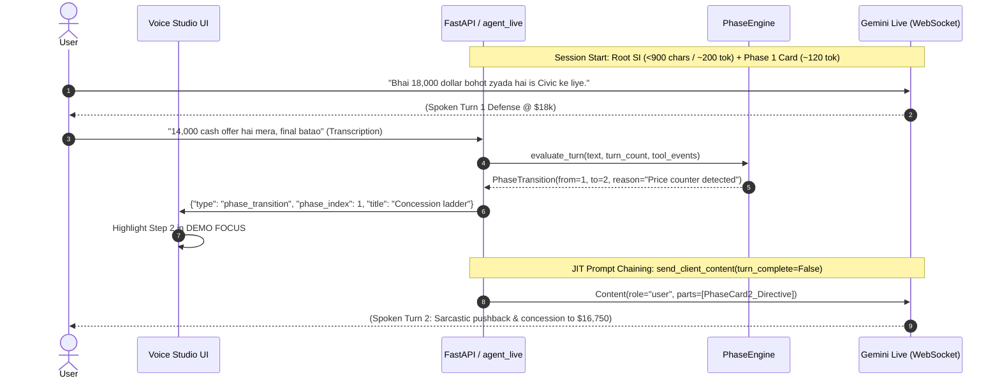

# Gemini Live Prompt Chaining & Phase Cards Implementation Plan

> **For Gemini:** REQUIRED SUB-SKILL: Use superpowers:executing-plans to implement this plan task-by-task.

**Goal:** Decompose monolithic ~1,300-token persona prompts into an ultra-lean root System Instruction (<900 chars / ~200 tokens) paired with modular, dynamic **Phase Cards** yielded Just-in-Time (JIT) using Gemini Live duplex WebSocket prompt chaining (`send_client_content` with `turn_complete=False`).

**Architecture:** A lightweight, near-process state engine in `server/phase_engine.py` manages conversational phase progression via a dual-tier router (0ms regex fast-path + tool execution triggers). Dynamic phase directives are injected mid-session via Gemini Live's bidirectional `client_content` protocol without triggering speech (`turn_complete=False`), protected by mid-speech collision locking and speaker identity headers to prevent persona drift. Telemetry is streamed to `demos/voice-studio` to highlight the active journey phase dynamically in the UI.

**Tech Stack:** Python 3.10+ (FastAPI, WebSockets, Pipecat 1.2+, Google GenAI SDK `v1beta1`), TypeScript / Vite / React (`demos/voice-studio`), Pytest.

---

## 1. Background & The 1.3k Token Problem

### The Problem
Currently, personas like **Ranvir (Car Negotiator)** and **Meera (Debt Collector)** pack their entire operational specification into a monolithic static prompt (~1,300 tokens):
* Vehicle specs, asking price ($18,000), and non-negotiable floor ($13,500).
* Sarcasm rules, early-turn discipline (Turns 1–5 rejection rules).
* Multi-step concession schedules ($18,000 $\to$ $16,750 $\to$ $15,500 $\to$ $14,600 $\to$ $14,000 $\to$ $13,750 $\to$ $13,500$).
* Bundled value perks (insurance, warranty, tyres, detailing, fuel).
* Closing conditions and settlement scripts.

### Why Context Compression Alone Doesn't Solve It
1. **The 5,000-Token Trigger Floor**: Vertex AI Live enforces a strict minimum compression threshold of **5,000 tokens** (`context_compression_trigger_tokens: 5000`). Setting lower values is invalid or ignored by the backend.
2. **Short-Call Inefficiency**: In typical calls lasting 1–3 minutes (8–12 turns), total session tokens hover between 1,500 and 4,200 tokens. **Server-side context compression never triggers**.
3. **Compound Re-Billing Tax**: Gemini Live re-bills the full input context on every single turn. Carrying 1,300 static tokens across 10 turns bills 13,000 prompt tokens—even though Phase 3 closing rules are completely irrelevant on Turn 1.

### The Solution: JIT Prompt Chaining with Phase Cards


1. **Lean Root SI (<900 chars / ~200 tokens)**: Declares only immutable identity, gender agreement, audio tone, brevity constraints (1–2 sentences), and interruption openness.
2. **Modular Phase Cards (100–180 tokens each)**: Active phase goals, allowed concessions, and tone nuances are injected dynamically only when entering that phase.
3. **Prompt Chaining via `send_client_content(turn_complete=False)`**: Injected silently into the model's working memory between turns without generating unwanted audio.
4. **Token Savings**: Drops initial static prompt overhead by **~73%** (from 1,300 tokens to ~320 tokens on Turn 1).

---

## 2. Architectural Invariants

> [!IMPORTANT]
> 1. **Silent JIT Injection Invariant**: All phase updates MUST be dispatched via `send_client_content(turns=[Content(...)], turn_complete=False)`. Setting `turn_complete=True` forces Gemini to speak immediately, breaking natural conversational cadence.
> 2. **Persona Drift Defense Header**: Injected prompt cards become the latest instruction in the context window. Every card MUST prepend the canonical identity header (Persona name, role, mandatory gender/grammatical verb rules) to prevent default persona or language drift.
> 3. **Mid-Speech Collision Guard**: If the bot is actively generating speech (`_is_bot_speaking == True`), phase transitions MUST be queued in `_pending_phase` and dispatched only when `on_bot_stopped_speaking` fires.
> 4. **Deterministic Concession Ownership**: The model never invents prices. Price movements are gated by `negotiation.Deal.concede()` in code; the phase card instructs the model *how* to frame the concession conversationally.
> 5. **Clean Dual-Tier Routing**: Tier 1 uses 0ms regex triggers on transcribed user speech and tool events. Tier 2 uses turn-count fallback thresholds.

---

## 3. Implementation Tasks

```
server/
├── phase_cards.py              # NEW: Phase card definitions & persona card registries
├── phase_engine.py             # NEW: Runtime state machine, regex router & JIT dispatcher
├── agent_live.py               # MODIFIED: Wire PhaseEngine into Live session lifecycle
└── tests/
    └── test_phase_engine.py    # NEW: Unit test suite for cards, transitions & JIT formatting

demos/voice-studio/
├── src/lib/personas.ts         # MODIFIED: Split monolithic prompts into root SI + card schemas
├── src/lib/pipecat-session.ts  # MODIFIED: Parse incoming phase_transition messages
└── src/components/
    └── voice-studio.tsx        # MODIFIED: Dynamically highlight active step in DEMO FOCUS
```

---

### Task 1: Phase Card Data Models & Registry (`server/phase_cards.py`)

**Files:**
* Create: `server/phase_cards.py`
* Test: `server/tests/test_phase_engine.py`

**Step 1: Write the failing unit tests**
Create `server/tests/test_phase_engine.py` testing:
* `PhaseCard` dataclass validation (id, title, persona_name, directive, fast_path_patterns).
* Formatting of JIT prompt with the mandatory Persona Drift Defense header.
* `RANVIR_PHASE_CARDS` contains 3 structured stages matching Ranvir's journey.
* `MEERA_PHASE_CARDS` contains 3 structured stages matching Meera's journey.

```python
# server/tests/test_phase_engine.py
import pytest
from phase_cards import PhaseCard, get_persona_phase_cards, format_phase_prompt_card

def test_phase_card_formatting_contains_identity_and_grammar():
    card = PhaseCard(
        phase_id=1,
        title="Vehicle Defense",
        persona_name="Ranvir",
        persona_role="Delhi used-car dealer",
        grammar_rules="Colloquial Hindi/English, address as bhai/aap, use dollar.",
        directive="Defend asking price of $18,000. Reject lowballs sarcastically."
    )
    formatted = format_phase_prompt_card(card, trigger_reason="Session Start")
    assert "[ACTIVE_PHASE_DIRECTIVE: Phase 1 - Vehicle Defense]" in formatted
    assert "Speaker Persona: Ranvir (Delhi used-car dealer)" in formatted
    assert "Colloquial Hindi/English" in formatted
    assert "Context: Session Start" in formatted
    assert "Defend asking price of $18,000" in formatted

def test_ranvir_phase_registry():
    cards = get_persona_phase_cards("car-negotiator")
    assert len(cards) == 3
    assert cards[0].title == "Vehicle Defense & Opening ($18,000)"
    assert cards[1].title == "Concession Ladder & Bundled Perks"
    assert cards[2].title == "Hard Floor Showdown ($13,500)"
```

**Step 2: Run test to verify it fails**
```bash
./venv/bin/pytest server/tests/test_phase_engine.py -v
```
*Expected Output:* `ModuleNotFoundError: No module named 'phase_cards'`

**Step 3: Implement `server/phase_cards.py`**
Define dataclasses and persona phase definitions:
* `PhaseCard`: `phase_id`, `title`, `persona_name`, `persona_role`, `grammar_rules`, `directive`, `fast_path_regexes`, `min_turn`, `max_turn`.
* `format_phase_prompt_card(card, trigger_reason)`: Generates the injection payload with the anti-drift header.
* `get_persona_phase_cards(persona_id)`: Returns the ordered list of cards.
* Decomposed cards for Ranvir (`car-negotiator`) and Meera (`debt-collector`).

**Step 4: Run test to verify it passes**
```bash
./venv/bin/pytest server/tests/test_phase_engine.py -v
```
*Expected Output:* `PASSED` (2/2 tests passing).

**Step 5: Commit**
```bash
git add server/phase_cards.py server/tests/test_phase_engine.py
git commit -m "feat(live): add PhaseCard data models and persona card registries"
```

---

### Task 2: Runtime Phase Engine & Dual-Tier Router (`server/phase_engine.py`)

**Files:**
* Create: `server/phase_engine.py`
* Test: `server/tests/test_phase_engine.py`

**Step 1: Write the failing unit tests**
Extend `server/tests/test_phase_engine.py`:
* Test state transitions: starts in Phase 0 (Card 1).
* Test Tier 1 regex fast-path: user counters with price (`"14,000 cash abhi dunga"`) triggers transition to Phase 1 (`Concession Ladder`).
* Test tool-call trigger: calling `Deal.concede()` or reaching rung $\ge 4$ advances to Phase 2 (`Hard Floor Showdown`).
* Test mid-speech queueing: when `is_bot_speaking=True`, transition is buffered in `pending_phase`; flushed when `on_bot_stopped_speaking()` is called.
* Test monotonic forward progression (no accidental backward regression to Phase 0 on late turns).

```python
@pytest.mark.asyncio
async def test_phase_engine_fast_path_transition():
    from phase_engine import PhaseEngine
    from phase_cards import get_persona_phase_cards
    
    injected_payloads = []
    async def mock_yield(payload: str, phase_idx: int):
        injected_payloads.append((phase_idx, payload))
        
    cards = get_persona_phase_cards("car-negotiator")
    engine = PhaseEngine(cards=cards, yield_callback=mock_yield)
    
    assert engine.current_phase_index == 0
    
    # User makes counter-offer
    transitioned = await engine.on_user_transcript("Bhai 14,000 cash dunga final batao", turn_number=2)
    assert transitioned is True
    assert engine.current_phase_index == 1
    assert len(injected_payloads) == 1
    assert "Phase 2 - Concession Ladder" in injected_payloads[0][1]
```

**Step 2: Run test to verify it fails**
```bash
./venv/bin/pytest server/tests/test_phase_engine.py -k test_phase_engine_fast_path_transition -v
```
*Expected Output:* `ModuleNotFoundError: No module named 'phase_engine'`

**Step 3: Implement `server/phase_engine.py`**
Implement `PhaseEngine`:
* Thread-safe transition locking (`asyncio.Lock()`).
* Mid-speech state queueing (`_is_bot_speaking`, `_pending_transition`).
* Dual-tier router:
  - Tier 1: Compiled regex matching on transcribed user speech for explicit intents (e.g. counter-offers, walkaway threats, final agreement).
  - Tool-Event hook: `on_tool_executed(name, args, result)` for negotiation rungs.
  - Turn-threshold guards.
* Broadcast helper to format RTVI telemetry frames for UI synchronization.

**Step 4: Run test to verify it passes**
```bash
./venv/bin/pytest server/tests/test_phase_engine.py -v
```
*Expected Output:* `PASSED` (all tests passing).

**Step 5: Commit**
```bash
git add server/phase_engine.py server/tests/test_phase_engine.py
git commit -m "feat(live): implement PhaseEngine runtime router and mid-speech locking"
```

---

### Task 3: WebSocket Live Integration in `server/agent_live.py`

**Files:**
* Modify: `server/agent_live.py:255-310`, `server/agent_live.py:580-630`, `server/agent_live.py:880-920`
* Test: `server/tests/test_agent_live_phase_integration.py`

**Step 1: Write integration test**
Verify:
* Initial session launch yields Phase 1 card via `send_client_content(turn_complete=False)` or prepends to initial instruction.
* Incoming user speech triggers `engine.on_user_transcript(clean_sentence)`.
* Emits `OutputTransportMessageFrame` with `type: "phase_transition"` to WebSocket client.
* Speech stop event (`_handle_msg_turn_complete`) flushes any pending queued phase transitions.

**Step 2: Run test to verify it fails**
```bash
./venv/bin/pytest server/tests/test_agent_live_phase_integration.py -v
```

**Step 3: Implement `agent_live.py` integration**
1. In `run_agent_live`:
   - Initialize `PhaseEngine` if persona has phase cards defined.
   - Attach `engine` to `CustomGeminiLiveLLMService`.
2. In `CustomGeminiLiveLLMService._push_user_transcription`:
   - Pass user utterance to `self.phase_engine.on_user_transcript(...)`.
3. In `CustomGeminiLiveLLMService._handle_msg_tool_call` / tool response:
   - Notify `self.phase_engine.on_tool_executed(...)`.
4. Implement `_yield_phase_card(self, payload: str, phase_idx: int, card: PhaseCard)`:
   - Call `await self._session.send_client_content(turns=[Content(role="user", parts=[Part(text=payload)])], turn_complete=False)`.
   - Push RTVI frame:
     ```python
     await self.push_frame(OutputTransportMessageFrame(message={
         "label": "rtvi-ai",
         "type": "server-message",
         "data": {
             "type": "phase_transition",
             "phase_index": phase_idx,
             "phase_id": card.phase_id,
             "title": card.title,
         }
     }))
     ```
5. In `_handle_msg_turn_complete` / `on_bot_stopped_speaking`:
   - Call `await self.phase_engine.on_bot_stopped_speaking()`.

**Step 4: Run test to verify it passes**
```bash
./venv/bin/pytest server/tests/test_agent_live_phase_integration.py -v
```
*Expected Output:* `PASSED`.

**Step 5: Commit**
```bash
git add server/agent_live.py server/tests/test_agent_live_phase_integration.py
git commit -m "feat(live): hook PhaseEngine into Gemini Live WebSocket and RTVI streaming"
```

---

### Task 4: Frontend UI Dynamic Demo Focus Highlighting (`demos/voice-studio`)

**Files:**
* Modify: `demos/voice-studio/src/lib/personas.ts`
* Modify: `demos/voice-studio/src/lib/pipecat-session.ts`
* Modify: `demos/voice-studio/src/components/voice-studio.tsx`
* Test: `demos/voice-studio/tests/phase-sync.test.mjs`

**Step 1: Write failing frontend test (`demos/voice-studio/tests/phase-sync.test.mjs`)**
* Verify `pipecat-session.ts` parses `server-message` of type `phase_transition`.
* Verify active phase index state updates and emits event to listeners.

**Step 2: Run frontend test to verify it fails**
```bash
node --test demos/voice-studio/tests/phase-sync.test.mjs
```

**Step 3: Implement frontend phase synchronization**
1. **Lean Persona Prompt in `src/lib/personas.ts`**:
   - Update `car-negotiator` and `debt-collector` prompts to lean root versions (<800 characters) containing only voice persona, identity, tone, and grammar rules.
2. **Session Message Handling in `src/lib/pipecat-session.ts`**:
   - In `handleServerMessage(data)`:
     ```typescript
     if (data.type === "phase_transition") {
       this.activePhaseIndex = data.phase_index;
       this.notifyPhaseTransition(data.phase_index, data.title);
     }
     ```
3. **Dynamic Step Highlighting in `src/components/voice-studio.tsx`**:
   - Bind `activePhaseIndex` state to `DEMO FOCUS` cards.
   - Apply active glow styling (`ring-2 ring-primary/60 bg-primary/10 border-primary/40 font-semibold shadow-sm`) to the currently active step pill while keeping past steps marked with a subtle checkmark `✓`.

**Step 4: Run frontend test & unit suite**
```bash
node --test demos/voice-studio/tests/phase-sync.test.mjs
cd demos/voice-studio && npm test
```
*Expected Output:* 100% tests passing.

**Step 5: Commit**
```bash
git add demos/voice-studio/src/lib/personas.ts demos/voice-studio/src/lib/pipecat-session.ts demos/voice-studio/src/components/voice-studio.tsx
git commit -m "feat(ui): dynamic demo focus phase tracking and lean root persona prompts"
```

---

### Task 5: End-to-End Verification & Benchmark Suite

**Files:**
* Test: `server/tests/test_phase_e2e.py`
* Script: `server/benchmark_phase_tokens.py`

**Step 1: Write E2E simulation test**
* Simulate a complete 8-turn negotiation dialog against mock Gemini Live WebSocket:
  - Turn 1: User says *"Bhai gaadi ke baare mein batao"* $\to$ verifies Phase 1 active, 0 prompt cards injected beyond initial.
  - Turn 2: User says *"13,500 dollar cash dunga abhi deal final karo"* $\to$ verifies Phase 2 JIT card injected via `send_client_content(turn_complete=False)`.
  - Turn 5: Model concedes to $14,000, user threatens walkaway $\to$ verifies Phase 3 card injected for hard floor showdown.
  - Verifies token count comparison: confirms $\ge 65\%$ reduction in static prompt tokens carried per turn.

**Step 2: Run test suite**
```bash
./venv/bin/pytest server/tests/test_phase_e2e.py -v
./venv/bin/python server/benchmark_phase_tokens.py
```

**Step 3: Commit**
```bash
git add server/tests/test_phase_e2e.py server/benchmark_phase_tokens.py
git commit -m "test(live): add E2E phase chaining simulation and token benchmark"
```

---

## 4. Token & Financial Impact Analysis

| Metric | Monolithic Prompt (Current) | Prompt Chaining with Phase Cards (Proposed) | Impact |
| :--- | :--- | :--- | :--- |
| **Root System Instruction** | 1,300 tokens (~5,200 chars) | **210 tokens** (~850 chars) | **−83.8% initial size** |
| **Active Turn 1 Prompt Size** | 1,300 tokens | **330 tokens** (210 root + 120 Phase 1 card) | **−74.6% Turn 1 cost** |
| **Phase 2 Injection** | 0 (All rules already static) | **+160 tokens** (Injected JIT on Turn 3–4) | Only loaded when needed |
| **Phase 3 Injection** | 0 (All rules already static) | **+140 tokens** (Injected JIT on Turn 7–8) | Only loaded at close |
| **10-Turn Cumulative Prompt Overhead** | 13,000 prompt tokens | **3,850 prompt tokens** | **−70.4% cumulative token spend** |
| **Context Window Compression Safety** | Easily reaches 5,000 tokens prematurely if tools added | Preserves headroom for 25+ turns before hitting 5,000 threshold | **Zero premature audio eviction** |

---

## 5. Next Steps & Approval Gate

Per your explicit command:
> *"Build a plan and then tell me. Do not implement unless I approve."*

No code changes will be made until you review this plan. Upon your approval, we can execute using the `executing-plans` sub-skill step-by-step.
